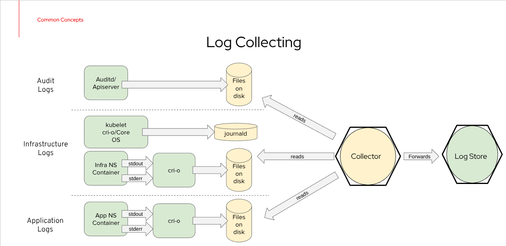
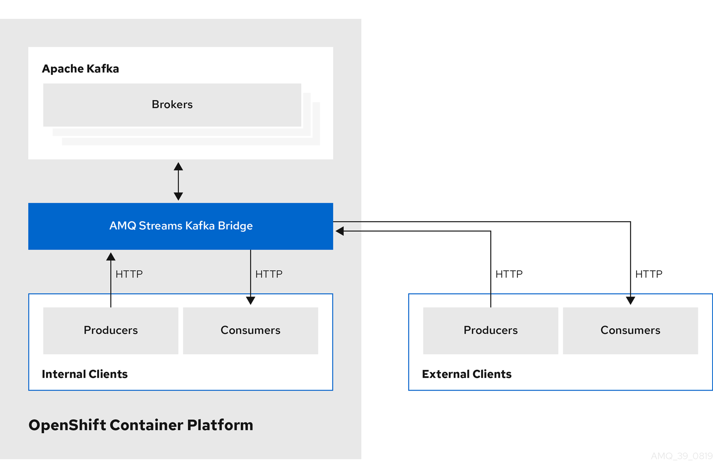
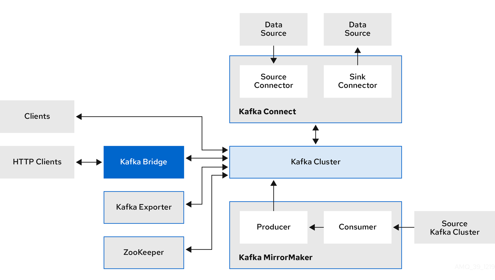
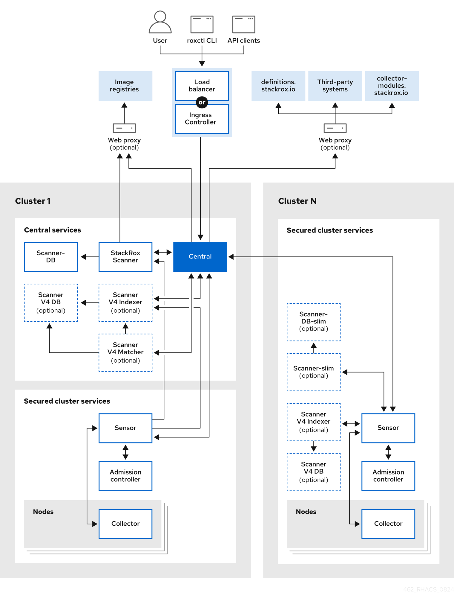
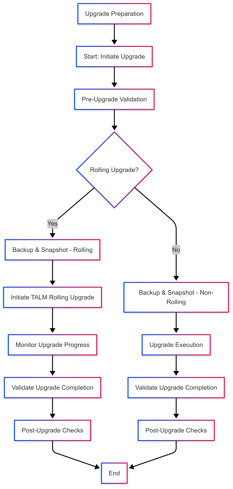
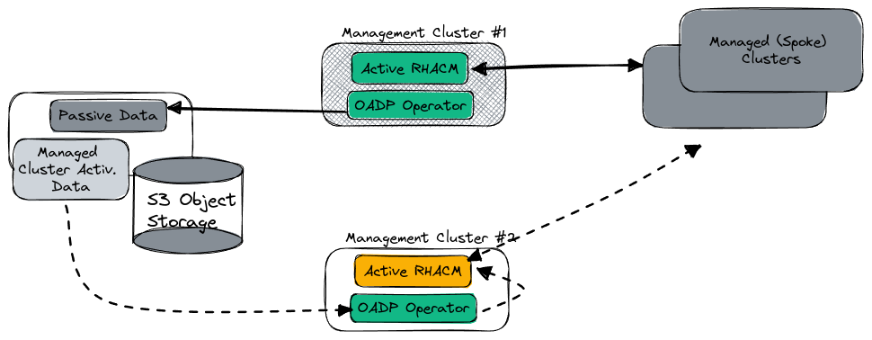

# High-Level Architecture of Management Cluster 

## Version History  

| Version | Date       | Author    | Description                           |
|---------|------------|-----------|---------------------------------------|
| 1.0     | 2025-02-12 | Mihai IDU | Initial draft                         |
| 1.1     | 2025-03-05 | Mihai IDU | Minor updates and corrections         |
| 1.2     | 2025-03-06 | Mihai IDU | Minor updates and corrections         |
| 1.3     | 2025-03-07 | Mihai IDU | Minor updates, corrections and format |
| 1.4     | 2025-03-08 | Mihai IDU | Minor updates, format                 |
| 1.5     | 2025-03-10 | Mihai IDU | Update on [OpenShift Management Cluster Security](#openshift-management-cluster-security)                 |

## Table of Contents

- [High-Level Architecture of Management Cluster](#high-level-architecture-of-management-cluster)
  - [Version History](#version-history)
  - [Table of Contents](#table-of-contents)
  - [Architecture Details](#architecture-details)
    - [Cluster Topology](#cluster-topology)
  - [Limits and Requirements](#limits-and-requirements)
    - [Considerations](#considerations)
      - [Non-Production Environments](#non-production-environments)
      - [Compute Node Scalability](#compute-node-scalability)
      - [Networking](#networking)
  - [Management Cluster Component Versions](#management-cluster-component-versions)
  - [Memory and CPU Requirements](#memory-and-cpu-requirements)
    - [Limits/Requirements](#limitsrequirements)
    - [Considerations](#considerations-1)
  - [Storage Requirements](#storage-requirements)
    - [Assisted Service](#assisted-service)
      - [Assisted Service Storage Requirements](#assisted-service-storage-requirements)
  - [Observability](#observability)
    - [Observability Deployment](#observability-deployment)
    - [Storage Requirements](#storage-requirements-1)
    - [Capacity Planner Input](#capacity-planner-input)
    - [Storage Estimation Results](#storage-estimation-results)
    - [Aggregating monitoring events in Management Cluster](#aggregating-monitoring-events-in-management-cluster)
  - [Logging](#logging)
    - [Logging Deployment](#logging-deployment)
    - [Logging - ServiceTelemetryFramework (STF)](#logging---servicetelemetryframework-stf)
      - [Red Hat AMQ Streams](#red-hat-amq-streams)
        - [Cluster Operator](#cluster-operator)
        - [Entity Operator](#entity-operator)
        - [Topic Operator](#topic-operator)
        - [User Operator](#user-operator)
  - [Quay Storage Considerations](#quay-storage-considerations)
  - [Git Repository for Cluster Management](#git-repository-for-cluster-management)
    - [Git Repository Requirements](#git-repository-requirements)
    - [Disaster Recovery \& Multi-Hub Considerations](#disaster-recovery--multi-hub-considerations)
    - [Limits and Requirements](#limits-and-requirements-1)
    - [Considerations](#considerations-2)
  - [Networking](#networking-1)
    - [Dual-Stack Networking Support](#dual-stack-networking-support)
    - [Limits and Requirements](#limits-and-requirements-2)
    - [Bonding](#bonding)
      - [Bonding Modes](#bonding-modes)
    - [MTU and Jumbo Frames](#mtu-and-jumbo-frames)
      - [Cluster Network MTU](#cluster-network-mtu)
    - [Networking Requirements Between Managed and Hub Clusters](#networking-requirements-between-managed-and-hub-clusters)
    - [Image Registry Requirements](#image-registry-requirements)
    - [Considerations](#considerations-3)
      - [Latency and Bandwidth Considerations](#latency-and-bandwidth-considerations)
  - [Identity Manager - TBD](#identity-manager---tbd)
  - [OpenShift Management Cluster Security](#openshift-management-cluster-security)
    - [Secure Boot UEFI](#secure-boot-uefi)
    - [Disable `kubeadmin` user](#disable-kubeadmin-user)
    - [Disable `core` user ssh login](#disable-core-user-ssh-login)
  - [OpenShift Management Cluster Upgrades](#openshift-management-cluster-upgrades)
    - [Upgrade Workflow](#upgrade-workflow)
    - [TALM-Based Automation](#talm-based-automation)
      - [TALM Policy Set for Automation](#talm-policy-set-for-automation)
    - [MCP Upgrade Post-Control Plane Upgrade](#mcp-upgrade-post-control-plane-upgrade)
    - [Example Automated EUS-EUS Upgrade](#example-automated-eus-eus-upgrade)
      - [Policy Configuration](#policy-configuration)
      - [Upgrade acknowledgement](#upgrade-acknowledgement)
    - [Example CGU for 4.15 Upgrade](#example-cgu-for-415-upgrade)
    - [Example CGU for 4.16 Upgrade](#example-cgu-for-416-upgrade)
  - [OpenShift Management Cluster Automation and ZeroTouchProvisioning (ZTP)](#openshift-management-cluster-automation-and-zerotouchprovisioning-ztp)
    - [Overview of OpenShift Management Cluster Automation](#overview-of-openshift-management-cluster-automation)
      - [Key Components](#key-components)
    - [Zero-Touch Provisioning (ZTP) for OpenShift](#zero-touch-provisioning-ztp-for-openshift)
      - [Zero-Touch Provisioning (ZTP) Workflow](#zero-touch-provisioning-ztp-workflow)
      - [Technologies Enabling ZTP](#technologies-enabling-ztp)
    - [Git Structure for Management Cluster ZTP](#git-structure-for-management-cluster-ztp)
  - [OpenShift Management Cluster Backup and Restore](#openshift-management-cluster-backup-and-restore)
  - [OpenShift Management Cluster Disaster Recovery](#openshift-management-cluster-disaster-recovery)
    - [Required Operators for High Availability and Data Recovery](#required-operators-for-high-availability-and-data-recovery)
  - [Red Hat Openshift](#red-hat-openshift)
    - [Deployment Strategy](#deployment-strategy)
      - [Steps for Deploying OpenShift with ABI](#steps-for-deploying-openshift-with-abi)
    - [Management Cluster Components](#management-cluster-components)
      - [Red Hat Advanced Cluster Management (RHACM)](#red-hat-advanced-cluster-management-rhacm)
        - [Limits / Requirements:](#limits--requirements)
        - [Considerations:](#considerations-4)
      - [Topology Aware Lifecycle Manager (TALM)](#topology-aware-lifecycle-manager-talm)
        - [Limits / Requirements:](#limits--requirements-1)
        - [Considerations:](#considerations-5)
      - [GitOps Operator and ZTP Plugins](#gitops-operator-and-ztp-plugins)
        - [Limits / Requirements:](#limits--requirements-2)
        - [Considerations:](#considerations-6)
      - [Local Storage Operator](#local-storage-operator)
        - [Limits / Requirements:](#limits--requirements-3)
        - [Considerations:](#considerations-7)
      - [OpenShift Data Foundation (ODF)](#openshift-data-foundation-odf)
        - [Limits / Requirements:](#limits--requirements-4)
        - [Considerations:](#considerations-8)
      - [Cluster Logging Operator](#cluster-logging-operator)
        - [Limits / Requirements:](#limits--requirements-5)
        - [Considerations:](#considerations-9)
      - [Red Hat Quay Operator](#red-hat-quay-operator)
        - [Limits / Requirements:](#limits--requirements-6)
        - [Considerations:](#considerations-10)
      - [OADP Operator](#oadp-operator)
        - [Limits / Requirements:](#limits--requirements-7)
        - [Considerations:](#considerations-11)
    - [Performance](#performance)
      - [Management Cluster ETCD](#management-cluster-etcd)
  - [EMS(USM) / MANO(SCO)](#emsusm--manosco)
    - [Element Management System \[EMS(USM)\]](#element-management-system-emsusm)
    - [Management and Orchestration \[MANO(SCO)\]](#management-and-orchestration-manosco)
      - [NFV Orchestrator (NFVO)](#nfv-orchestrator-nfvo)
      - [VNF Manager (VNFM)](#vnf-manager-vnfm)
      - [Virtualized Infrastructure Manager (VIM)](#virtualized-infrastructure-manager-vim)
  - [APPENDIX A: Hardware](#appendix-a-hardware)

## Architecture Details

### Cluster Topology
In production environments, the management cluster must operate on a highly available [OpenShift](https://www.redhat.com/en/technologies/cloud-computing/openshift) cluster to ensure the continuous availability of management functions.

## Limits and Requirements
Any highly available topology for the underlying OpenShift cluster may be utilized, including:

- **Compact Configuration:** A three-node setup where control plane and compute functions are combined.
- **Standard Configuration:** A setup with three dedicated control plane nodes and a variable number of compute nodes, depending on workload requirements.

### Considerations

#### Non-Production Environments
In non-production environments, a [Single Node OpenShift (SNO)](https://docs.openshift.com/container-platform/latest/architecture/control-plane.html#single-node-openshift) cluster may be used for limited management cluster functionality. However, certain capabilities, such as [OpenShift Data Foundation (ODF)](https://www.redhat.com/en/technologies/cloud-computing/openshift-data-foundation), are not supported on SNO, requiring alternative solutions.

#### Compute Node Scalability
Compute node count can be adjusted based on the workload scale. Nodes may be added as necessary following [OCP Node Postinstallation tasks](https://docs.openshift.com/container-platform/latest/post_installation_configuration/node-tasks.html).

#### Networking
The management cluster operates in a disconnected (AirGapped) environment where internet access is restricted. The cluster requires access to an image registry hosting OpenShift and Operator Lifecycle Manager (OLM) images, as well as an HTTPS server for RHCOS images.


## Management Cluster Component Versions

| Hub Cluster Component      | Software Version (y-stream) |
|----------------------------|-----------------------------|
| OCP                        | 4.16                        |
| LSO                        | 4.16                        |
| ODF                        | 4.16                        |
| ACM                        | 2.12                        |
| OpenShift GitOps Operator  | 1.14                        |
| ZTP plugins                | 4.16                        |
| MCE PolicyGenerator plugin | 2.12                        |
| TALM                       | 4.16                        |
| Quay [Internal only]       | 3.13                        |
| Cluster Logging Operator   | 5.9                         |
| OADP                       | 1.4                         |

## Memory and CPU Requirements

### Limits/Requirements
- Compliance with [OpenShift](https://docs.openshift.com/) and [Advanced Cluster Management (ACM)](https://access.redhat.com/documentation/en-us/red_hat_advanced_cluster_management_for_kubernetes/) requirements.

### Considerations
- A comprehensive sizing analysis should be conducted before deploying a Telco hub cluster.
- Refer to [ACM Sizing Your Cluster](https://access.redhat.com/documentation/en-us/red_hat_advanced_cluster_management_for_kubernetes/) for detailed CPU and memory requirements.

## Storage Requirements

### Assisted Service
[Assisted Service](https://access.redhat.com/documentation/en-us/red_hat_advanced_cluster_management_for_kubernetes/) is deployed with Multicluster Engine and Red Hat Advanced Cluster Management (RHACM).

#### Assisted Service Storage Requirements
| PV Size | Component         | Description                                                                                                                                                            |
|---------|-------------------|------------------------------------------------------------------------------------------------------------------------------------------------------------------------|
| 50GB    | imageStorage      | [ImageStorage](https://github.com/openshift/assisted-service/blob/6bf3a76ee8fa7f5574a00e61e82e8419a13b14f9/api/v1beta1/agentserviceconfig_types.go#L72)                |
| 700GB   | filesystemStorage | [FileSystemStorage Reference](https://github.com/openshift/assisted-service/blob/6bf3a76ee8fa7f5574a00e61e82e8419a13b14f9/api/v1beta1/agentserviceconfig_types.go#L61) |
| 20GB    | dataBaseStorage   | [DataBaseStorage](https://github.com/openshift/assisted-service/blob/6bf3a76ee8fa7f5574a00e61e82e8419a13b14f9/api/v1beta1/agentserviceconfig_types.go#L67)             |

> [!NOTE]
> The PV size values represent the recommended allocations and are based on a Management Cluster overseeing 3,500 SNOs.


## Observability

### Observability Deployment
Observability is deployed with [Multicluster Engine (MCE)](https://access.redhat.com/documentation/en-us/red_hat_advanced_cluster_management_for_kubernetes/) and [Red Hat Advanced Cluster Management (RHACM)](https://access.redhat.com/documentation/en-us/red_hat_advanced_cluster_management_for_kubernetes/).

The [Method of Procedure (MOP)](./observability_metrics_spoke_to_hub.md) provides a structured, step-by-step approach for implementing this use case.

### Storage Requirements
Storage requirements depend on factors such as data retention duration, number of managed clusters, and workload characteristics. The [ACM capacity planning repository](https://github.com/stolostron/acm-capacity-planning) provides a sizing calculator for storage estimation.

Monitoring data can be stored locally for a predefined period. The exact retention period will be determined based on operational requirements and team performance. This period defines how long the data remains available before being archived or deleted.  

### Capacity Planner Input
| Source of Data                   | Parameter                         | Value Used |
|----------------------------------|-----------------------------------|------------|
| Hub (Scale) & RAN (Topology) RDS | Number of control plane nodes     | 3,500      |
| Hub (Scale) & RAN (Topology) RDS | Number of additional worker nodes | 0          |
| Hub RDS                          | Days for storage of data          | 15         |
| RAN RDS                          | Total number of pods per cluster  | 120        |
| Default                          | Number of metric samples per hour | 12         |

### Storage Estimation Results
| Component           | Per Replica   | Total        |
|---------------------|---------------|--------------|
| Alertmanager PV     | 10GBi         | 30GBi        |
| Thanos-receive PV   | 10GBi         | 30GBi        |
| Thanos-compactor PV | 100GBi        | 100GBi       |
| Thanos-rule PV      | 30GBi         | 90GBi        |
| Thanos-store PV     | 100GBi        | 300GBi       |
| Object bucket*      | 15GBi per day | 101GBi total |

For the **Object bucket**, it is assumed that downsampling is disabled. Therefore, only the raw data is considered for sizing.

The retention period values can be adjusted based on specific requirements, typically defined in multiple-day increments. To accommodate longer retention periods, storage capacity should be appropriately increased in GiB.  


Prometheus and Alertmanager data are stored in persistent volumes (PVs) provisioned by OpenShift Data Foundation (ODF) storage. The designated storage class for these volumes is:  

- `ocs-storagecluster-ceph-rbd`

### Aggregating monitoring events in Management Cluster
The metrics/events collected by Openshift monitoring stack in the Management Cluster (or remote Spoke Clusters) can be sent to two different destinations:
-  All (or a subset) of the metrics/events can be forwarded towards the Management cluster.
-  A subset of metrics/events are forwarded towards Management Cluster multicluster observability service in order to facilitate remote cluster monitoring.

   - This is achieved by the `observability add-on` that its installed by [RHACM multicluster observability service on the local (and all remote clusters)](./observability_metrics_spoke_to_hub.md) that are managed by RHACM.

> [!WARNING]
> If the **Remote OpenShift Clusters (vDU/vCU)** are deployed by Management Cluster, then no extra step is needed in order for observe the health of the clusters, if observability service was already enabled in the Management Cluster. 
> 
> However, if the **Remote Openshift Clusters (vDU/vCU)** are deployed with some other mechanisms, then they need to be imported into the Management Cluster in order for RHACM to be able to observe their health. In order to achieve this, [the following steps](https://docs.redhat.com/en/documentation/red_hat_advanced_cluster_management_for_kubernetes/2.12/html/clusters/cluster_mce_overview#import-intro) can be used to import the **Remote Openshift Clusters (vDU/vCU)** cluster into the Management Cluster.

## Logging

### Logging Deployment
The Logging Stack is deployed with [Multicluster Engine (MCE)](https://access.redhat.com/documentation/en-us/red_hat_advanced_cluster_management_for_kubernetes/) and [Red Hat Advanced Cluster Management (RHACM)](https://access.redhat.com/documentation/en-us/red_hat_advanced_cluster_management_for_kubernetes/).

Cluster Logging Operator is being used to enable Cluster Logging in the Management Clusters. The Cluster Logging Operator creates and manages the components of the logging stack. Once the operator is installed, a Cluster Logging Custom Resource (CR) is used to schedule cluster logging Pods and other resources necessary to support cluster logging. The operator is responsible for deploying, upgrading, and maintaining cluster logging.

The [Method of Procedure (MOP)](./audit_and_infra_logs_fw_to_hub.md) provides a structured, step-by-step approach for implementing this use case.



### Logging - ServiceTelemetryFramework (STF)

Service Telemetry Framework (STF) facilitates the automated collection of measurements and data from remote clients and OpenShift nodes. This data is then transmitted to the Management OpenShift Container Platform (OCP) deployment for storage, retrieval, and monitoring.

The collected data can be categorized as follows:  

- **Metric**: A numeric measurement representing the state of an application or system.  
- **Event**: Irregular and discrete occurrences within a system.  
- **Log**: Log messages generated by various OpenStack components.  

The client-side collection components are lightweight. A shared multicast message bus ensures efficient and reliable data transport across all clients and the deployment. Additionally, modular components for data reception and storage are deployed within containers on OCP.  

STF enables monitoring capabilities such as alert generation and telemetry analysis as a single source of truth to support orchestration.  

#### Red Hat AMQ Streams

Red Hat [AMQ Streams](https://docs.redhat.com/en/documentation/red_hat_amq/7.7/html/amq_streams_on_openshift_overview/kafka-components_str#con-overview-components-kafka-bridge-clients_str) facilitates the deployment and management of Apache Kafka within an OpenShift cluster. It provides container images and Operators designed to streamline the operation of Kafka on OpenShift. The AMQ Streams Operators play a crucial role in managing AMQ Streams, incorporating specialized operational knowledge to enhance the efficiency of Kafka management.



[AMQ Streams](https://docs.redhat.com/en/documentation/red_hat_amq/7.7/html/amq_streams_on_openshift_overview/kafka-components_str#con-overview-components-kafka-bridge-clients_str) Operators extend OpenShift’s capabilities by automating both routine and complex Kafka deployment tasks. By embedding Kafka operational expertise into code, administrative tasks are simplified, reducing the need for manual intervention.

[AMQ Streams](https://docs.redhat.com/en/documentation/red_hat_amq/7.7/html/amq_streams_on_openshift_overview/kafka-components_str#con-overview-components-kafka-bridge-clients_str) includes the following Operators to support Kafka cluster management within an OpenShift environment:

##### Cluster Operator
- Deploys and manages Apache Kafka clusters, Kafka Connect, Kafka MirrorMaker, Kafka Bridge, Kafka Exporter, and the Entity Operator.

##### Entity Operator
- Comprises the Topic Operator and User Operator.

##### Topic Operator
- Manages Kafka topics.

##### User Operator
- Manages Kafka users.

The Cluster Operator can deploy the Topic Operator and User Operator as part of an Entity Operator configuration, simultaneously with a Kafka cluster deployment. The high level diagram of the Kafka cluster management its presented in the figure below:



## Quay Storage Considerations
- High-availability PersistentVolumes should be provisioned through a storage backend, such as **OpenShift Data Foundation (ODF)**.
- **SSD or NVMe disks** with low latency and high throughput are recommended for etcd storage.

## Git Repository for Cluster Management

### Git Repository Requirements
A Git repository serves as the **source-of-truth** for cluster definitions and configurations.

- Red Hat does **not** offer a commercially supported Git server.
- Self-hosted options include [Gitea](https://gitea.io/en-us/) and [Gogs](https://gogs.io/).
- The repository is typically deployed **outside** the hub cluster.

### Disaster Recovery & Multi-Hub Considerations
- The repository should be **highly available**.
- Running the repository **separately** from the hub cluster enhances reliability.

### Limits and Requirements
- A Git repository is **mandatory** for supporting **GitOps Zero Touch Provisioning (ZTP)**.
- The repository must be accessible from the management cluster with **read access credentials**.

### Considerations
- The Git repository is utilized by the **GitOps Operator** to ensure continuous deployment and configuration synchronization.

## Networking

### Dual-Stack Networking Support

The hub cluster supports dual-stack networking to facilitate access to both IPv6 networks, which are commonly used in edge and far-edge segments, and IPv4 networks, typically associated with legacy equipment within the datacenter.

### Limits and Requirements

Regardless of the selected installation method, the following network types must be configured:

- **Cluster Network**
- **Service Network**
- **Machine Network**

Additionally, the following IP addresses must be defined:

- **API VIPs**
- **Ingress VIPs**

Certain values may be mandatory, while others can be automatically assigned based on the chosen architecture and DHCP configuration.

The default OpenShift Container Platform (OCP) network provider, **OVN-Kubernetes**, is utilized.

### Bonding

Network bonding in OpenShift 4 is a technique used to aggregate multiple network interfaces into a single logical interface, enhancing redundancy and increasing throughput. By leveraging Linux bonding, OpenShift ensures higher availability and load balancing for critical network connections, which is essential for enterprise-grade Kubernetes deployments.

#### Bonding Modes

OpenShift 4 supports multiple [bonding modes](https://docs.openshift.com/container-platform/4.16/installing/installing_with_agent_based_installer/preparing-to-install-with-agent-based-installer.html#agent-install-sample-config-bonds-vlans_preparing-to-install-with-agent-based-installer), each designed for specific use cases. The commonly used modes include:

- **Active-Backup (Mode 1)**

    - One interface is active while the other(s) remain in standby.
    - If the active interface fails, a standby interface takes over.
    - Provides redundancy but does not increase bandwidth.

- **LACP (Mode 4 - 802.3ad)**

    - Uses the Link Aggregation Control Protocol (LACP) to dynamically aggregate links.
    - Requires switch support for LACP.
    - Provides load balancing and redundancy.

- **Balance-XOR (Mode 2)**

    - Distributes traffic based on a hash function (e.g., source/destination MAC/IP addresses).
    - Requires static configuration on switches.
    - Offers increased throughput but is less flexible than LACP.

- **Broadcast (Mode 3)**

    - Sends all packets over all interfaces in the bond.
    - Provides maximum redundancy but inefficient for bandwidth utilization.

- **Balance-TLB (Mode 5)**

    - Adaptive transmit load balancing.
    - Does not require switch configuration.
    - Uses a single active receiver while transmit traffic is load balanced.

- **Balance-ALB (Mode 6)**

    - Adaptive load balancing for both transmit and receive traffic.
    - No switch configuration required.
    - Provides a good balance of redundancy and throughput.

### MTU and Jumbo Frames

The Maximum Transmission Unit (MTU) setting determines the maximum amount of data transmitted with a single Ethernet frame. Using a larger value may yield a better throughput as header overhead decreases, as well as the number of frames which need to be processed by network equipment on a local data center fabric.

In a distributed environment however, such as the one described in this reference solution, the MTU is limited by the capabilities of the network transport between the RAN sites.


#### Cluster Network MTU

During the deployment of the Management Cluster, the parameter `networking.networkType: OVNKubernetes` introduces a specific overhead of approximately **100 bytes** for OVN-Kubernetes. The distribution of this overhead is as follows:  

- **Ethernet Header (14 bytes)**  
  - Contains source and destination MAC addresses, along with the EtherType field.  

- **VXLAN or Geneve Encapsulation (~50-60 bytes)**  
  - OpenShift with OVN-Kubernetes utilizes **Geneve (Generic Network Virtualization Encapsulation)**.  
  - The Geneve header size varies, typically around **54 bytes**.  

- **IP Header (20 bytes)**  
  - Includes either an **IPv4 header (20 bytes)** or an **IPv6 header (40 bytes)**.  

- **UDP Header (8 bytes)**  
  - Required for Geneve or VXLAN encapsulation.  

- **Overlay Protocols**  
  - Additional overhead may be introduced based on network policies and configurations.  


### Networking Requirements Between Managed and Hub Clusters

Networking between the managed cluster and the hub cluster must comply with the [ACM networking documentation](https://access.redhat.com/documentation/en-us/red_hat_advanced_cluster_management_for_kubernetes/), including the following connectivity requirements:

- **Hub cluster to managed cluster:** Access to the API service, Ironic Python Agent, and BMC port.
- **Managed cluster to hub cluster:** Access to the API service, ingress IP, and control plane node IP addresses.
- **Managed cluster BMC access to hub cluster:** Access to control plane node IP addresses.

### Image Registry Requirements

An image registry must be accessible throughout the hub cluster's lifecycle. All necessary container images must be mirrored to a disconnected registry, as outlined in the following references:

- [OCP Disconnected Installation](https://docs.openshift.com/container-platform/latest/installing/disconnected_install/installing-mirroring-disconnected.html)
- [OLM on Disconnected Networks](https://docs.openshift.com/container-platform/latest/operators/admin/olm-restricted-networks.html)

The hub cluster must be configured to utilize a disconnected registry, as detailed in [Preparing the Hub Cluster for GitOps ZTP](https://docs.openshift.com/container-platform/latest/ztp/preparing-the-hub-cluster-for-ztp.html). The hub cluster **cannot** host its own image registry. For instance, the registry must remain available to facilitate recovery from unexpected power losses affecting all nodes.

### Considerations

When deploying a hub cluster, it is essential to define appropriately sized **CIDR ranges** to accommodate networking requirements.

For additional networking information, refer to the following resources:

- [OCP Installation Documentation](https://docs.openshift.com/container-platform/latest/installing/index.html)
- [OCP Networking Documentation](https://docs.redhat.com/en/documentation/openshift_container_platform/4.16/html/networking/index)
- [ACM Networking Documentation](https://docs.redhat.com/en/documentation/red_hat_advanced_cluster_management_for_kubernetes/2.12/html/networking/index)
- [ACM Maximum network latency](https://access.redhat.com/solutions/6964462)
- [Preparing the Management Cluster for GitOps ZTP](https://docs.redhat.com/en/documentation/openshift_container_platform/4.16/html/edge_computing/ztp-preparing-the-hub-cluster#ztp-gitops-ztp-max-spoke-clusters_ztp-preparing-the-hub-cluster)

This document provides an overview of the high-level architectural considerations necessary for configuring and maintaining a hub cluster within an OpenShift environment.

#### Latency and Bandwidth Considerations

 Simulated Network Specifications

| Specification                 | Description       |
|-------------------------------|-------------------|
| Round-trip time (RTT) latency | 50 ms             |
| Packet loss                   | 0.02% packet loss |
| Network bandwidth limit       | 20 Mbps           |


> [!WARNING] 
> The following network specifications are representative of a typical real-world RAN network and were applied to the scale lab environment during testing.


## Identity Manager - TBD

## OpenShift Management Cluster Security

This section presents a [high-level overview of Red Hat Advanced Cluster Security for Kubernetes (RHACS)](https://docs.openshift.com/acs/4.6/architecture/acs-architecture.html), a Kubernetes-native security platform designed to enhance the security of cloud-native applications throughout their lifecycle. The solution provides robust protection for containerized workloads running on Kubernetes.

RHACS consists of two services:
- **Central services** that you install on only one cluster in the network
- **Secured cluster services** that you install on all clusters in the network



The Central component serves as the primary management interface and service layer for RHACS. It is deployed on a single cluster, designated as the Management Cluster in the TNC architecture. The Secured Cluster component is deployed on each cluster that requires monitoring and management, including the management cluster itself if monitoring through RHACS is required. A single Central instance can be used to secure multiple OpenShift Container Platform or Kubernetes clusters.

In a managed cluster, RHACS consists of the following key components:

- **Central**: Central is the RHACS application management interface and services. It handles API interactions and user interface (RHACS Portal) access. You can use the same Central instance to secure multiple OpenShift Container Platform or Kubernetes clusters.

- **Central DB**: Central DB is the database for RHACS and handles all data persistence. It is currently based on PostgreSQL 13.

- **Scanner V4**: Beginning with version 4.4, RHACS contains the Scanner V4 vulnerability scanner for scanning container images. Scanner V4 is built on ClairCore, which also powers the Clair scanner. Scanner V4 supports scanning of language and OS-specific image components. For version 4.4, you must use this scanner in conjunction with the StackRox Scanner to provide node and platform scanning capabilities until Scanner V4 support those capabilities. Scanner V4 contains the Indexer, Matcher, and DB components.

  - **Scanner V4 Indexer**: The Scanner V4 Indexer performs image indexing, previously known as image analysis. Given an image and registry credentials, the Indexer pulls the image from the registry. It finds the base operating system, if it exists, and looks for packages. It stores and outputs an index report, which contains the findings for the given image.

  - **Scanner V4 Matcher**: The Scanner V4 Matcher performs vulnerability matching. If the Central services Scanner V4 Indexer indexed the image, then the Matcher fetches the index report from the Indexer and matches the report with the vulnerabilities stored in the Scanner V4 database. If a Secured Cluster services Scanner V4 Indexer performed the indexing, then the Matcher uses the index report that was sent from that Indexer, and then matches against vulnerabilities. The Matcher also fetches vulnerability data and updates the Scanner V4 database with the latest vulnerability data. The Scanner V4 Matcher outputs a vulnerability report, which contains the final results of an image.

  - **Scanner V4 DB**: This database stores information for Scanner V4, including all vulnerability data and index reports. A persistent volume claim (PVC) is required for Scanner V4 DB on the cluster where Central is installed.

- **StackRox Scanner**: The StackRox Scanner is the default scanner in RHACS. Version 4.4 adds a new scanner, Scanner V4. The StackRox Scanner originates from a fork of the Clair v2 open source scanner. You must continue using this scanner for RHCOS node scanning and platform scanning.

- **Scanner-DB**: This database contains data for the StackRox Scanner.

RHACS scanners analyze each image layer to determine the base operating system and identify programming language packages and packages that were installed by the operating system package manager. They match the findings against known vulnerabilities from various vulnerability sources. In addition, the StackRox Scanner identifies vulnerabilities in the node’s operating system and platform. These capabilities are planned for Scanner V4 in a future release.

### Secure Boot UEFI

Secure Boot is a UEFI firmware security feature developed by the [UEFI Consortium](https://uefi.org/), designed to ensure that only trusted and signed software is loaded during the boot process. It utilizes digital signatures to verify the authenticity, source, and integrity of the boot code, thereby preventing the execution of malicious software and mitigating risks such as rootkit installation.

For more information on UEFI Secure Boot, please refer to the [relevant documentation](https://access.redhat.com/articles/5254641).

UEFI Secure Boot can be integrated into the Zero-Touch Provisioning (ZTP) deployment methodology used for workload cluster installations. To enforce Secure Boot during cluster setup, set the `spec.clusters.nodes.bootMode` field in the SiteConfig manifest.

### Disable `kubeadmin` user

To enhance security, it is recommended to disable the default OpenShift `kubeadmin` user account. However, prior to disabling the `kubeadmin` account, the following steps should be completed to prevent loss of access to the OpenShift cluster:

1. **Integrate the OpenShift cluster with an external LDAP** server using the LDAP OAUTH provider, and assign cluster admin privileges to specific LDAP users.
2. **Create a local user account** using the htpasswd OAUTH provider and assign cluster admin privileges to this account.

The local account should be reserved for emergency access in the event that connectivity to the external LDAP server is lost. Normal operations should be carried out using LDAP user accounts.

### Disable `core` user ssh login

By default, SSH access to RHEL CoreOS nodes is granted through SSH using the `core` user. However, if all users log in using this default account, it becomes impossible to track individual actions performed on the nodes. 

To prevent anonymous access to RHEL CoreOS nodes, it is recommended to configure SSSD to retrieve CoreOS users from an Identity Management (IdM) or LDAP system. This configuration not only eliminates anonymous access but also allows for more granular control over what cluster administrators can do when accessing the nodes, such as applying specific sudo rules for each user.

Based on the integration of RHEL CoreOS with LDAP and SSSD, the following steps outline the process for disabling anonymous access to OpenShift Container Platform (OCP) nodes:

**Steps to be executed on IdM:**
1. Create a group in IdM (e.g., rhcosadmins).
2. Create a bind user (e.g., ocb-bind-user).
3. Create user accounts within IdM.
4. Define and configure sudo rules.
5. Associate the user accounts and sudo rules with the previously created group (rhcosadmins).

**Steps to be executed on OCP:**
1. Download the SSL certificate from IdM.
2. Download the configuration files from the following repository: idm_rhcos.
3. Configure the `sssd.conf` and `sshd.conf` files to point to the LDAP server.

This setup ensures better security and management of user access on RHEL CoreOS nodes.

## OpenShift Management Cluster Upgrades

This section provides a high-level blueprint for upgrading the Management Cluster, including Extended Update Support (EUS-EUS) upgrades, using the Topology Aware Lifecycle Manager (TALM). TALM streamlines cluster upgrades by providing:
- **Progressive rollout** across multiple clusters
- **Organized upgrade workflow** through a single unit of work

### Upgrade Workflow
For traditional (non-IBU) upgrades across all cluster topologies, the upgrade steps remain largely the same, except for MachineConfigPool (MCP) pause/unpause handling. The key upgrade steps are:
1. Bind the cluster to updated policies
2. Update `CatalogSource` to reference the next version index
3. Update `IDMS/ITMS` as needed (ICSP is deprecated, update if used)
4. Update `Subscriptions` to reference the new `CatalogSource` and channel
5. *Pause all non-control plane MCPs* (standard cluster topology only)
6. Upgrade OLM operators, approving `InstallPlans` for manual subscriptions
7. Upgrade OpenShift Container Platform (OCP)
8. Repeat the above for EUS-EUS upgrades
9. *Unpause MCPs* after planned maintenance windows

The above outlined Upgrade workflow steps are depicted in the below diagram: 




These steps, excluding MCP actions, are documented in [TALM’s far-edge and general upgrade documentation](https://docs.openshift.com/container-platform/4.16/edge_computing/ztp-talm-updating-managed-policies.html).

### TALM-Based Automation
Using TALM and a set of policies capturing the desired cluster state, the control-plane upgrade—including EUS-EUS—can be automated. This results in a cluster ready for administrators to begin unpausing MCPs based on maintenance schedules.

> [!NOTE] 
> The main intention its to minimize the downtime.

#### TALM Policy Set for Automation
The upgrade automation is defined through three primary policies:
1. **Prep Policy**
   - Defines the state of `CatalogSource`, `ImageSignature`, and `IDMS/ITMS/ICSP`
   - Pauses all non-control plane MCPs
2. **OLM Policy**
   - Manages all OLM subscriptions
   - Automates InstallPlan approval and completion checks
3. **OCP Policy**
   - Defines the `ClusterVersion` CR for upgrade
   - Waits for completion

These policies can be combined into a single **ClusterGroupUpgrade (CGU)** to automate a single-version upgrade (y- or z-stream). Two CGUs can be chained to automate an **EUS-EUS upgrade**.

### MCP Upgrade Post-Control Plane Upgrade
Once the control-plane upgrade is completed, administrators unpause MCPs during maintenance windows. MCP upgrades typically occur separately due to constraints like:
- Cluster size
- `maxUnavailable` settings
- Cordon/drain time
- Reboot time

MCP unpausing can be automated via GitOps or manually using:
```sh
oc patch MachineConfigPool worker-2 --type=merge -p '{"spec":{"paused":false}}'
```

### Example Automated EUS-EUS Upgrade
This example demonstrates an automated EUS-EUS upgrade from **4.14 → 4.16** through **two CGUs**.

#### Policy Configuration
- **Two sets of policies:**
  - `upgrade-prep-15`, `upgrade-olm-15`, `upgrade-ocp-15`
  - `upgrade-prep-16`, `upgrade-olm-16`, `upgrade-ocp-16`
- Temporary binding label: `upgrade-version-xxxx`
- Required [upgrade acknowledgment](#upgrade-acknowledgement) (`upgrade-ack.yaml` for 4.16)
- Policies applied via GitOps
- ClusterGroupUpgrades applied to the hub cluster:
  - `eus-upgrade-15` executes first
  - `eus-upgrade-16` executes after `eus-upgrade-15` completes

#### Upgrade acknowledgement 

During a Openshift upgrade, providing an upgrade acknowledgement is a crucial step to ensure cluster stability and compatibility. This process involves confirming that your cluster is ready for the upgrade, particularly in terms of API usage and resource configurations. The primary reasons for this requirement are:

1. **API Deprecations and Removals**: Kubernetes [periodically deprecates and removes certain APIs](https://kubernetes.io/docs/reference/using-api/deprecation-policy/). If your cluster relies on these deprecated APIs, proceeding with an upgrade without addressing them can lead to failures or unexpected behavior. By acknowledging the upgrade, you confirm that you've audited your cluster for such [deprecated APIs](https://access.redhat.com/articles/6955985) and have taken necessary actions to migrate or update them.

2. **Resource Compatibility**: Upgrades can introduce changes that affect existing resources and configurations. Acknowledging the upgrade indicates that you've reviewed these changes and ensured that your current setups are compatible with the new version. This proactive approach helps prevent disruptions in cluster operations post-upgrade.

3. **Cluster Stability**: The acknowledgement serves as a checkpoint to verify that all necessary preparations have been made for a smooth upgrade. This includes ensuring that workloads are resilient and that the cluster can handle the transition without significant downtime or issues.


### Example CGU for 4.15 Upgrade
```yaml
apiVersion: ran.openshift.io/v1alpha1
kind: ClusterGroupUpgrade
metadata:
  name: eus-upgrade-15
  namespace: default
spec:
  actions:
    afterCompletion:
      deleteObjects: true
  clusters:
  - local-cluster
  enable: true
  managedPolicies:
  - upgrade-prep-15
  - upgrade-olm-15
  - upgrade-ocp-15
  remediationStrategy:
    maxConcurrency: 1
    timeout: 240
```

### Example CGU for 4.16 Upgrade
```yaml
apiVersion: ran.openshift.io/v1alpha1
kind: ClusterGroupUpgrade
metadata:
  name: eus-upgrade-16
  namespace: default
spec:
  actions:
    afterCompletion:
      deleteObjects: true
    beforeEnable:
      deleteClusterLabels:
        upgrade-version-4-15: ""
  clusters:
  - local-cluster
  enable: true
  managedPolicies:
  - upgrade-prep-16
  - upgrade-olm-16
  - upgrade-ocp-16
  remediationStrategy:
    maxConcurrency: 1
    timeout: 240
  blockingCRs:
  - name: eus-upgrade-15
    namespace: default
```

By leveraging TALM automation, operators can streamline OpenShift upgrades while maintaining control over maintenance schedules and ensuring a predictable upgrade process.

> [!NOTE] 
> The OpenShift Management Cluster Upgrades from OpenShift 4.16 to Openshift 4.18 EUS-EUS will require a [migration of the SiteConfig to ClusterInstance CR](https://access.redhat.com/articles/7105238).

## OpenShift Management Cluster Automation and ZeroTouchProvisioning (ZTP)

OpenShift Management Cluster Automation and Zero-Touch Provisioning (ZTP) streamline the deployment, configuration and lifecycle management of OpenShift clusters in large-scale environments. This approach ensures consistent, repeatable, and efficient provisioning of OpenShift clusters with minimal manual intervention, reducing operational overhead and accelerating time to production.

### Overview of OpenShift Management Cluster Automation

The OpenShift Management Cluster acts as the central control plane for managing multiple worker and workload clusters. It provides:

- **Centralized Policy Enforcement**: Defines and applies cluster policies at scale.

- **Declarative Configuration Management**: Uses GitOps principles to maintain desired cluster states.

- **Automated Deployment and Lifecycle Management**: Enables rapid cluster provisioning and updates.

- **Monitoring and Observability**: Integrates with telemetry solutions for real-time insights.

#### Key Components

- **GitOps Workflow** - Leverages tools like ArgoCD and OpenShift GitOps to manage cluster configurations as code.

- **Cluster API (CAPI) and Hive** - Automates OpenShift cluster deployment across different infrastructure providers.

- **Infrastructure as Code (IaCode.)** - Uses Terraform and Ansible to define and provision infrastructure.

Security and Compliance - Implements Open Policy Agent (OPA) and Compliance Operator for policy enforcement.

### Zero-Touch Provisioning (ZTP) for OpenShift

Zero-Touch Provisioning (ZTP) eliminates manual intervention in deploying and configuring OpenShift clusters by leveraging automation frameworks and predefined policies.

> [!NOTE] 
> The Zero-Touch Provisioning (ZTP) framework is applied to the Management Cluster immediately after the successful completion of the Agent-Based Installation. At this stage, the administrator can create the ArgoCD Application responsible for enforcing the configuration of the Management Cluster. This approach ensures that the same configuration is consistently applied across all clusters, with any modifications being propagated directly from the Git repository. This establishes Git as the single source of truth for cluster configuration management.


#### Zero-Touch Provisioning (ZTP) Workflow

The Zero-Touch Provisioning (ZTP) process includes the following steps:

- **Bootstrap & Discovery**: Nodes boot with a predefined image containing an agent for automatic onboarding.

- **Cluster Configuration**: Predefined manifests and MachineConfig policies are applied.

- **Network and Storage Provisioning**: Automated configuration of networking (SR-IOV, Multus) and storage (ODF, CSI).

- **Validation and Handover**: Automated verification of cluster health before handover for workload deployment.

#### Technologies Enabling ZTP

- Assisted Installer - Automates cluster discovery and installation.

- Site Customization Profiles - Uses predefined templates for specific deployments.

- GitOps-based Configuration - Ensures consistency and repeatability across sites.

### Git Structure for Management Cluster ZTP

The following structure outlines the organization of the Management Cluster ZTP Git repository:

```bash
hub-config/
├── argocd
│   └── argopatch.json
├── hub-operators-argoapps.yaml
├── operators-config
│   ├── 00_rhacmConfig.yaml
│   ├── 01_aiConfig.yaml
│   ├── 02_aiConfig.yaml
│   ├── 02_patchProvisioning.yaml
│   ├── 03_mceConfig.yaml
│   ├── 04_observabilityConfig.yaml
│   ├── 05_gitopsServiceClusterConfig.yaml
│   ├── 06_acmPerfSearch.yaml
│   ├── 99_00_lsoConfig.yaml
│   ├── 99_01_odfConfig.yaml
│   ├── 99_02_observabilityStorage.yaml
│   ├── 99_02_ocsStorageClusterCephfs.yaml
│   ├── 99_03_openshiftAmqStreams.yaml
│   ├── 99_03_openshift-cluster-loggingv585.yaml
│   ├── 99_03_openshiftClusterLoggingv604.yaml
│   ├── kustomization.yaml
│   ├── s3_bucket
│   │   ├── 01_backup-odf-s3-storage.yaml
│   │   ├── 01_ibu-odf-s3-storage.yaml
│   │   └── 04_thanos_objectbucketclaim.yaml
│   └── source-crs
│       └── thanos-s3-secret.yaml
├── operators-deployment
│   ├── 00_rhacm_deployment.yaml
│   ├── 01_talm_deployment.yaml
│   ├── 02_mce_deployment.yaml
│   ├── 03_observability_deployment.yaml
│   ├── 99_00_lso_deployment.yaml
│   ├── 99_01_odf_deployment.yaml
│   ├── 99_02_openshift-amq-streams.yaml
│   ├── 99_02_openshift-cluster-logging.yaml
│   ├── 99_02_openshift-oadp-operator.yaml
│   ├── 99_02_openshift-quay-operator.yaml
│   └── kustomization.yaml
└── spoke-argoapps.yaml

6 directories, 35 files
```
This structure defines the organization of automation configurations, operator deployments, and GitOps-managed components, ensuring consistency and scalability in the OpenShift Management Cluster.

The directory structure outline above and its roles are outlined as follows:

| Path                                      | File                                       | Description                                                       |
|-------------------------------------------|--------------------------------------------|-------------------------------------------------------------------|
| `hub-config/argocd/`                      | `argopatch.json`                           | Patch configuration for ArgoCD.                                   |
| `hub-config/`                             | `hub-operators-argoapps.yaml`              | Defines ArgoCD applications for operators.                        |
| `hub-config/operators-config/`            | `00_rhacmConfig.yaml`                      | Configuration for Red Hat Advanced Cluster Management (RHACM).    |
|                                           | `01_aiConfig.yaml`                         | Assisted Installer general configuration.                         |
|                                           | `02_aiConfig.yaml`                         | Additional Assisted Installer configuration. Using TLS encryption |
|                                           | `02_patchProvisioning.yaml`                | Patch for provisioning settings.                                  |
|                                           | `03_mceConfig.yaml`                        | Configuration for Multi-Cluster Engine (MCE).                     |
|                                           | `04_observabilityConfig.yaml`              | Observability stack configuration.                                |
|                                           | `05_gitopsServiceClusterConfig.yaml`       | GitOps service cluster configuration.                             |
|                                           | `06_acmPerfSearch.yaml`                    | ACM performance and search settings.                              |
|                                           | `99_00_lsoConfig.yaml`                     | Configuration for Local Storage Operator (LSO).                   |
|                                           | `99_01_odfConfig.yaml`                     | Configuration for OpenShift Data Foundation (ODF).                |
|                                           | `99_02_observabilityStorage.yaml`          | Storage configuration for observability.                          |
|                                           | `99_02_ocsStorageClusterCephfs.yaml`       | CephFS storage cluster settings.                                  |
|                                           | `99_03_openshiftAmqStreams.yaml`           | Configuration for OpenShift AMQ Streams.                          |
|                                           | `99_03_openshift-cluster-loggingv585.yaml` | Logging stack configuration (v5.85).                              |
|                                           | `99_03_openshiftClusterLoggingv604.yaml`   | Logging stack configuration (v6.04).                              |
|                                           | `kustomization.yaml`                       | Kustomize configuration file.                                     |
| `hub-config/operators-config/s3_bucket/`  | `01_backup-odf-s3-storage.yaml`            | ODF backup storage configuration.                                 |
|                                           | `01_ibu-odf-s3-storage.yaml`               | Additional S3 storage configuration.                              |
|                                           | `04_thanos_objectbucketclaim.yaml`         | Thanos ObjectBucketClaim for storage.                             |
| `hub-config/operators-config/source-crs/` | `thanos-s3-secret.yaml`                    | Secret for Thanos S3 bucket.                                      |
| `hub-config/operators-deployment/`        | `00_rhacm_deployment.yaml`                 | Deployment file for RHACM.                                        |
|                                           | `01_talm_deployment.yaml`                  | Deployment file for TALM.                                         |
|                                           | `02_mce_deployment.yaml`                   | Deployment file for MCE.                                          |
|                                           | `03_observability_deployment.yaml`         | Deployment for observability stack.                               |
|                                           | `99_00_lso_deployment.yaml`                | Deployment for Local Storage Operator.                            |
|                                           | `99_01_odf_deployment.yaml`                | Deployment for OpenShift Data Foundation.                         |
|                                           | `99_02_openshift-amq-streams.yaml`         | Deployment for OpenShift AMQ Streams.                             |
|                                           | `99_02_openshift-cluster-logging.yaml`     | Deployment for OpenShift Cluster Logging.                         |
|                                           | `99_02_openshift-oadp-operator.yaml`       | Deployment for OpenShift API Data Protection (OADP).              |
|                                           | `99_02_openshift-quay-operator.yaml`       | Deployment for OpenShift Quay.                                    |
|                                           | `kustomization.yaml`                       | Kustomize configuration file.                                     |
| `hub-config/`                             | `spoke-argoapps.yaml`                      | Defines ArgoCD applications for spoke clusters.                   |


## OpenShift Management Cluster Backup and Restore 

## OpenShift Management Cluster Disaster Recovery

The management cluster sub-architecture comprises two geographically redundant Management clusters, which are identical in configuration. Both Management clusters run the same applications; however, client traffic is actively handled only by one of the Management clusters.  

Certain applications in the standby Management cluster may be fully configured, operational, and ready for immediate takeover. However, others may require recovery from backup in the event of a failure in the active instance.  

> [!NOTE]
> There is no built-in cluster-level geo-redundancy mechanism. Each application running in the management cluster must have its own recovery procedure to facilitate a switchover to the standby management cluster when necessary.

When the primary (active) hub cluster experiences a failure, the administrator designates the passive (or redeployed) hub cluster to assume management of the managed clusters.  

The passive hub cluster restores the managed cluster activation data from the OADP backup. At this stage, the managed clusters establish connections with Hub Cluster 2, and the passive hub cluster transitions into the primary (active) hub cluster. The administrator initiates a backup on the new primary hub cluster (Hub Cluster 2) by creating a `BackupSchedule.cluster.open-cluster-management.io` resource and storing the backups in the same storage location as the original primary hub cluster.  

### Required Operators for High Availability and Data Recovery  
The following operators are essential for the high availability and data recovery process:  

- **Cluster Backup and Restore Operator**  
- **OADP Operator**  

These operators are enabled via the `MultiClusterHub` resource, which is part of **RHACM**, by setting the `cluster-backup` parameter to `true`.  

To prevent the redeployment of all managed clusters after cluster recovery, all `BareMetalHost` CRs with the `infraenvs.agent-install.openshift.io` label must be assigned the following label:  

```yaml
cluster.open-cluster-management.io/backup
```  

This includes all `BareMetalHost` CRs deployed using **GitOps ZTP** from `ClusterInstance` or `SiteConfig` CRs. In the reference configuration, an **ACM Policy** is included, which continuously enforces this labeling exclusively on the hub cluster. This policy identifies `BareMetalHost` CRs requiring this annotation and automatically applies it, ensuring that managed clusters are not inadvertently reinstalled during hub disaster recovery.

The [Method of Procedure (MOP)](./backup_and_restore.md) provides a structured, step-by-step approach for implementing this use case.




As illustrated in the figure above, the RHACM disaster recovery procedure involves storing backups in an external S3-compatible storage. The OADP backup/restore operator will be installed on both management clusters. This operator deploys Velero, which requires an external S3-compatible storage that is not included in the management cluster sub-architecture. The external storage used must be compatible with Velero. A list of supported S3 storage providers is available at the following [link](https://velero.io/docs/v1.7/supported-providers/#s3-compatible-object-store-providers).  

> [!NOTE]
> ACM backups include only resources (custom resources used to configure ACM) and do not include PVCs (Persistent Volume Claims) or OBCs (Object Bucket Claims) unless they are supported by the S3 backing store and explicitly selected by the administrator for backup. If OBCs or PVCs are not backed up, observability data will be lost when switching over to the standby cluster.  

Using an external S3 storage solution for RHACM backups is the recommended approach, even though it requires deploying and managing the external S3 storage. However, an alternative solution is available that eliminates the need for deploying and managing external storage.  

## Red Hat Openshift

### Deployment Strategy

The **Red Hat OpenShift Cluster** on bare metal nodes supports a various number of deployment methods. In t his section, the deployment method which has been chosen and tested for the Management Cluster its the [Agent Based Installer](https://docs.openshift.com/container-platform/4.16/installing/installing_with_agent_based_installer/preparing-to-install-with-agent-based-installer.html).

Here is an enhanced description of the steps for deploying OpenShift 4 using the Agent-Based Installer (ABI), with additional details:

The **Management Cluster** for OpenShift is deployed using the **Agent-Based Installer (ABI)**, which provides a high level of automation and simplifies the deployment process by reducing dependencies on external components, such as load balancers. This method is particularly beneficial for disconnected environments or those requiring customized configurations.

#### Steps for Deploying OpenShift with ABI

1. **Download the Agent-Based Installer**
   - Start by downloading the Agent-Based Installer from the OpenShift release page. Ensure you download the version compatible with your OpenShift deployment needs.

2. **Prepare Configuration Files**
   - Create the required configuration files for your environment. These include:
     - `install-config.yaml`: Defines the basic cluster configuration, including networking, authentication, and infrastructure.
     - `agent-config.yaml`: Contains machine-specific configurations, including the hardware and software settings for the installation process.
     - **Optional Manifests**: Customization files for additional configurations like dual-stack networking, high availability, disable the public catalogsources, the AirGapped Registry ICSP/ITMS/IDMS, the argoCD OperatorGroup, Subscription and other custom settings.

3. **Network Customizations for Disconnected Environments**
   - For disconnected installations, ensure that your configuration files account for local repositories and mirror registries. This step involves specifying network details and pointing to locally hosted OpenShift and container images to be used during the installation process.

4. **Generate Bootable ISO Image**
   - Using the `openshift-install agent create image` command, generate the bootable ISO image. This image will include the necessary installation components for your hosts.
   - This step involves ensuring that the generated ISO file is customized with your configuration, including the manifests and network customizations.

5. **Host the Bootable ISO Image**
   - Host the generated ISO image on a web server that will be accessible by the installation hosts. The web server should be reachable by the first node and any subsequent nodes during the boot process.
   - Ensure the server is highly available and capable of serving large files during the installation.

6. **Boot the First Installation Host**
   - Boot the first installation host using the bootable ISO image. The machine should be set to boot from the network (PXE or local disk if ISO is available on the machine).
   - Once the host boots from the ISO image, the **Assisted Service** process will be triggered, and it will automatically continue the installation, including network validation, machine provisioning, and installation of required OpenShift components.

7. **Automatic Installation Process**
   - After the Assisted Service starts, the installation process continues autonomously, setting up the cluster control plane, worker nodes, and networking. The system checks the configuration and logs any issues during the setup process.

8. **[Generating PXE Assets (Optional)](https://docs.openshift.com/container-platform/4.16/installing/installing_with_agent_based_installer/prepare-pxe-assets-agent.html#pxe-assets-ocp-agent_prepare-pxe-assets-agent)**
   - If booting from virtual media via Redfish is not feasible, the Agent-Based Installer allows the generation of PXE assets and optional **iPXE** scripts through the command:
     ```bash
     openshift-install agent create pxe-files
     ```
   - These assets and scripts can then be uploaded to a location where the installation hosts can access them during the boot process. This is particularly useful for environments where traditional media booting isn't supported.

9. **Host and Boot Additional Hosts**
   - After the first installation host is set up, additional hosts can be provisioned using the same process. The remaining nodes will boot, retrieve their configuration, and begin the process of joining the cluster.

10. **Final Validation and Monitoring**
    - After all nodes are deployed and the OpenShift cluster is operational, monitor the installation process for any issues. Use OpenShift’s monitoring tools to validate that the cluster is functioning correctly and that all nodes are properly registered and operational. Once the installation finished, the state of the cluster should allow the administrator to create the `hub-operators-deployment` and `hub-operators-config` using the Application ArgoCD CR and continue the configuration of the Management Cluster.

11. **Final State of the Management Cluster**
    - The final state of the Management Cluster is expected to include all deployed and configured software components. A detailed description of each component within the Management Cluster is provided [below](#management-cluster-components). Once completed, the cluster will be ready to initiate the deployment of Spoke/Managed Clusters.

The [Method of Procedure (MOP)](./README.md) provides a structured, step-by-step approach for implementing this use case.

### Management Cluster Components

This section will describe each of the Management Cluster components and specify which components are mandatory and which are optional.

#### Red Hat Advanced Cluster Management (RHACM)

Red Hat Advanced Cluster Management (RHACM) offers centralized management of OpenShift clusters through several core features (pillars), including:

- **Multi Cluster Engine (MCE):** Manages cluster installation, scale-in, and scale-out operations, including Zero Touch Provisioning (ZTP).
- **Policy / Governance:** Provides configuration management, cluster upgrades, and status monitoring. The Topology Aware Lifecycle Manager (TALM) builds on Policy/GRC, enabling control over the timing and progressive rollout of updates in alignment with telco operational models. TALM ensures proper configuration for new clusters, including day-2 configuration.
- **MultiClusterHub Observability:** Offers selective monitoring, dashboards, alerts, and metrics to provide visibility into the health of all managed clusters.

The integration of MCE, GitOps operator (ArgoCD), Policy/GRC, and TALM supports a GitOps-based ZTP installation and configuration management approach. In this setup, cluster configurations are defined declaratively in a Git repository. Cluster instances (ClusterInstance CRs) are used to define the cluster topology, which triggers the deployment process.

Policies, also stored in Git and synchronized to the hub cluster via GitOps, define the desired configuration state for managed clusters. Multiple policy sets can be created for different OpenShift versions or overall solutions. The binding of policies to clusters is managed via labels on the ManagedCluster CR on the hub. Adjusting the policy content or the policy binding allows for the configuration updates of clusters. TALM manages the timing of policy changes.

**MultiClusterHub Observability** provides a centralized view of the health and status of managed clusters. By default, all managed clusters send metrics and alerts from their OpenShift Monitoring operator to the MultiClusterHub Observability system.

##### Limits / Requirements:
- For cluster management limits, refer to the **Telco Management Cluster Use Model** section. 
- The hub cluster must meet ACM cluster requirements.
- Effective management of clusters depends on factors such as:
  - Resource availability at each managed cluster.
  - Policy complexity and cluster size.
  - Network utilization.
  - Workload demands and distribution.
  
For scalability requirements and best practices, refer to the relevant documentation.

**Storage Requirements:** Refer to the **Storage** section for specific storage requirements.
  
**Network Requirements:** The hub and managed clusters must maintain bi-directional connectivity. A documented list of required inbound/outbound ports is available.

##### Considerations:
- **Policy Hub-side Templating:** It is strongly recommended to use RHACM hub-side templating for policy management, which reduces the need for multiple policies by enabling content templating on a per-cluster or per-group basis (e.g., region, hardware type).
- **Cluster-Specific Configuration:** For managed clusters with configuration values unique to them, RHACM Policy hub-side templating should be used, with values pulled from ConfigMaps based on the cluster name.

---

#### Topology Aware Lifecycle Manager (TALM)

The Topology Aware Lifecycle Manager (TALM) is an operator running on the hub cluster to manage the rollout of changes (including upgrades and configuration changes) to the cluster network. TALM extends the functionality of the ACM Policy/GRC component by supporting:
- **Progressive Rollout:** Allows updates (policies) to be rolled out in user-configured batches across clusters.
- **Per-cluster Actions:** Labels such as "ztp-done" are added once the rollout is completed.

**Pre-caching (SNO Only):** TALM supports optional pre-caching of OpenShift, OLM operator, and additional user images to managed clusters before initiating an upgrade. Pre-caching settings are configurable and can exclude unused images.

##### Limits / Requirements:
- Supports concurrent upgrades for up to 500 clusters in batches.
- Pre-caching is available only for Single Node OpenShift (SNO) cluster topologies.

##### Considerations:
- **PreCachingConfig CR:** This configuration resource is optional and is only necessary if pre-caching of platform-related images is desired.
- **Hub-side Templating:** TALM supports the use of hub-side templating with ACM policies, but object-template-raw policies are not compatible.

---

#### GitOps Operator and ZTP Plugins

The GitOps operator allows a Git repository to be used as the definitive source of truth for cluster configuration. Within the Telco hub cluster, this includes defining the installation and topology of managed clusters and their configurations via policies.

Key components:
- **GitOps Plugin:** The Kustomize plugin supports PolicyGen (configuration) resources transformation during synchronization.
- **SiteGen Plugin:** This plugin, now deprecated in OpenShift 4.18, has been replaced by the SiteConfig Operator, which supports the newer ClusterInstance CR.
- **ClusterInstance CR:** This resource enables installations using either the MCE-assisted installer or the Image-Based Installer function.
  
**PolicyGen Plugin:** The PolicyGen plugin converts PolicyGenTemplate CRs to policies and placement CRs, with the newer ACM PolicyGenerator plugin supporting conversion of PolicyGenerator CRs.

##### Limits / Requirements:
- Supports synchronization of 300 single-node SiteConfig CRs per ArgoCD Application. To scale beyond this, multiple applications can be used.
- ArgoCD should be set to background deletion mode to prevent issues when deleting clusters or nodes.

##### Considerations:
- To avoid conflicts or unintentional overwrites during updates, use unique and easily distinguishable names for custom CRs and manifests in the Git repository.

---

#### Local Storage Operator

The Local Storage Operator is part of the hub cluster and enables provisioning of persistent storage using local volumes. Local persistent volumes are accessible through the standard persistent volume claim interface.

##### Limits / Requirements:
For further details, refer to the **OpenShift Local Storage Overview** and **Persistent Storage Using Local Volumes** documentation.

##### Considerations:
- Ensure the `/dev/disk/by-path/xxx` specification is used for device listing in LocalVolume, as logical device names (e.g., `/dev/sda`) may not remain consistent after node reboots.

---

#### OpenShift Data Foundation (ODF)

OpenShift Data Foundation provides file, block, and object storage services within the hub cluster.

##### Limits / Requirements:
- ODF in internal mode requires the Local Storage Operator to define a storage class.
- When planning the Telco management cluster, consider ODF infrastructure and network requirements.

##### Considerations:
- Address any capacity warnings promptly, as recovery from storage exhaustion can be challenging.

---

#### Cluster Logging Operator

The Cluster Logging Operator facilitates the collection and export of various logs (node system, audit logs, application containers) for audit and troubleshooting purposes. By default, the reference configuration collects and forwards audit and infrastructure logs to an off-cluster centralized log collector.

##### Limits / Requirements:
- The reference configuration does not include local log storage or aggregation of managed cluster logs at the hub cluster.

##### Considerations:
- The reference configuration uses Vector for log collection (Cluster Logging Operator). As of Cluster Logging Operator version 6.x, support for certain resources has been removed.

---

#### Red Hat Quay Operator

The Red Hat Quay Operator deploys and manages a production-ready private container registry on the hub cluster.

##### Limits / Requirements:
- A Quay instance on the hub cluster cannot provide registry services for that hub cluster.

##### Considerations:
- Adequate storage must be allocated to the Quay operator to store necessary images. Periodic maintenance and garbage collection may be required to create capacity for new images.

---

#### OADP Operator

The OpenShift APIs for Data Protection (OADP) operator enables backup and restore functionality for workloads in OpenShift clusters. It is essential for disaster recovery and high availability for the hub cluster.

##### Limits / Requirements:
- Only one version of OADP can be installed at a time. The version installed by ACM should be used for ACM disaster recovery features.

##### Considerations:
- It is recommended to enable backup and disaster recovery features using the OADP operator for optimal high availability and protection.

### Performance

#### Management Cluster ETCD

To mitigate potential performance issues, it is recommended to use a [high-performance dedicated disk for the etcd database](https://docs.openshift.com/container-platform/4.16/scalability_and_performance/recommended-performance-scale-practices/recommended-etcd-practices.html#recommended-etcd-practices_recommended-etcd-practices). Additionally, the etcd database can be allocated to a [separate disk](https://docs.openshift.com/container-platform/4.16/scalability_and_performance/recommended-performance-scale-practices/recommended-etcd-practices.html#move-etcd-different-disk_recommended-etcd-practices) for improved performance.

> [!NOTE]
> It is recomended to allocate the etcd database to a separate disk for Single Node OpenShift and Compact OpenShift Clusters deployments.

## EMS(USM) / MANO(SCO)

In the Management and Orchestration (MANO) architectural framework, key components include the Element Management System (EMS) and the Management and Orchestration (MANO) functions.  

### Element Management System [EMS(USM)]

The **EMS(USM)** is responsible for managing specific network functions and their corresponding resources. It provides functionalities such as fault, configuration, accounting, performance, and security management for network elements.  

In the context of NFV, the **EMS(USM)** interacts with Virtualized Network Functions (VNFs) to perform these management tasks. It ensures that each VNF operates correctly by handling function-specific management tasks that are not covered by the generic management functionalities of the NFV-MANO framework.  

### Management and Orchestration [MANO(SCO)]  

The **MANO(SCO)** framework is a pivotal part of the NFV architecture, overseeing the orchestration and management of VNFs and the underlying virtualized infrastructure. It comprises three primary components:  

#### NFV Orchestrator (NFVO)  

Manages the lifecycle of network services, including onboarding of new network services and VNFs, service instantiation, scaling, updating, and termination.  


#### VNF Manager (VNFM)  

Handles the lifecycle management of VNFs, such as instantiation, update, query, scaling, and termination.  

#### Virtualized Infrastructure Manager (VIM)  

Controls and manages the NFV infrastructure's (NFVI) compute, storage, and network resources, typically within one operator's infrastructure domain.  

These components work together to enable the efficient and flexible management of virtualized network services, supporting rapid deployment and operational agility.  

> [!NOTE]
> Regarding the Management Cluster, these components are self-hosted on a dedicated OpenShift Cluster instance. The interfaces that facilitate integration between **EMS (USM), MANO (SCO), and the Management Cluster** are yet **to be documented**.

For a detailed overview of , visit the [ETSI specification](https://www.etsi.org/deliver/etsi_gs/NFV-MAN/001_099/001/01.01.01_60/gs_NFV-MAN001v010101p.pdf).  


## APPENDIX A: Hardware 

The hardware outlined in the table below its used in the reference solution design for the Management Cluster:


| Model         | CPU        | Memory     | Storage    | Network    | Use        |
|---------------|------------|------------|------------|------------|------------|
|PowerEdge R660 Server| 1 x Intel Xeon Gold 5420+ 2.0G, 28C/64T, 16GT/s, 52.5M Cache, Turbo, HT (205W) DDR5-4400 | 6 x 32GB RDIMM, 5600MT/s, Dual Rank | 2 x 1.92TB Enterprise NVMe Read Intensive AG Drive U.2 Gen4 with carrier | 1 x Intel E810-XXV Dual Port 10/25GbE SFP28 Adapter, OCP NIC 3.0 <br> 1 x Intel E810-XXV Dual Port 10/25GbE SFP28 Adapter, PCIe Low Profile <br> 1 x Broadcom 5720 Dual Port 1Gb On-Board LOM| Management Cluster  
