# L1-CloudPlatform

The purpose of this repo its to document all the steps in deploying a OpenShiftv4.Y.Z Hub Cluster wich deploy, manage and monitor a number of Spoke(s) OCP Clusters.

> [!CAUTION]
> Unless specified otherwise, everything contained in this repository is unsupported by Red Hat.

[](https://github.com/midu16/l1-cp/actions/workflows/generate-pdf.yml)


## Table of Content

### High Level Architecture 

```mermaid
graph TB
    subgraph Internet["Internet"]
        RH_Registry["Red Hat Public Registry<br/>quay.io<br/>registry.redhat.io"]
    end
    
    subgraph JumpHost["Jump-Host Environment"]
        Bastion["Bastion Host<br/>oc-mirror<br/>openshift-install"]
    end

    subgraph Infrastructure["Infrastructure Services"]
        Registry["AirGapped Registry<br/>infra.5g-deployment.lab:8443"]
        HTTPServer["HTTP(s) Server<br/>RHCOS Images"]
        DNSServer["DNS Server<br/>Zone: 5g-deployment.lab"]
        GitServer["Git Server<br/>Hub/Spoke Configs"]
    end
    
    subgraph AirGapped["AirGapped Environment - OpenShift 4.18"]
        subgraph HubCluster["Hub Cluster - OCP 4.18.28"]
            subgraph Operators["Day-2 Operators"]
                GitOps["OpenShift GitOps<br/>(ArgoCD)"]
                ACM["Advanced Cluster Management<br/>v2.13"]
                MCE["MultiCluster Engine<br/>v2.8"]
                ODF["OpenShift Data Foundation<br/>v4.18"]
                LSO["Local Storage Operator"]
                LVMS["LVM Storage<br/>v4.18"]
                Logging["Cluster Logging<br/>v6.2"]
                PTP["PTP Operator"]
                SRIOV["SR-IOV Operator"]
                KMM["Kernel Module Management"]
                Compliance["Security & Compliance"]
                OADP["OADP Backup<br/>v1.4"]
                Quay["Quay Registry<br/>v3.13"]
                ServiceMesh["Service Mesh"]
                Kafka["AMQ Streams"]
            end
            
            OCP["OpenShift Container Platform<br/>v4.18.28"]
            
            subgraph ControlPlane["Control Plane"]
                Master0["hub-ctlplane-0<br/>172.16.30.20"]
                Master1["hub-ctlplane-1<br/>172.16.30.21"]
                Master2["hub-ctlplane-2<br/>172.16.30.22"]
            end
        end
        
        subgraph SpokeCluster["Managed Spoke Clusters"]
            Spoke1["Spoke Cluster 1<br/>ZTP Deployed"]
            Spoke2["Spoke Cluster 2<br/>ZTP Deployed"]
            SpokeN["Spoke Cluster N<br/>ZTP Deployed"]
        end
        
        Network["Machine Network<br/>172.16.30.0/24"]
    end
    
    RH_Registry -->|"Mirror OCP 4.18.28<br/>+ Operators"| Bastion
    Bastion -.->|"Push Images<br/>68GB+"| Registry
    Bastion -.->|"RHCOS ISO/RootFS"| HTTPServer
    Bastion -.->|"DNS Records"| DNSServer
    Bastion -.->|"GitOps Configs"| GitServer
    
    Registry -->|"Pull Images"| OCP
    HTTPServer -->|"Boot Images"| OCP
    DNSServer -->|"DNS Resolution"| OCP
    GitServer -->|"Hub Config"| GitOps
    
    OCP -->|"Platform"| Operators
    Operators -->|"Deploy on"| ControlPlane
    
    GitOps -->|"Spoke Deployment"| SpokeCluster
    ACM -->|"Manage & Monitor"| SpokeCluster
    MCE -->|"Zero Touch Provisioning"| SpokeCluster
    
    Master0 ---|"Primary Node"| Network
    Master1 ---|"HA Node"| Network
    Master2 ---|"HA Node"| Network
    
    Registry ---|"Services"| Network
    HTTPServer ---|"Services"| Network
    DNSServer ---|"Services"| Network
    GitServer ---|"Services"| Network
    
    SpokeCluster -.->|"Metrics & Logs"| Operators
    
    style Internet fill:#e1f5ff,stroke:#0066cc
    style JumpHost fill:#fff4e6,stroke:#ff9800
    style AirGapped fill:#ffe6e6,stroke:#d32f2f
    style HubCluster fill:#fff9e6,stroke:#ff9800
    style Operators fill:#e8f5e9,stroke:#4caf50
    style OCP fill:#ffebee,stroke:#f44336
    style ControlPlane fill:#f5f5f5,stroke:#757575
    style Infrastructure fill:#f3e5f5,stroke:#9c27b0
    style SpokeCluster fill:#e3f2fd,stroke:#2196f3
    style GitOps fill:#c8e6c9,stroke:#4caf50
    style ACM fill:#c8e6c9,stroke:#4caf50
    style MCE fill:#c8e6c9,stroke:#4caf50
    style ODF fill:#c8e6c9,stroke:#4caf50
    style LSO fill:#c8e6c9,stroke:#4caf50
    style LVMS fill:#c8e6c9,stroke:#4caf50
    style Logging fill:#c8e6c9,stroke:#4caf50
```



### Mirror to AirGapped Registry

This section aims to document the 

1. Download the `oc-mirror` client:

```bash
make download-oc-tools VERSION=4.20.3
```

2. Mirror content to AirGapped Registry:

```bash
./bin/oc-mirror -c imageset-config.yaml --v2 --workspace file://hub-demo/  docker://infra.5g-deployment.lab:8443/hub-demo  --max-nested-paths 10 --parallel-images 10 --parallel-layers 10 --dest-tls-verify=false --log-level debug
```

3. `hub-demo/` directory content

This section aims to document the content after the mirroring process has finished using the ImageSetConfigurationv2 CR.

```bash
tree hub-demo/working-dir/

hub-demo/working-dir/cluster-resources/
├── cc-redhat-operator-index-v4-18.yaml
├── cs-redhat-operator-index-v4-18.yaml
├── idms-oc-mirror.yaml
├── itms-oc-mirror.yaml
├── signature-configmap.json
├── signature-configmap.yaml
└── updateService.yaml

0 directories, 7 files

```

4. [working-dir](./workingdir/) 

This section aims to document the content of the `workingdir/` as a minimal base for deploying and configuring the RH OpenShift Hub Cluster:

```bash
tree workingdir/

workingdir/
├── agent-config.yaml
├── install-config.yaml
├── install-config.yaml.bak
└── openshift
    ├── 98-var-lib-etcd.yaml
    ├── 99_01_argo.yaml
    ├── 99-masters-chrony-configuration.yaml
    ├── catalogSource-cs-redhat-operator-index.yaml
    ├── disable-operatorhub.yaml
    └── idms-oc-mirror.yaml

2 directories, 9 files
```

> [!NOTE]
> The [catalogSource-cs-redhat-operator-index.yaml](./workingdir/openshift/catalogSource-cs-redhat-operator-index.yaml) content should be the same with the one obtain under `hub-demo/working-dir/cluster-resources/cs-redhat-operator-index-v4-18.yaml`
> 

5. Generating the `openshift-install`:

```bash
make generate-openshift-install RELEASE_IMAGE=infra.5g-deployment.lab:8443/hub-demo/openshift/release-images:4.18.27-x86_64
```

The above command will generate the `openshift-install` binary under the ./bin/ direcotry


6. Create the Hub VMs:

```bash
kcli create vm -P start=True -P uefi_legacy=true -P plan=hub -P memory=71680 -P numcpus=40 -P disks=[300,100,50] -P nets=['{"name": "br0", "mac": "aa:aa:aa:aa:01:01"}'] -P uuid=aaaaaaaa-aaaa-aaaa-aaaa-aaaaaaaa0101 -P name=hub-ctlplane-0 -P iso=/opt/webcache/data/agent.x86_64.iso
kcli create vm -P start=True -P uefi_legacy=true -P plan=hub -P memory=71680 -P numcpus=40 -P disks=[300,100,50] -P nets=['{"name": "br0", "mac": "aa:aa:aa:aa:01:02"}'] -P uuid=aaaaaaaa-aaaa-aaaa-aaaa-aaaaaaaa0102 -P name=hub-ctlplane-1 -P iso=/opt/webcache/data/agent.x86_64.iso
kcli create vm -P start=True -P uefi_legacy=true -P plan=hub -P memory=71680 -P numcpus=40 -P disks=[300,100,50] -P nets=['{"name": "br0", "mac": "aa:aa:aa:aa:01:03"}'] -P uuid=aaaaaaaa-aaaa-aaaa-aaaa-aaaaaaaa0103 -P name=hub-ctlplane-2 -P iso=/opt/webcache/data/agent.x86_64.iso
```