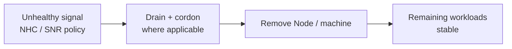
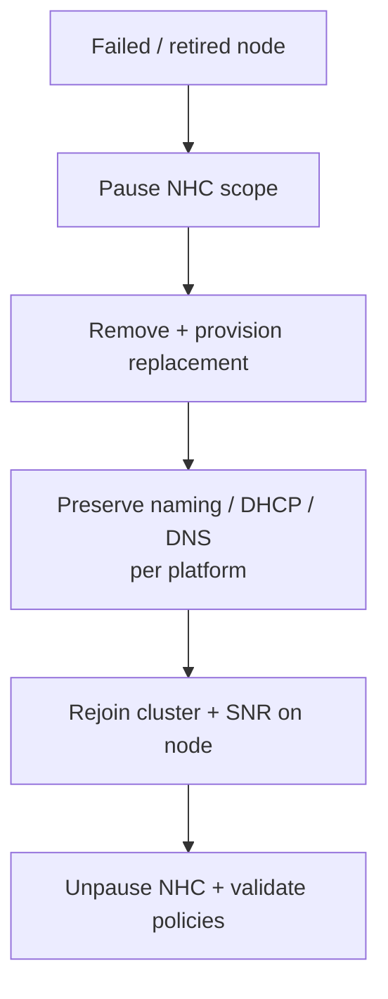
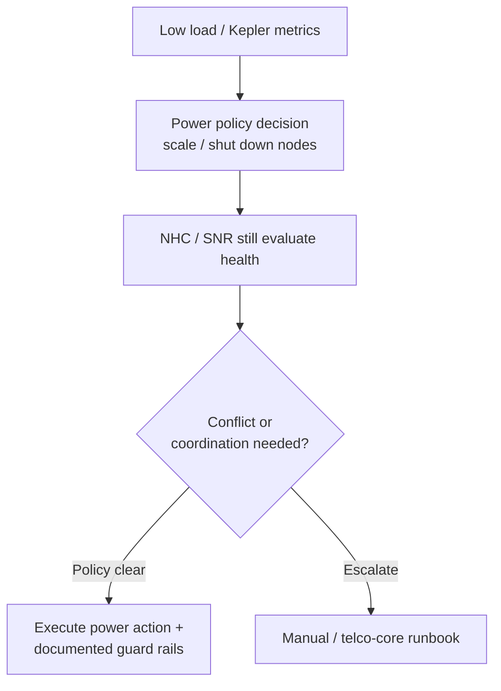
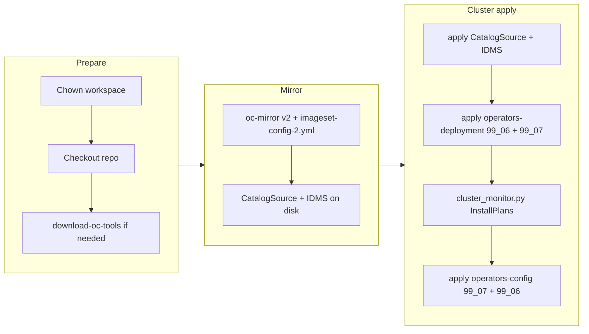
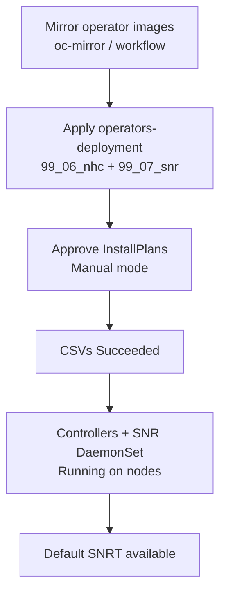
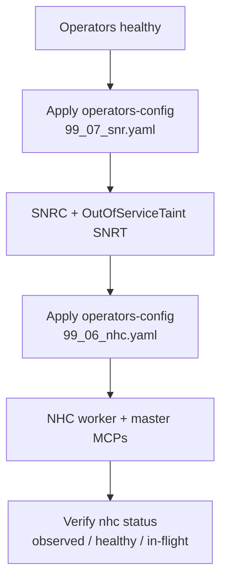
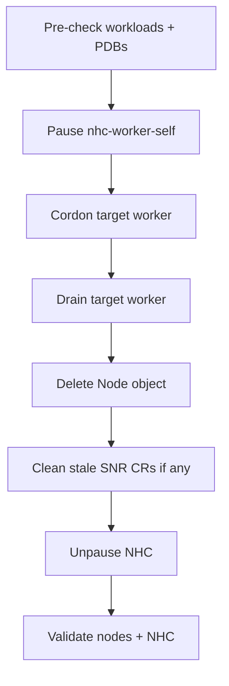
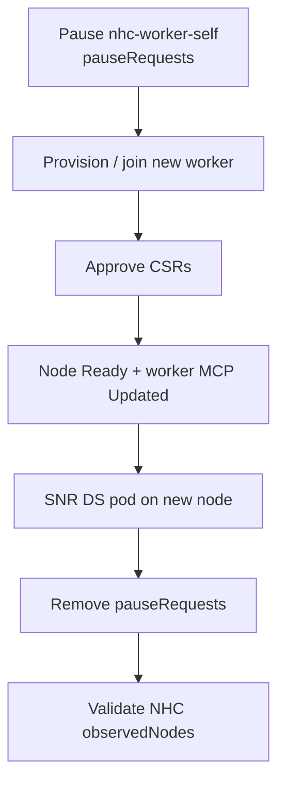
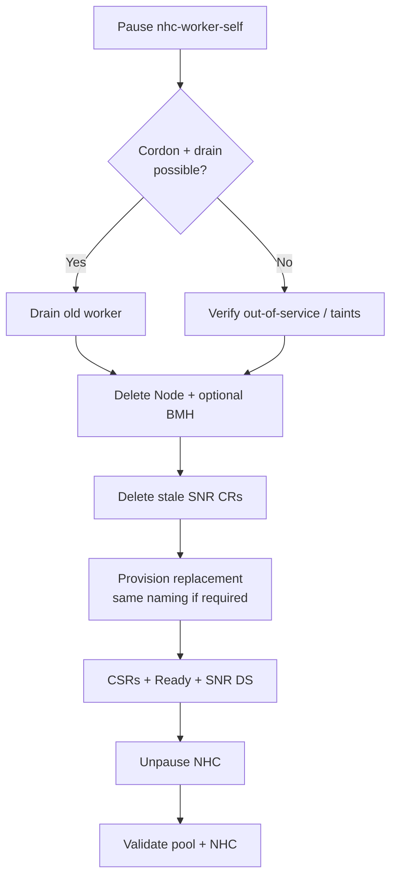
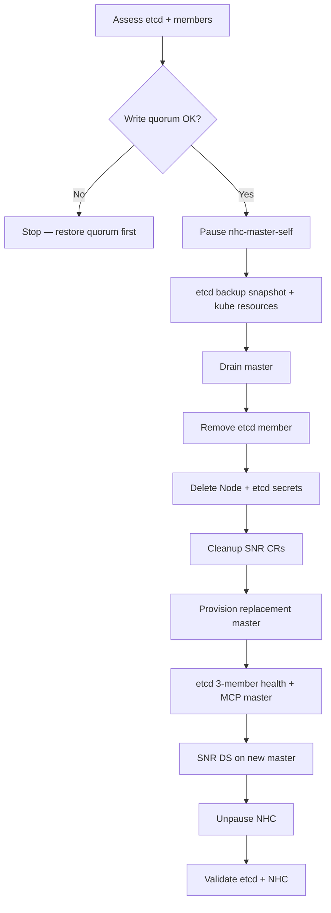

# CNF-20877 — Node lifecycle orchestration (removal, replacement, power optimization)

## User story

**As an integrator**, I need the ability to **manage the lifecycle of nodes** within the cluster—specifically **removal**, **replacement**, and **power optimization**—so that we maintain **operational efficiency** and **cost-effectiveness**.

## Table of Content

<!-- TOC -->

- [CNF-20877 — Node lifecycle orchestration removal, replacement, power optimization](#cnf-20877--node-lifecycle-orchestration-removal-replacement-power-optimization)
    - [1. User story](#1-user-story)
    - [2. Table of Content](#2-table-of-content)
    - [3. Relationship to telco-core RDS and other work](#3-relationship-to-telco-core-rds-and-other-work)
    - [4. Scope of work](#4-scope-of-work)
        - [4.1. Node removal](#41-node-removal)
        - [4.2. Node replacement](#42-node-replacement)
        - [4.3. Power saving / scaling](#43-power-saving--scaling)
    - [5. Acceptance criteria](#5-acceptance-criteria)
    - [6. Out of scope handled under other CNF-20877 streams](#6-out-of-scope-handled-under-other-cnf-20877-streams)
    - [7. Automation: snr-deployment.yml workflow](#7-automation-snr-deploymentyml-workflow)
            - [7.1. Pipeline Mermaid](#71-pipeline-mermaid)
        - [4.4. High-level stages](#44-high-level-stages)
        - [4.5. Inputs non-exhaustive](#45-inputs-non-exhaustive)
        - [4.6. Integration note](#46-integration-note)
    - [8. References repository](#8-references-repository)
    - [9. Cluster validation evidence](#9-cluster-validation-evidence)
        - [9.1. Cluster nodes](#91-cluster-nodes)
        - [9.2. MachineConfigPools](#92-machineconfigpools)
        - [9.3. OperatorGroup AllNamespaces mode](#93-operatorgroup-allnamespaces-mode)
        - [9.4. Subscriptions](#94-subscriptions)
        - [9.5. ClusterServiceVersions](#95-clusterserviceversions)
        - [9.6. Operator pods](#96-operator-pods)
        - [9.7. SelfNodeRemediationConfig](#97-selfnoderemediationconfig)
        - [9.8. SelfNodeRemediationTemplates](#98-selfnoderemediationtemplates)
        - [9.9. NodeHealthCheck — worker MCP](#99-nodehealthcheck--worker-mcp)
        - [9.10. NodeHealthCheck — master MCP](#910-nodehealthcheck--master-mcp)
        - [9.11. NHC summary](#911-nhc-summary)
        - [9.12. etcd cluster health](#912-etcd-cluster-health)
    - [10. Use-case runbooks](#10-use-case-runbooks)
        - [10.1. Cluster topology reference](#101-cluster-topology-reference)
        - [10.2. Manifest inventory](#102-manifest-inventory)
        - [10.3. Installation](#103-installation)
        - [10.4. Configuration](#104-configuration)
        - [10.5. Use-case 1 — Worker node removal](#105-use-case-1--worker-node-removal)
        - [10.6. Use-case 3 — Worker pool expansion](#106-use-case-3--worker-pool-expansion)
        - [10.7. Use-case 4 — Worker node replacement](#107-use-case-4--worker-node-replacement)
        - [10.8. Use-case 5 — Master node replacement](#108-use-case-5--master-node-replacement)
    - [11. Document history](#11-document-history)

<!-- /TOC -->

## Relationship to telco-core RDS and other work

| Track | Responsibility |
|--------|----------------|
| **This initiative (node-level orchestration & validation)** | Processes, workflows, and validation for **graceful node transitions** using **Node Health Check (NHC)** and **Self Node Remediation (SNR)** operators, plus integration points for **power-aware scaling** (e.g. Kepler-driven low-load behavior). |
| **Telco-core RDS updates (CNF-20877 — parallel stream)** | Applying the relevant **Custom Resources (CRs)** to the telco-core Reference Design Specification (RDS). |
| **Functional testing (CNF-20877 — parallel stream)** | **Disaster Recovery (DR)** and **Upgrade** scenario testing. |

While RDS CR updates and DR/Upgrade functional tests progress under the broader **CNF-20877** program, **this document focuses on orchestration and validation of node-level transitions** (not on authoring RDS CR content or executing DR/Upgrade test suites).

---

## Scope of work

### 1. Node removal

Define and implement the **process and procedure** for **gracefully decommissioning and removing** a node from an **active** cluster, using the **Node Health Check** and **Self Node Remediation** operators as part of the control path (health signals, remediation policy, and safe drain/remove sequencing as applicable).

**Goals:** predictable ordering, minimal blast radius, and documented operator interactions (NHC/SNR) with standard OpenShift node deletion practices.



### 2. Node replacement

Define and implement the **workflow and procedure** for replacing a **failed or retired** node with **new hardware / compute** while **preserving platform-level naming** and identity expectations of the old node (where the platform and DNS/DHCP design require it), in an **active** cluster that uses **Node Health Check** and **Self Node Remediation** operators.

**Goals:** repeatable replacement runbooks, alignment with install/scale patterns (e.g. `oc adm node-image` / agent workflows where used), and validation that NHC/SNR policies remain consistent after replacement.



### 3. Power saving / scaling

Define and implement **power-saving** behavior for **low load** (e.g. using **Kepler** for power/energy visibility and triggers) to **reduce power consumption** on underutilized nodes, and **restore** capacity as **demand increases**, while the cluster continues to use **Node Health Check** and **Self Node Remediation** operators for health and remediation.

**Goals:** clear boundaries between **power management** actions and **operator-driven remediation**, documented escalation paths, and safe coordination so NHC/SNR do not fight automated power state changes without policy.



---

## Acceptance criteria

| # | Criterion |
|---|-----------|
| AC1 | **Node removal:** Nodes can be **removed** from the cluster **without compromising stability** of remaining workloads (validated procedures + checks). |
| AC2 | **Node replacement:** **New nodes** can be **provisioned** and **integrated** to **replace** removed nodes, with naming/platform expectations documented and verified. |
| AC3 | **Power workflows:** **Power-saving** flows can **shut down** underutilized nodes and **bring them back** based on **load (or equivalent) triggers**, with documented interaction with NHC/SNR. |
| AC4 | **Documentation:** **Integration** of these lifecycle events within the **broader telco-core framework** is **documented** (architecture notes, runbooks, and pointers to automation). |

---

## Out of scope (handled under other CNF-20877 streams)

The following remain **out of scope for this node-lifecycle orchestration track**; they are covered elsewhere under **CNF-20877**:

- Updating **telco-core RDS** with the necessary **CRs**.
- **Functional testing** of **Disaster Recovery (DR)** use cases.
- **Functional testing** of **Upgrade** scenarios.

---

## Automation: `snr-deployment.yml` workflow

The repository provides a GitHub Actions workflow to **deploy the Node Health Check and Self Node Remediation operators** on an OpenShift cluster (air-gapped mirror + cluster apply + monitoring). This supports the **prerequisite operator footprint** for the lifecycle work above.

| Item | Detail |
|------|--------|
| **Workflow file** | [`.github/workflows/snr-deployment.yml`](../.github/workflows/snr-deployment.yml) |
| **Trigger** | `workflow_dispatch` (manual), concurrency group `snr-deployment` |
| **Runner** | Self-hosted `linux` / `x64` (typical integration lab) |

#### Pipeline (Mermaid)



### High-level stages

1. **Prepare tools** — Workspace ownership fix, checkout, `make download-oc-tools` if `./bin/oc` or `./bin/oc-mirror` is missing.
2. **Mirror operators** — `oc-mirror` v2 using `imageset-config-2.yml` (configurable), workspace under `hub-demo/` (default), destination registry path (e.g. `hub-demo-2`).
3. **Apply cluster mirror metadata** — `oc apply` of **CatalogSource** and **ImageDigestMirrorSet** manifests generated under  
   `{workspace_dir}/working-dir/cluster-resources/`  
   (defaults: `cs-redhat-operators-disconnected-2-v4-18.yaml`, `idms-oc-mirror.yaml`).
4. **Apply operator subscriptions** — `oc apply` of  
   - `hub-config/operators-deployment/99_06_nhc.yaml` (namespace, OperatorGroup, Node Health Check subscription), then  
   - `hub-config/operators-deployment/99_07_snr.yaml` (Self Node Remediation subscription; shared `openshift-workload-availability` namespace / OperatorGroup).
5. **Wait for operator rollout** — `monitoring/cluster_monitor.py` with `--installplan` and configurable `--stable-for` (default 600 seconds), using kubeconfig from workflow input `kubeconfig_path`.
6. **Apply operator configuration (CRs)** — After CSVs are healthy, `oc apply` of  
   - `hub-config/operators-config/99_07_snr.yaml` first (`SelfNodeRemediationConfig`, `SelfNodeRemediationTemplate`), then  
   - `hub-config/operators-config/99_06_nhc.yaml` (`NodeHealthCheck` CRs).  
   Paths are configurable via workflow inputs `operators_config_snr` and `operators_config_nhc`.

### Inputs (non-exhaustive)

Key inputs include: `ocp_version`, `registry_url`, `dest_namespace`, `imageset_config`, `workspace_dir`, `docker_config`, mirror parallelism and logging, `kubeconfig_path`, catalog/IDMS manifest names, `cluster_monitor_stable_for`, and `operators_config_nhc` / `operators_config_snr`.

### Integration note

- **This workflow does not** implement node removal/replacement/power policies by itself; it **installs and stabilizes** NHC/SNR so that **documented runbooks and telco-core integration** can rely on those operators.
- **Kepler** and **power-scaling** flows should be documented and validated **in addition** to this workflow, with explicit policy on how they interact with NHC/SNR (see *Scope §3*).

---

## References (repository)

| Resource | Purpose |
|----------|---------|
| `hub-config/operators-deployment/99_06_nhc.yaml` | Namespace, OperatorGroup, NHC `Subscription` |
| `hub-config/operators-deployment/99_07_snr.yaml` | SNR `Subscription` (shared namespace / OperatorGroup) |
| `imageset-config-2.yml` | Operator packages mirrored for NHC/SNR (e.g. disconnected catalog) |
| `monitoring/cluster_monitor.py` | InstallPlan monitoring after apply |

---

## Cluster validation evidence

All outputs collected from the live cluster on 2026-03-23 after completing installation and configuration.

### Cluster nodes

```
$ oc get nodes
NAME                                   STATUS   ROLES                         AGE    VERSION
hub-ctlplane-0.hub.5g-deployment.lab   Ready    control-plane,master,worker   113m   v1.31.13
hub-ctlplane-1.hub.5g-deployment.lab   Ready    control-plane,master,worker   131m   v1.31.13
hub-ctlplane-2.hub.5g-deployment.lab   Ready    control-plane,master,worker   131m   v1.31.13
hub-worker-0.hub.5g-deployment.lab     Ready    worker                        62m    v1.31.13
hub-worker-1.hub.5g-deployment.lab     Ready    worker                        63m    v1.31.13
```

### MachineConfigPools

```
$ oc get mcp -o custom-columns='NAME:.metadata.name,UPDATED:..Updated..status,DEGRADED:..Degraded..status,NODES:.status.machineCount,READY:.status.readyMachineCount'
NAME     UPDATED   DEGRADED   NODES   READY
master   True      False      3       3
worker   True      False      2       2
```

### OperatorGroup (AllNamespaces mode)

```
$ oc get operatorgroup -n openshift-workload-availability
NAME                        AGE
node-healthcheck-operator   28m
```

`spec: {}` — no `targetNamespaces`, which enables `AllNamespaces` install mode as required by both operators.

### Subscriptions

```
$ oc get sub -n openshift-workload-availability -o custom-columns='NAME:..name,STATE:..state,CSV:..currentCSV,CHANNEL:..channel,APPROVAL:..installPlanApproval'
NAME                        STATE           CSV                                 CHANNEL   APPROVAL
node-healthcheck-operator   AtLatestKnown   node-healthcheck-operator.v0.10.1   stable    Manual
self-node-remediation       AtLatestKnown   self-node-remediation.v0.11.0       stable    Manual
```

### ClusterServiceVersions

```
$ oc get csv -n openshift-workload-availability
NAME                                     DISPLAY                          VERSION   REPLACES                               PHASE
node-healthcheck-operator.v0.10.1        Node Health Check Operator       0.10.1    node-healthcheck-operator.v0.10.0      Succeeded
self-node-remediation.v0.11.0            Self Node Remediation Operator   0.11.0    self-node-remediation.v0.10.2          Succeeded
```

### Operator pods

```
$ oc get pods -n openshift-workload-availability -o wide
NAME                                                              READY   STATUS    NODE
node-healthcheck-controller-manager-fbfddd76d-gqdw9               2/2     Running   hub-ctlplane-1
node-healthcheck-controller-manager-fbfddd76d-kpqtw               2/2     Running   hub-ctlplane-0
node-healthcheck-node-remediation-console-plugin-678c75d55px6hw   1/1     Running   hub-ctlplane-1
self-node-remediation-controller-manager-7f5fc87778-dvht2         2/2     Running   hub-worker-0
self-node-remediation-controller-manager-7f5fc87778-gfd5b         2/2     Running   hub-worker-1
self-node-remediation-ds-9wk7d                                    1/1     Running   hub-ctlplane-2
self-node-remediation-ds-c7jp4                                    1/1     Running   hub-worker-1
self-node-remediation-ds-jx9tx                                    1/1     Running   hub-ctlplane-1
self-node-remediation-ds-v7hvm                                    1/1     Running   hub-ctlplane-0
self-node-remediation-ds-vgq24                                    1/1     Running   hub-worker-0
```

SNR DaemonSet pod running on all 5 nodes (3 masters + 2 workers). NHC controller replicas on two master nodes. Console plugin active.

### SelfNodeRemediationConfig

```
$ oc get snrc -n openshift-workload-availability -o custom-columns='NAME:..name,API_CHECK:..apiCheckInterval,TIMEOUT:..apiServerTimeout,MAX_ERRORS:..maxApiErrorThreshold,MIN_PEERS:..minPeersForRemediation,WATCHDOG:..watchdogFilePath,SW_REBOOT:..isSoftwareRebootEnabled'
NAME                           API_CHECK   TIMEOUT   MAX_ERRORS   MIN_PEERS   WATCHDOG        SW_REBOOT
self-node-remediation-config   15s         5s        3            1           /dev/watchdog   true
```

### SelfNodeRemediationTemplates

```
$ oc get snrt -n openshift-workload-availability -o custom-columns='NAME:..name,STRATEGY:..remediationStrategy'
NAME                                                        STRATEGY
self-node-remediation-automatic-strategy-template           Automatic
self-node-remediation-outofservicetaint-strategy-template   OutOfServiceTaint
```

Two templates available: `Automatic` (operator-created default, used by both NHCs) and `OutOfServiceTaint` (applied via `99_07_snr.yaml` for stateful workload recovery).

### NodeHealthCheck — worker MCP

```
$ oc get nhc nhc-worker-self -o yaml
status:
  conditions:
  - lastTransitionTime: "2026-03-23T13:17:37Z"
    message: No issues found, NodeHealthCheck is enabled.
    reason: NodeHealthCheckEnabled
    status: "False"
    type: Disabled
  healthyNodes: 2
  observedNodes: 2
  phase: Enabled
  reason: NHC is enabled, no ongoing remediation
```

2 observed, 2 healthy — matches the 2 worker-only nodes (`hub-worker-0`, `hub-worker-1`). Control-plane nodes correctly excluded by `control-plane=DoesNotExist` selector.

### NodeHealthCheck — master MCP

```
$ oc get nhc nhc-master-self -o yaml
status:
  conditions:
  - lastTransitionTime: "2026-03-23T13:17:38Z"
    message: No issues found, NodeHealthCheck is enabled.
    reason: NodeHealthCheckEnabled
    status: "False"
    type: Disabled
  healthyNodes: 3
  observedNodes: 3
  phase: Enabled
  reason: NHC is enabled, no ongoing remediation
```

3 observed, 3 healthy — matches all 3 control-plane nodes. `maxUnhealthy: 2` guard rail active (remediation blocked only if all 3 are down).

### NHC summary

```
$ oc get nhc
NAME              OBSERVED   HEALTHY   INFLIGHT
nhc-master-self   3          3         <none>
nhc-worker-self   2          2         <none>
```

No in-flight remediations. Both health checks enabled and monitoring.

### etcd cluster health

```
$ oc get etcd cluster -o jsonpath='{range .status.conditions[*]}{.type}: {.status} - {.message}{"\n"}{end}'
EtcdMembersAvailable: True - 3 members are available
EtcdMembersDegraded: False - No unhealthy members found
EtcdMembersProgressing: False - No unstarted etcd members found
NodeControllerDegraded: False - All master nodes are ready
StaticPodsAvailable: True - 3 nodes are active; 3 nodes are at revision 10
NodeInstallerProgressing: False - 3 nodes are at revision 10
```

Full 3-member etcd quorum. All static pods active at the same revision. No degraded conditions.

---

## Use-case runbooks

### Cluster topology reference

| Role | Nodes | Labels |
|------|-------|--------|
| Control-plane (master MCP) | `hub-ctlplane-{0,1,2}` | `node-role.kubernetes.io/control-plane`, `node-role.kubernetes.io/master`, `node-role.kubernetes.io/worker` |
| Worker (worker MCP) | `hub-worker-{0,1}` | `node-role.kubernetes.io/worker` |

### Manifest inventory

| File | Contents |
|------|----------|
| `hub-config/operators-deployment/99_06_nhc.yaml` | Namespace, OperatorGroup (`AllNamespaces`), NHC `Subscription` |
| `hub-config/operators-deployment/99_07_snr.yaml` | SNR `Subscription` (shared namespace/OperatorGroup) |
| `hub-config/operators-config/99_06_nhc.yaml` | `NodeHealthCheck` CRs for worker and master MCPs |
| `hub-config/operators-config/99_07_snr.yaml` | `SelfNodeRemediationConfig` + `SelfNodeRemediationTemplate` (OutOfServiceTaint) |

---

### Installation

Deploys the NHC and SNR operators into the cluster. In a disconnected environment the images must be mirrored first (handled by the `snr-deployment.yml` workflow or manually).



**Step 1 — Create namespace, OperatorGroup, and subscriptions**

```bash
oc apply -f hub-config/operators-deployment/99_06_nhc.yaml
oc apply -f hub-config/operators-deployment/99_07_snr.yaml
```

`99_06_nhc.yaml` creates:
- `Namespace` `openshift-workload-availability`
- `OperatorGroup` with `spec: {}` (AllNamespaces mode — required by both operators)
- `Subscription` for `node-healthcheck-operator` (channel: stable, Manual approval)

`99_07_snr.yaml` creates:
- Same Namespace and OperatorGroup (idempotent)
- `Subscription` for `self-node-remediation` (channel: stable, Manual approval)

**Step 2 — Approve InstallPlans (Manual approval mode)**

```bash
# List pending InstallPlans
oc get installplan -n openshift-workload-availability

# Approve each pending plan
oc patch installplan <plan-name> -n openshift-workload-availability \
  --type merge -p '{"spec":{"approved":true}}'
```

**Step 3 — Verify operator health**

```bash
# CSVs should show Succeeded
oc get csv -n openshift-workload-availability

# All pods Running (2 NHC controllers, 1 console plugin, 2 SNR controllers, 5 SNR DaemonSet pods)
oc get pods -n openshift-workload-availability

# SNR creates a default SelfNodeRemediationTemplate
oc get snrt -n openshift-workload-availability
```

Expected output: CSV `node-healthcheck-operator` and `self-node-remediation` both `Succeeded`, DaemonSet pod on every node.

---

### Configuration

Applies the health-check policies and remediation agent settings after the operators are running.



**Step 1 — Apply SelfNodeRemediationConfig and OutOfServiceTaint template**

```bash
oc apply -f hub-config/operators-config/99_07_snr.yaml
```

This creates two resources:

| Resource | Purpose |
|----------|---------|
| `SelfNodeRemediationConfig/self-node-remediation-config` | Agent behaviour: API check every 15 s, 3-strike threshold (~45 s), peer confirmation, watchdog `/dev/watchdog`, 180 s safe-reboot window |
| `SelfNodeRemediationTemplate/self-node-remediation-outofservicetaint-strategy-template` | OutOfServiceTaint strategy: applies `node.kubernetes.io/out-of-service` taint to force-evict stateful pods and force-detach PVCs |

**Step 2 — Apply NodeHealthCheck CRs for both MCPs**

```bash
oc apply -f hub-config/operators-config/99_06_nhc.yaml
```

This creates two `NodeHealthCheck` resources:

| NHC | Selector | Guard rail | Rationale |
|-----|----------|------------|-----------|
| `nhc-worker-self` | `worker=Exists` AND `control-plane=DoesNotExist` → 2 worker nodes | `minHealthy: 51%` | At least 1 of 2 workers must be healthy before remediation is allowed |
| `nhc-master-self` | `control-plane=Exists` → 3 master nodes | `maxUnhealthy: 2` | Remediation is blocked only when all 3 masters are unhealthy; preserves at least 1 master for etcd read-mode |

Both NHCs trigger when `Ready=False` or `Ready=Unknown` for 300 s and reference the `self-node-remediation-automatic-strategy-template`.

**Step 3 — Verify NHC status**

```bash
oc get nhc
oc describe nhc nhc-worker-self
oc describe nhc nhc-master-self
```

The NHC controller reports `ObservedNodes`, `HealthyNodes`, and `InFlightRemediations` in its status.

---
### Use-case 1 — Worker node removal

Gracefully remove a **dedicated worker** node while **Node Health Check** and **Self Node Remediation** are installed and configured (`nhc-worker-self` + SNR). This procedure was validated against a cluster with **two** workers (`hub-worker-0`, `hub-worker-1`) and **three** compact control-plane nodes (`hub-ctlplane-0`–`2`), OpenShift **4.x** / Kubernetes **v1.31.x**.

**Cluster context (example)**

```bash
oc get nodes
# NAME                                   STATUS   ROLES                         VERSION
# hub-ctlplane-0.hub.5g-deployment.lab   Ready    control-plane,master,worker   v1.31.13
# hub-ctlplane-1.hub.5g-deployment.lab   Ready    control-plane,master,worker   v1.31.13
# hub-ctlplane-2.hub.5g-deployment.lab   Ready    control-plane,master,worker   v1.31.13
# hub-worker-0.hub.5g-deployment.lab     Ready    worker                        v1.31.13
# hub-worker-1.hub.5g-deployment.lab     Ready    worker                        v1.31.13
```

**Target:** remove **`hub-worker-0.hub.5g-deployment.lab`** only.

**NHC guard rail:** `nhc-worker-self` uses `minHealthy: 51%` on worker-only nodes. With **two** workers, at least **one** must stay healthy. After removal, **one** worker remains — ensure that single node can carry your workload; NHC will then observe **one** worker and require it to be healthy.



**Step 1 — Preconditions**

```bash
# Confirm NHC/SNR objects exist
oc get nhc
oc get pods -n openshift-workload-availability -l app.kubernetes.io/name=self-node-remediation -o wide

# Review workloads on the node to remove (reschedule / PDBs)
oc get pods -A -o wide --field-selector spec.nodeName=hub-worker-0.hub.5g-deployment.lab
```

Resolve or tolerate **PodDisruptionBudgets** and **local data** (`emptyDir`) before drain.

**Step 2 — Pause NHC remediation for workers (intentional removal)**

While NHC/SNR remain **enabled**, pause remediation so drain/delete is not interpreted as an unexpected failure requiring automated reboot:

```bash
oc patch nhc nhc-worker-self --type merge -p \
  '{"spec":{"pauseRequests":["worker-node-removal-hub-worker-0"]}}'
```

Use a **unique** pause token per change window so you can audit it in `oc describe nhc nhc-worker-self`.

**Step 3 — Cordon and drain `hub-worker-0`**

```bash
oc adm cordon hub-worker-0.hub.5g-deployment.lab

oc adm drain hub-worker-0.hub.5g-deployment.lab \
  --ignore-daemonsets \
  --delete-emptydir-data \
  --force \
  --timeout=300s
```

If drain blocks on PDBs or local volumes, fix workloads or use `--disable-eviction` only when your policy allows (see OpenShift *Working with pods* / eviction docs).

**Step 4 — Delete the Node object**

```bash
oc delete node hub-worker-0.hub.5g-deployment.lab
```

If your platform uses **Machine** / **Metal3** / **MachineSet** for workers, also remove or scale the corresponding **Machine** so the node is not re-created automatically — follow your install method’s removal procedure.

**Step 5 — Clean up stale `SelfNodeRemediation` CRs (if any)**

```bash
oc get snr -n openshift-workload-availability
oc delete snr <stale-snr-name> -n openshift-workload-availability
```

**Step 6 — Unpause NHC remediation**

```bash
oc patch nhc nhc-worker-self --type json -p \
  '[{"op":"remove","path":"/spec/pauseRequests"}]'
```

If you use multiple `pauseRequests`, remove only the entry you added (JSON patch `remove` on the specific index) instead of clearing all.

**Step 7 — Validate cluster and NHC**

```bash
oc get nodes
# Expect hub-worker-1 only under workers (plus ctlplanes as in your topology)

oc get nhc nhc-worker-self -o jsonpath='{.status.observedNodes}{"\n"}{.status.healthyNodes}{"\n"}'
oc describe nhc nhc-worker-self
```

Confirm **`hub-worker-1.hub.5g-deployment.lab`** is **Ready** and SNR DaemonSet pods still run where expected:

```bash
oc get pods -n openshift-workload-availability -l app.kubernetes.io/name=self-node-remediation -o wide
```

> **Capacity:** With a **single** remaining worker, schedule only what that node can support; add another worker (Use-case 3) before heavy load if needed.

### Use-case 2 — Master node removal

### Use-case 3 — Worker pool expansion

Adding a new worker node to the cluster while NHC/SNR are active.



**Step 1 — Pause NHC remediation for workers during scale-up**

```bash
oc patch nhc nhc-worker-self --type merge -p \
  '{"spec":{"pauseRequests":["worker-pool-expansion"]}}'
```

This prevents NHC from triggering remediation on new nodes that are still bootstrapping and reporting `Ready=Unknown`.

**Step 2 — Provision and add the new worker node**

Use the cluster's provisioning method (e.g. BareMetalHost, `oc adm node-image`, agent-based installer):

```bash
# Example: approve pending CSRs for the new node
oc get csr | grep Pending
oc adm certificate approve <csr-name>
```

**Step 3 — Wait for node to join and become Ready**

```bash
oc get nodes -w
# Wait until the new worker shows Ready
oc get mcp worker
# Wait until UPDATED=True, DEGRADED=False
```

**Step 4 — Verify SNR DaemonSet pod is running on the new node**

```bash
oc get pods -n openshift-workload-availability -l app.kubernetes.io/name=self-node-remediation \
  -o wide --field-selector spec.nodeName=<new-node-name>
```

**Step 5 — Unpause NHC remediation**

```bash
oc patch nhc nhc-worker-self --type json -p \
  '[{"op":"remove","path":"/spec/pauseRequests"}]'
```

**Step 6 — Validate**

```bash
oc get nhc nhc-worker-self -o jsonpath='{.status.observedNodes}{"\n"}'
# Should now include the new node count
oc get nodes -l 'node-role.kubernetes.io/worker,!node-role.kubernetes.io/control-plane'
```

> **Note:** `minHealthy: 51%` scales automatically — with 3 workers, at least 2 must be healthy (ceil(3 × 0.51) = 2).

---

### Use-case 4 — Worker node replacement

Replacing a failed or retired worker node with new hardware.



**Step 1 — Pause NHC remediation for workers**

```bash
oc patch nhc nhc-worker-self --type merge -p \
  '{"spec":{"pauseRequests":["worker-node-replacement"]}}'
```

**Step 2 — Cordon and drain the node being replaced**

If the node is still reachable:

```bash
oc adm cordon <old-worker-node>
oc adm drain <old-worker-node> --ignore-daemonsets --delete-emptydir-data --force --timeout=120s
```

If the node is unreachable (already failed), the SNR agent may have already applied the out-of-service taint. Verify:

```bash
oc get node <old-worker-node> -o jsonpath='{.spec.taints[*].key}{"\n"}'
```

**Step 3 — Delete the old node object**

```bash
oc delete node <old-worker-node>
```

If using BareMetalHost, also clean up the BMH resource:

```bash
oc get bmh -n openshift-machine-api
oc delete bmh <old-bmh> -n openshift-machine-api
```

**Step 4 — Clean up any stale SelfNodeRemediation CRs**

```bash
oc get snr --all-namespaces
# Delete any SNR CR referencing the old node
oc delete snr <old-node-snr> -n openshift-workload-availability
```

**Step 5 — Provision the replacement node**

Provision new hardware using the cluster's method. 

If the replacement reuses the same hostname, FQDN, and MAC (platform/DNS/DHCP design), ensure the old entries are cleaned before reprovisioning.

```bash
# Approve CSRs for the replacement node
oc get csr | grep Pending
oc adm certificate approve <csr-name>

# Watch until it joins
oc get nodes -w
oc get mcp worker
```
If the replacement uses a new hostname, FQDN, and MAC, the following example its something can be used as reference for ABI/IPI/UPI deployment methods: 

```yaml
# Aligned with dnsmasq hub.ipv4 on INBACRNRDL0102 (e.g. /opt/dnsmasq/include.d/hub.ipv4):
#   dhcp-host=aa:aa:aa:aa:01:08,ocp-worker-2,172.16.30.28
# DNS / gateway: infra.5g-deployment.lab → 172.16.30.1 (host-record on dnsmasq)
hosts:
- hostname: hub-worker-2.hub.5g-deployment.lab
  interfaces:
    - name: enp1s0
      macAddress: aa:aa:aa:aa:01:08
  rootDeviceHints:
    deviceName: "/dev/vda"
  networkConfig:
    interfaces:
      - name: enp1s0
        type: ethernet
        state: up
        mac-address: aa:aa:aa:aa:01:08
        ipv4:
          enabled: true
          address:
            - ip: 172.16.30.28
              prefix-length: 24
          dhcp: false
        ipv6:
          enabled: false
      - name: br-ex
        type: linux-bridge
        state: up
        mtu: 1500
    dns-resolver:
      config:
        server:
          - 172.16.30.1
    routes:
      config:
        - destination: 0.0.0.0/0
          next-hop-address: 172.16.30.1
          next-hop-interface: enp1s0
          table-id: 254
```

> Note: The parameter values can be used as exemple, ensure you adthere to your environment values. 

If the replacement uses a new hostname, FQDN, and MAC, the following example its something can be used as reference for ZTP deployment methods: 

```yaml
TBD
```

**Step 6 — Verify SNR DaemonSet pod on the replacement node**

```bash
oc get pods -n openshift-workload-availability -o wide | grep <new-node>
```

**Step 7 — Unpause NHC remediation**

```bash
oc patch nhc nhc-worker-self --type json -p \
  '[{"op":"remove","path":"/spec/pauseRequests"}]'
```

**Step 8 — Validate health check coverage**

```bash
oc get nhc nhc-worker-self -o jsonpath='{.status.observedNodes}{"\n"}'
oc get nodes -l 'node-role.kubernetes.io/worker,!node-role.kubernetes.io/control-plane'
```

---

### Use-case 5 — Master node replacement

Replacing a failed or retired control-plane node. This is more sensitive due to etcd quorum requirements.



**Step 1 — Assess etcd quorum before starting**

```bash
oc get etcd cluster -o jsonpath='{range .status.conditions[*]}{.type}: {.status} - {.message}{"\n"}{end}'
oc get pods -n openshift-etcd -l app=etcd -o wide
```

Confirm at least 2 etcd members are healthy (write quorum). If only 1 is healthy, **do not proceed** — restore a second member first.

**Step 2 — Pause NHC remediation for masters**

```bash
oc patch nhc nhc-master-self --type merge -p \
  '{"spec":{"pauseRequests":["master-node-replacement"]}}'
```

**Step 3 — Back up etcd (before cordon / drain)**

Take a **consistent etcd snapshot** and capture **Kubernetes static-pod resources** while write quorum is still intact and **before** you cordon or drain the node. Store artifacts **off the node** (secure object storage, bastion, or backup vault).

**Preferred (OpenShift 4.18+):** follow Red Hat **Backing up etcd** — [control plane backup and restore](https://docs.redhat.com/en/documentation/openshift_container_platform/4.18/html/backup_and_restore/control-plane-backup-and-restore#backing-up-etcd) (GA automated / on-demand backup flows for your version).

**This repository:** use the one-time backup Job and procedure in [`etcd_backup.md`](../etcd_backup.md) with [`etcd_backup.yaml`](../etcd_backup.yaml) (namespace `ocp-etcd-backup`). Example:

```bash
# If not already installed: install CronJob + RBAC once (see etcd_backup.md)
oc create -f etcd_backup.yaml

# Trigger a backup Job from the CronJob (or wait for schedule); confirm Completed
oc get pods -n ocp-etcd-backup -w
oc logs -n ocp-etcd-backup -l job-name=backup --tail=-1
```

Verify logs show a successful **snapshot** (`.db`) and that **kube static-pod resources** were collected. Copy snapshot and bundles to **external** storage before continuing.

> **Do not skip:** If replacement goes wrong, etcd restore procedures require a recent snapshot. Re-run Step 3 if the maintenance window is long or you retry the replacement later.

**Step 4 — Cordon and drain the master node being replaced**

If reachable:

```bash
oc adm cordon <old-master-node>
oc adm drain <old-master-node> --ignore-daemonsets --delete-emptydir-data --force --timeout=180s
```

**Step 5 — Remove the etcd member**

Use the **etcd static-pod** for a **healthy** control-plane node (not the one being replaced). Those pods are labeled `app=etcd` and `k8s-app=etcd` (see `oc get pods -n openshift-etcd --show-labels`). **Do not** use `etcd-guard-*` pods.

```bash
# Resolve the etcd pod on a healthy master by node name (FQDN as shown in oc get nodes)
HEALTHY_NODE=<healthy-master-fqdn>   # e.g. hub-ctlplane-0.hub.5g-deployment.lab
ETCD_POD=$(oc get pods -n openshift-etcd -l app=etcd,k8s-app=etcd \
  --field-selector spec.nodeName="${HEALTHY_NODE}",status.phase=Running \
  -o jsonpath='{.items[0].metadata.name}')

# Identify the etcd member ID to remove (the member for <old-master-node>)
oc rsh -n openshift-etcd "${ETCD_POD}" etcdctl member list -w table

# Remove the failed member
oc rsh -n openshift-etcd "${ETCD_POD}" etcdctl member remove <member-id>
```

**Interpreting `etcdctl member list -w table`**

Example output (3 control-plane nodes):

```text
+------------------+---------+--------------------------------------+---------------------------+---------------------------+------------+
|        ID        | STATUS  |                 NAME                 |        PEER ADDRS         |       CLIENT ADDRS        | IS LEARNER |
+------------------+---------+--------------------------------------+---------------------------+---------------------------+------------+
| 820e48b8edbeda19 | started | hub-ctlplane-1.hub.5g-deployment.lab | https://172.16.30.21:2380 | https://172.16.30.21:2379 |      false |
| b67e212807ddedcd | started | hub-ctlplane-2.hub.5g-deployment.lab | https://172.16.30.22:2380 | https://172.16.30.22:2379 |      false |
| f8a45df83ba07c61 | started | hub-ctlplane-0.hub.5g-deployment.lab | https://172.16.30.20:2380 | https://172.16.30.20:2379 |      false |
+------------------+---------+--------------------------------------+---------------------------+---------------------------+------------+
```

| Column | Meaning |
|--------|---------|
| **ID** | Hex member ID used with `etcdctl member remove <id>` (see [etcd runtime reconfiguration](https://etcd.io/docs/v3.5/op-guide/runtime-configuration/#remove-a-member)). |
| **STATUS** | Member state (e.g. `started`). |
| **NAME** | etcd member name (typically matches the control-plane node hostname). |
| **PEER ADDRS** | Raft / etcd peer traffic (usually port **2380**). |
| **CLIENT ADDRS** | Client API (usually port **2379**). |
| **IS LEARNER** | Whether the member is a **learner** (non-voting); `false` for full voting members. |

Public references:

- **etcd (upstream):** [Runtime configuration](https://etcd.io/docs/v3.5/op-guide/runtime-configuration/) — cluster membership (`member list`, `member remove`, learners).
- **OpenShift (Red Hat):** [Backup and restore](https://docs.redhat.com/en/documentation/openshift_container_platform/4.18/html/backup_and_restore/control-plane-backup-and-restore) — *Control plane backup and restore*; includes procedures that use **etcd** member operations when **replacing** or **recovering** members (see the section on replacing an unhealthy etcd member for your minor version).

**Step 6 — Delete the old node and associated secrets**

```bash
oc delete node <old-master-node>

# Delete etcd peer/serving/metrics secrets for the old node
oc get secrets -n openshift-etcd | grep <old-master-hostname>
oc delete secret -n openshift-etcd <etcd-peer-old-node> <etcd-serving-old-node> <etcd-serving-metrics-old-node>
```

**Step 7 — Clean up stale SelfNodeRemediation CRs**

```bash
oc get snr --all-namespaces
oc delete snr <old-node-snr> -n openshift-workload-availability
```

**Step 8 — Provision the replacement master node**

Use the cluster's provisioning method. The replacement must use the same hostname/FQDN if the DNS/DHCP and platform design require it. Approve CSRs:

```bash
oc get csr | grep Pending
oc adm certificate approve <csr-name>
# May need to approve twice (node-bootstrapper + node-serving)
```

**Step 9 — Wait for etcd to re-form quorum**

```bash
# Watch the new etcd member join (etcd static pods only; same labels as above)
oc get pods -n openshift-etcd -l app=etcd,k8s-app=etcd -o wide -w

# Verify 3-member quorum restored (use ETCD_POD on any healthy master, as in Step 5)
HEALTHY_NODE=<healthy-master-fqdn>
ETCD_POD=$(oc get pods -n openshift-etcd -l app=etcd,k8s-app=etcd \
  --field-selector spec.nodeName="${HEALTHY_NODE}",status.phase=Running \
  -o jsonpath='{.items[0].metadata.name}')
oc rsh -n openshift-etcd "${ETCD_POD}" etcdctl member list -w table
oc rsh -n openshift-etcd "${ETCD_POD}" etcdctl endpoint health --cluster
```

**Step 10 — Wait for MCP convergence**

```bash
oc get mcp master
# Wait until UPDATED=True, UPDATING=False, DEGRADED=False, READYMACHINECOUNT=3
```

**Step 11 — Verify SNR DaemonSet pod on replacement master**

```bash
oc get pods -n openshift-workload-availability -o wide | grep <new-master>
```

**Step 12 — Unpause NHC remediation**

```bash
oc patch nhc nhc-master-self --type json -p \
  '[{"op":"remove","path":"/spec/pauseRequests"}]'
```

**Step 13 — Validate health check coverage and etcd**

```bash
oc get nhc nhc-master-self -o jsonpath='{.status.observedNodes}{"\n"}'
oc get nodes -l node-role.kubernetes.io/control-plane
oc get etcd cluster -o jsonpath='{range .status.conditions[*]}{.type}: {.status}{"\n"}{end}'
```

> **Quorum safety:** `nhc-master-self` uses `maxUnhealthy: 2`. During replacement only 1 master is removed at a time. If a second master fails while replacement is in progress, SNR will still remediate it (2 ≤ maxUnhealthy). Remediation is only blocked if all 3 masters are unhealthy simultaneously, preventing a cascading reboot storm on a fully-down control plane.

---

## Document history

| Version | Date | Notes |
|---------|------|--------|
| 1.0 | — | Initial scope, acceptance criteria, out-of-scope split, and `snr-deployment.yml` integration |
| 2.0 | 2026-03-23 | Added use-case runbooks: installation, configuration, worker pool expansion, worker node replacement, master node replacement. Linked to validated `99_06_nhc.yaml` and `99_07_snr.yaml` manifests. |
| 2.1 | 2026-03-23 | Added Mermaid workflow diagrams for scope (removal / replacement / power), `snr-deployment.yml` pipeline, and use-cases 1–5. |
| 2.2 | 2026-03-24 | Use-case 5 (master replacement): added Step 3 etcd backup before cordon/drain; linked `etcd_backup.md` / OCP 4.18 docs; renumbered following steps. |
| 2.3 | 2026-03-24 | Use-case 5 Steps 5 & 9: resolve etcd pod via `app=etcd,k8s-app=etcd` + `spec.nodeName` field selector instead of bare `etcd-<node>` pod name. |
| 2.4 | 2026-03-24 | Use-case 5: added sample `etcdctl member list -w table` output, column reference, and links to etcd.io v3.5 runtime configuration + OCP 4.18 control-plane backup/restore docs. |
| 2.5 | 2026-03-24 | Use-case 1: full worker removal runbook for `hub-worker-0.hub.5g-deployment.lab` with NHC pause, drain, delete node, SNR cleanup, unpause, validate (2-worker cluster). |
