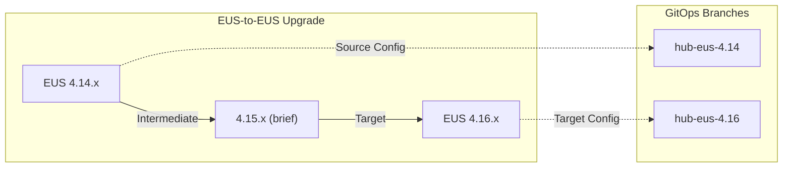
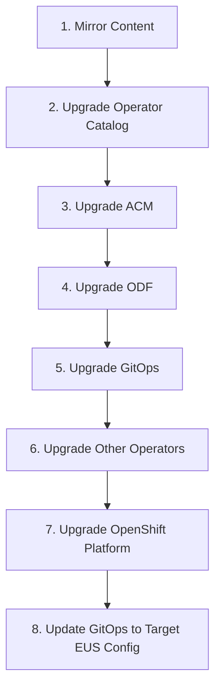

# EUS Upgrade Method of Procedure

The purpose of this document is to provide a validated procedure for upgrading a Hub RDS-compliant OpenShift cluster from one Extended Update Support (EUS) release to the next EUS release. The upgrade is fully orchestrated by ArgoCD and designed to be non-disruptive to managed spoke clusters.

> [!CAUTION]
> Unless specified otherwise, everything contained in this repository is unsupported by Red Hat.

## Table of Contents

- [EUS Upgrade Method of Procedure](#eus-upgrade-method-of-procedure)
  - [Table of Contents](#table-of-contents)
  - [Overview](#overview)
  - [Scope and Requirements](#scope-and-requirements)
    - [Cluster Topology](#cluster-topology)
    - [Upgrade Requirements](#upgrade-requirements)
    - [GitOps Strategy](#gitops-strategy)
  - [Prerequisites](#prerequisites)
  - [EUS Upgrade Path](#eus-upgrade-path)
  - [Method of Procedure](#method-of-procedure)
    - [Phase 0: Pre-Upgrade Validation](#phase-0-pre-upgrade-validation)
    - [Phase 1: Prepare the Target EUS Configuration in Git](#phase-1-prepare-the-target-eus-configuration-in-git)
    - [Phase 2: Mirror Required Content](#phase-2-mirror-required-content)
    - [Phase 3: Pause Spoke Cluster Operations](#phase-3-pause-spoke-cluster-operations)
    - [Phase 4: Upgrade ACM and Operators](#phase-4-upgrade-acm-and-operators)
    - [Phase 5: Upgrade OpenShift Platform (EUS-to-EUS)](#phase-5-upgrade-openshift-platform-eus-to-eus)
    - [Phase 6: Update ArgoCD to Target EUS Configuration](#phase-6-update-argocd-to-target-eus-configuration)
    - [Phase 7: Post-Upgrade Validation](#phase-7-post-upgrade-validation)
    - [Phase 8: Resume Spoke Cluster Operations](#phase-8-resume-spoke-cluster-operations)
  - [Rollback Procedure](#rollback-procedure)
  - [Troubleshooting](#troubleshooting)
  - [Appendix](#appendix)
    - [A. Component Upgrade Order](#a-component-upgrade-order)
    - [B. EUS Release Matrix](#b-eus-release-matrix)

---

## Overview

Extended Update Support (EUS) releases provide a longer support lifecycle and allow administrators to skip intermediate minor versions when upgrading. This procedure documents the upgrade path from one EUS release to the next (e.g., 4.14 → 4.16 → 4.18) for a Hub cluster running the full RDS configuration.



---

## Scope and Requirements

### Cluster Topology

This procedure applies to Hub clusters with the following characteristics:

| Attribute | Requirement |
|-----------|-------------|
| **Topology** | 3-node compact or standard topology |
| **Configuration** | Full Hub RDS configuration (including optional components) |
| **Management** | Configuration managed by GitOps (ArgoCD) |
| **Managed Clusters** | At least one spoke cluster under management |

### Upgrade Requirements

| Requirement | Description |
|-------------|-------------|
| **EUS-to-EUS** | Upgrade must follow the EUS release upgrade path |
| **Non-disruptive** | Spoke clusters must remain operational during Hub upgrade |
| **ACM Guidance** | Follow ACM and component-specific upgrade guidance |
| **GitOps Control** | End state must have Hub under GitOps control with EUS-aligned configuration |

### GitOps Strategy

> [!IMPORTANT]
> We prefer the hub configuration for each EUS release to be captured **separately in Git** (versus delete/overwrite). This allows for:
> - Clear audit trail of configuration changes between EUS releases
> - Easy rollback by pointing ArgoCD to the previous branch
> - Parallel testing of new EUS configuration before cutover

**Recommended Git Branch Strategy:**

```
main
├── hub-eus-4.14/          # EUS 4.14 configuration (frozen)
│   ├── operators-deployment/
│   ├── operators-config/
│   └── hub-operators-argoapps.yaml
├── hub-eus-4.16/          # EUS 4.16 configuration (target)
│   ├── operators-deployment/
│   ├── operators-config/
│   └── hub-operators-argoapps.yaml
└── hub-eus-4.18/          # Future EUS release
```

---

## Prerequisites

Before starting the EUS upgrade, ensure the following:

- [ ] **Backup completed** - Hub cluster backup via OADP is current and verified
- [ ] **Health checks passed** - All cluster operators healthy, no degraded conditions
- [ ] **Storage healthy** - ODF/Ceph cluster is healthy with no degraded OSDs
- [ ] **ACM healthy** - All managed clusters showing "Ready" status
- [ ] **GitOps healthy** - All ArgoCD applications are synced and healthy
- [ ] **Mirrored content ready** - Target EUS release images mirrored to disconnected registry
- [ ] **Operator catalog updated** - Target EUS operator catalog mirrored and available
- [ ] **Maintenance window scheduled** - Coordinate with stakeholders
- [ ] **Rollback plan documented** - Ensure rollback procedure is understood

---

## EUS Upgrade Path

OpenShift EUS releases follow a predictable pattern. Always verify the supported upgrade path using:

```bash
oc adm upgrade --include-not-recommended
```

| Source EUS | Intermediate | Target EUS | Notes |
|------------|--------------|------------|-------|
| 4.12.x | 4.13.x | 4.14.x | |
| 4.14.x | 4.15.x | 4.16.x | |
| 4.16.x | 4.17.x | 4.18.x | |

> [!NOTE]
> EUS-to-EUS upgrades require briefly transitioning through an intermediate odd-numbered release. Worker node reboots are minimized by pausing MachineConfigPool updates during this transition.

---

## Method of Procedure

### Phase 0: Pre-Upgrade Validation

**Duration:** ~30 minutes

#### 0.1 Verify Cluster Health

```bash
# Check all cluster operators
oc get clusteroperators
oc get clusteroperators -o json | jq -r '.items[] | select(.status.conditions[] | select(.type=="Degraded" and .status=="True")) | .metadata.name'

# Check cluster version
oc get clusterversion
oc adm upgrade

# Check nodes
oc get nodes
oc get mcp
```

#### 0.2 Verify ACM and Managed Clusters

```bash
# Check ACM hub status
oc get multiclusterhub -A
oc get mch multiclusterhub -n open-cluster-management -o jsonpath='{.status.phase}'

# Check managed clusters
oc get managedclusters
oc get managedclusters -o jsonpath='{range .items[*]}{.metadata.name}{"\t"}{.status.conditions[?(@.type=="ManagedClusterConditionAvailable")].status}{"\n"}{end}'
```

#### 0.3 Verify Storage Health

```bash
# Check ODF status
oc get storagecluster -n openshift-storage
oc get cephcluster -n openshift-storage -o jsonpath='{.items[0].status.ceph.health}'

# Check PVCs
oc get pvc -A | grep -v Bound
```

#### 0.4 Verify GitOps Health

```bash
# Check ArgoCD applications
oc get applications -n openshift-gitops
oc get applications -n openshift-gitops -o jsonpath='{range .items[*]}{.metadata.name}{"\t"}{.status.sync.status}{"\t"}{.status.health.status}{"\n"}{end}'
```

#### 0.5 Create Backup

```bash
# Trigger OADP backup
oc create -f - <<EOF
apiVersion: velero.io/v1
kind: Backup
metadata:
  name: pre-eus-upgrade-$(date +%Y%m%d-%H%M)
  namespace: openshift-adp
spec:
  includedNamespaces:
  - open-cluster-management
  - open-cluster-management-hub
  - openshift-gitops
  - openshift-storage
  ttl: 720h0m0s
EOF

# Verify backup completed
oc get backup -n openshift-adp -w
```

---

### Phase 1: Prepare the Target EUS Configuration in Git

**Duration:** ~1-2 hours (can be done ahead of maintenance window)

#### 1.1 Create Target EUS Branch

```bash
# Clone the repository
git clone <your-hub-config-repo>
cd <repo>

# Create new branch from current EUS
git checkout hub-eus-4.14
git checkout -b hub-eus-4.16

# Update configurations for target EUS
# - Update operator channel versions
# - Update image references
# - Apply any RDS configuration changes for new EUS
```

#### 1.2 Update Operator Channels

Update each operator subscription to use EUS-compatible channels:

```yaml
# Example: Update ODF operator channel
apiVersion: operators.coreos.com/v1alpha1
kind: Subscription
metadata:
  name: odf-operator
  namespace: openshift-storage
spec:
  channel: stable-4.16  # Updated from stable-4.14
  name: odf-operator
  source: cs-redhat-operator-index
  sourceNamespace: openshift-marketplace
```

#### 1.3 Update Operator Index Reference

Update the CatalogSource to point to the new EUS operator index:

```yaml
apiVersion: operators.coreos.com/v1alpha1
kind: CatalogSource
metadata:
  name: cs-redhat-operator-index
  namespace: openshift-marketplace
spec:
  image: <registry>/redhat-operator-index:v4.16
  sourceType: grpc
```

#### 1.4 Commit and Push Target Configuration

```bash
git add .
git commit -m "feat: Update hub configuration for EUS 4.16"
git push origin hub-eus-4.16
```

---

### Phase 2: Mirror Required Content

**Duration:** ~2-4 hours (can be done ahead of maintenance window)

#### 2.1 Mirror OpenShift Release Images

```bash
# Mirror target EUS release
oc adm release mirror \
  --from=quay.io/openshift-release-dev/ocp-release:4.16.x-x86_64 \
  --to=<registry>/openshift/release-images \
  --to-release-image=<registry>/openshift/release-images:4.16.x-x86_64

# Mirror intermediate release (for EUS-to-EUS path)
oc adm release mirror \
  --from=quay.io/openshift-release-dev/ocp-release:4.15.x-x86_64 \
  --to=<registry>/openshift/release-images \
  --to-release-image=<registry>/openshift/release-images:4.15.x-x86_64
```

#### 2.2 Mirror Operator Catalog

```bash
# Mirror target EUS operator catalog
oc mirror --config=imageset-config-4.16.yaml file://<mirror-path>
oc mirror --from=<mirror-path> docker://<registry>
```

#### 2.3 Verify Mirrored Content

```bash
# Verify release image
oc adm release info <registry>/openshift/release-images:4.16.x-x86_64

# Verify operator catalog
oc get catalogsource cs-redhat-operator-index -n openshift-marketplace -o yaml
```

---

### Phase 3: Pause Spoke Cluster Operations

**Duration:** ~15 minutes

> [!IMPORTANT]
> This ensures spoke clusters are not affected during Hub upgrade.

#### 3.1 Pause ClusterGroupUpgrades (if using TALM)

```bash
# Pause any active CGUs
oc get clustergroupupgrades -A
oc patch clustergroupupgrade <cgu-name> -n <namespace> --type=merge -p '{"spec":{"enable":false}}'
```

#### 3.2 Pause ArgoCD Spoke Applications

```bash
# Disable auto-sync for spoke-related applications
oc patch application cluster-deployment -n openshift-gitops --type=merge -p '{"spec":{"syncPolicy":null}}'
oc patch application policies -n openshift-gitops --type=merge -p '{"spec":{"syncPolicy":null}}'
```

#### 3.3 Verify Spoke Clusters Stable

```bash
# Confirm all managed clusters are available
oc get managedclusters
```

---

### Phase 4: Upgrade ACM and Operators

**Duration:** ~1-2 hours

> [!NOTE]
> Follow the ACM upgrade guidance: Upgrade ACM **before** upgrading OpenShift when moving to a new EUS release.

#### 4.1 Upgrade Operator Catalog

```bash
# Update CatalogSource to target EUS
oc patch catalogsource cs-redhat-operator-index -n openshift-marketplace --type=merge -p '{
  "spec": {
    "image": "<registry>/redhat-operator-index:v4.16"
  }
}'

# Wait for catalog to update
oc get catalogsource cs-redhat-operator-index -n openshift-marketplace -w
```

#### 4.2 Upgrade ACM

```bash
# Check current ACM version
oc get csv -n open-cluster-management | grep advanced-cluster-management

# Update ACM subscription channel
oc patch subscription acm-operator-subscription -n open-cluster-management --type=merge -p '{
  "spec": {
    "channel": "release-2.11"
  }
}'

# Monitor upgrade
oc get csv -n open-cluster-management -w
oc get mch multiclusterhub -n open-cluster-management -w
```

#### 4.3 Upgrade Other Operators (Sequenced)

Follow this sequence for operator upgrades:

1. **Local Storage Operator (LSO)**
2. **OpenShift Data Foundation (ODF)**
3. **OpenShift GitOps**
4. **Cluster Logging**
5. **Other optional operators**

```bash
# Example: Upgrade ODF
oc patch subscription odf-operator -n openshift-storage --type=merge -p '{
  "spec": {
    "channel": "stable-4.16"
  }
}'

# Monitor ODF upgrade
oc get csv -n openshift-storage -w
oc get storagecluster -n openshift-storage -w
```

#### 4.4 Verify All Operators Healthy

```bash
# Check all CSVs are Succeeded
oc get csv -A | grep -v Succeeded

# Check all operators are healthy
oc get operators
```

---

### Phase 5: Upgrade OpenShift Platform (EUS-to-EUS)

**Duration:** ~2-4 hours

#### 5.1 Pause Worker MachineConfigPools

> [!NOTE]
> Pausing MCPs minimizes node reboots during the intermediate upgrade.

```bash
# Pause worker MCP (if using standard topology)
oc patch mcp worker --type=merge -p '{"spec":{"paused":true}}'

# For 3-node compact, pause master MCP
oc patch mcp master --type=merge -p '{"spec":{"paused":true}}'
```

#### 5.2 Acknowledge Admin Gates (if required)

```bash
# Check for admin acks required
oc get configmap admin-acks -n openshift-config -o yaml

# Acknowledge if required
oc patch configmap admin-acks -n openshift-config --type=merge -p '{"data":{"ack-4.15-kube-1.28-api-removals-in-4.16":"true"}}'
```

#### 5.3 Upgrade to Intermediate Release

```bash
# Start upgrade to intermediate release
oc adm upgrade --to-image=<registry>/openshift/release-images:4.15.x-x86_64 --allow-explicit-upgrade

# Monitor upgrade progress
oc get clusterversion -w
oc get co
```

#### 5.4 Upgrade to Target EUS Release

```bash
# Once intermediate upgrade completes, proceed to target EUS
oc adm upgrade --to-image=<registry>/openshift/release-images:4.16.x-x86_64 --allow-explicit-upgrade

# Monitor upgrade progress
oc get clusterversion -w
```

#### 5.5 Unpause MachineConfigPools

```bash
# Unpause MCPs to allow node updates
oc patch mcp worker --type=merge -p '{"spec":{"paused":false}}'
oc patch mcp master --type=merge -p '{"spec":{"paused":false}}'

# Monitor node updates
oc get nodes -w
oc get mcp -w
```

---

### Phase 6: Update ArgoCD to Target EUS Configuration

**Duration:** ~30 minutes

#### 6.1 Update ArgoCD Application to Target EUS Branch

```bash
# Update the hub-operators ArgoCD application to point to new EUS branch
oc patch application hub-operators -n openshift-gitops --type=merge -p '{
  "spec": {
    "source": {
      "targetRevision": "hub-eus-4.16"
    }
  }
}'
```

#### 6.2 Sync ArgoCD Application

```bash
# Trigger sync
argocd app sync hub-operators --prune

# Or via oc
oc annotate application hub-operators -n openshift-gitops argocd.argoproj.io/refresh=hard
```

#### 6.3 Verify GitOps Sync

```bash
# Check application status
oc get application hub-operators -n openshift-gitops -o jsonpath='{.status.sync.status}'
oc get application hub-operators -n openshift-gitops -o jsonpath='{.status.health.status}'

# Verify all resources synced
argocd app get hub-operators
```

---

### Phase 7: Post-Upgrade Validation

**Duration:** ~30 minutes

#### 7.1 Verify Cluster Version

```bash
oc get clusterversion
oc version
```

#### 7.2 Verify All Cluster Operators

```bash
oc get co
oc get co -o json | jq -r '.items[] | select(.status.conditions[] | select(.type=="Degraded" and .status=="True")) | .metadata.name'
```

#### 7.3 Verify All Operators

```bash
oc get csv -A | grep -v Succeeded
```

#### 7.4 Verify ACM and Managed Clusters

```bash
oc get mch multiclusterhub -n open-cluster-management -o jsonpath='{.status.currentVersion}'
oc get managedclusters
```

#### 7.5 Verify Storage

```bash
oc get storagecluster -n openshift-storage
oc get cephcluster -n openshift-storage -o jsonpath='{.items[0].status.ceph.health}'
```

#### 7.6 Verify GitOps

```bash
oc get applications -n openshift-gitops
```

---

### Phase 8: Resume Spoke Cluster Operations

**Duration:** ~15 minutes

#### 8.1 Re-enable ArgoCD Auto-Sync for Spoke Applications

```bash
# Re-enable auto-sync for spoke applications
oc patch application cluster-deployment -n openshift-gitops --type=merge -p '{
  "spec": {
    "syncPolicy": {
      "automated": {
        "prune": true,
        "selfHeal": true
      }
    }
  }
}'

oc patch application policies -n openshift-gitops --type=merge -p '{
  "spec": {
    "syncPolicy": {
      "automated": {
        "prune": true,
        "selfHeal": true
      }
    }
  }
}'
```

#### 8.2 Re-enable ClusterGroupUpgrades (if using TALM)

```bash
oc patch clustergroupupgrade <cgu-name> -n <namespace> --type=merge -p '{"spec":{"enable":true}}'
```

#### 8.3 Verify Spoke Clusters

```bash
oc get managedclusters
oc get applications -n openshift-gitops
```

---

## Rollback Procedure

> [!WARNING]
> OpenShift does not support downgrading cluster version. Rollback is limited to configuration rollback via GitOps.

### Configuration Rollback via GitOps

If the upgrade completes but configuration issues arise:

```bash
# Point ArgoCD back to previous EUS configuration
oc patch application hub-operators -n openshift-gitops --type=merge -p '{
  "spec": {
    "source": {
      "targetRevision": "hub-eus-4.14"
    }
  }
}'
```

### Full Rollback via Backup Restore

For critical failures, restore from pre-upgrade backup:

```bash
# Restore from OADP backup
oc create -f - <<EOF
apiVersion: velero.io/v1
kind: Restore
metadata:
  name: restore-pre-eus-upgrade
  namespace: openshift-adp
spec:
  backupName: pre-eus-upgrade-<timestamp>
  includedNamespaces:
  - open-cluster-management
  - openshift-gitops
EOF
```

---

## Troubleshooting

### Upgrade Stuck at Intermediate Version

```bash
# Check cluster version conditions
oc get clusterversion version -o yaml

# Check failing operators
oc get co | grep -v "True.*False.*False"

# Check operator logs
oc logs -n openshift-cluster-version deployment/cluster-version-operator
```

### ACM Upgrade Fails

```bash
# Check MCH status
oc get mch multiclusterhub -n open-cluster-management -o yaml

# Check ACM operator logs
oc logs -n open-cluster-management deployment/multiclusterhub-operator
```

### ArgoCD Application Out of Sync

```bash
# Check sync status
argocd app get hub-operators

# Force refresh
argocd app refresh hub-operators --hard

# Check for drift
argocd app diff hub-operators
```

---

## Appendix

### A. Component Upgrade Order

The recommended upgrade sequence for Hub components:



### B. EUS Release Matrix

| Component | EUS 4.14 | EUS 4.16 | EUS 4.18 |
|-----------|----------|----------|----------|
| ACM | 2.9.x | 2.11.x | 2.13.x |
| MCE | 2.4.x | 2.6.x | 2.8.x |
| ODF | 4.14.x | 4.16.x | 4.18.x |
| GitOps | 1.11.x | 1.13.x | 1.15.x |
| Logging | 5.8.x | 5.9.x | 6.0.x |
| TALM | 4.14.x | 4.16.x | 4.18.x |

> [!NOTE]
> Always verify exact version compatibility using Red Hat's official compatibility matrices.
