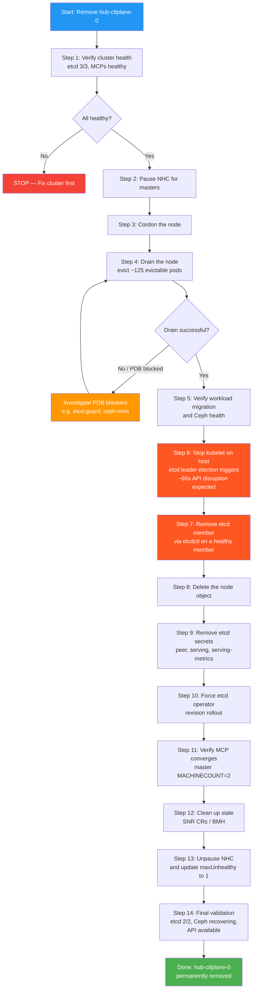

# Procedure: Remove hub-ctlplane-0.hub.5g-deployment.lab from the cluster

## Overview

This document provides a step-by-step procedure to **permanently** remove control-plane node `hub-ctlplane-0.hub.5g-deployment.lab` from the cluster while NHC and SNR operators are active.

> **WARNING — Reducing from 3 to 2 control-plane nodes eliminates all etcd fault tolerance.**
> With 2 etcd members, quorum requires **both** members to be available for writes. If either remaining master goes down, the cluster loses write capability. This procedure should only be performed when the node is permanently decommissioned and a replacement is planned.

### Pre-removal cluster state

| Item | Value |
|------|-------|
| **Node** | `hub-ctlplane-0.hub.5g-deployment.lab` (`172.16.30.20`) |
| **Roles** | `control-plane`, `master`, `worker` |
| **Pods on node** | 145 (static pods + DaemonSets + ReplicaSets + StatefulSets) |
| **etcd member** | `f8a45df83ba07c61` — **current LEADER** |
| **etcd cluster** | 3 members, v3.5.18, raft term 11 |
| **ODF/Ceph** | MON `c`, MGR `b` (**active**), MDS `b` (standby), OSD `2`, CSI provisioners |
| **NHC policy** | `nhc-master-self` — `maxUnhealthy: 2` |
| **SNR DaemonSet** | `self-node-remediation-ds-v7hvm` running on node |
| **etcd secrets** | `etcd-peer-*`, `etcd-serving-*`, `etcd-serving-metrics-*` |
| **BMH** | `hub-ctlplane-0.hub.5g-deployment.lab` (unmanaged, machine `hub-7lp5w-master-0`) |

### Risk assessment

| Risk | Impact | Mitigation |
|------|--------|------------|
| etcd quorum (3→2) | Zero fault tolerance for writes | Monitor remaining members; plan replacement |
| etcd leader on this node | Brief API disruption (~65s) during leader election | API monitor confirms recovery |
| Ceph MGR active on node | MGR failover to standby | Rook operator handles automatically |
| Ceph MON (mon.c) on node | MON quorum reduces to 2/3→2/2 | Still quorum; Rook re-creates if needed |
| Ceph OSD-2 on node | Data degraded (33%) until rebuild | PGs recover on remaining OSDs |
| 145 pods to reschedule | Scheduling pressure on remaining 3 nodes | PDBs allow 1 disruption each |
| Kubelet auto-re-registration | Stale NotReady node appears | Requires SSH/BMC to fully stop; cosmetic |

---

## Workflow diagram



---

## Step-by-step procedure

### Step 1 — Verify cluster health

```bash
oc get nodes
oc get mcp
oc get nhc
oc get etcd cluster -o jsonpath='{range .status.conditions[?(@.type=="EtcdMembersAvailable")]}{.type}: {.status}{"\n"}{end}'
oc exec -n openshift-etcd $(oc get pods -n openshift-etcd -l app=etcd -o name | head -1) \
  -c etcd -- etcdctl endpoint status --cluster -w table
```

All nodes must be Ready, MCPs updated, etcd 3/3 members available.

<details>
<summary><b>Cluster validation output (2026-03-23T20:30Z)</b></summary>

```
$ oc get nodes
NAME                                   STATUS   ROLES                         AGE   VERSION
hub-ctlplane-0.hub.5g-deployment.lab   Ready    control-plane,master,worker   9h    v1.31.13
hub-ctlplane-1.hub.5g-deployment.lab   Ready    control-plane,master,worker   9h    v1.31.13
hub-ctlplane-2.hub.5g-deployment.lab   Ready    control-plane,master,worker   9h    v1.31.13
hub-worker-1.hub.5g-deployment.lab     Ready    worker                        8h    v1.31.13

$ oc get mcp
NAME     CONFIG                                             UPDATED   UPDATING   DEGRADED   MACHINECOUNT   READYMACHINECOUNT
master   rendered-master-553d223f82f66cf6f44cd6e7b5d09201   True      False      False      3              3
worker   rendered-worker-06d82c71f4be67cba16828dd3c593cc3   True      False      False      1              1

$ oc get etcd cluster -o jsonpath='{...EtcdMembersAvailable...}'
EtcdMembersAvailable: True - 3 members are available

$ oc exec -n openshift-etcd etcd-hub-ctlplane-1.hub.5g-deployment.lab -c etcd -- etcdctl endpoint status --cluster -w table
+---------------------------+------------------+---------+---------+-----------+------------+-----------+
|         ENDPOINT          |        ID        | VERSION | DB SIZE | IS LEADER | IS LEARNER | RAFT TERM |
+---------------------------+------------------+---------+---------+-----------+------------+-----------+
| https://172.16.30.21:2379 | 820e48b8edbeda19 |  3.5.18 |  139 MB |     false |      false |        11 |
| https://172.16.30.22:2379 | b67e212807ddedcd |  3.5.18 |  142 MB |     false |      false |        11 |
| https://172.16.30.20:2379 | f8a45df83ba07c61 |  3.5.18 |  136 MB |      true |      false |        11 |
+---------------------------+------------------+---------+---------+-----------+------------+-----------+
```

ctlplane-0 (`172.16.30.20`) is confirmed as the current etcd **leader** (raft term 11).

</details>

---

### Step 2 — Pause NHC remediation for masters

```bash
oc patch nhc nhc-master-self --type merge -p \
  '{"spec":{"pauseRequests":["removing-hub-ctlplane-0"]}}'
```

<details>
<summary><b>Cluster validation output (2026-03-23T20:30Z)</b></summary>

```
$ oc patch nhc nhc-master-self --type merge -p '{"spec":{"pauseRequests":["removing-hub-ctlplane-0"]}}'
nodehealthcheck.remediation.medik8s.io/nhc-master-self patched

$ oc get nhc nhc-master-self -o jsonpath='{.spec.pauseRequests[*]}'
removing-hub-ctlplane-0
```

</details>

---

### Step 3 — Cordon the node

```bash
oc adm cordon hub-ctlplane-0.hub.5g-deployment.lab
```

<details>
<summary><b>Cluster validation output (2026-03-23T20:30Z)</b></summary>

```
$ oc adm cordon hub-ctlplane-0.hub.5g-deployment.lab
node/hub-ctlplane-0.hub.5g-deployment.lab cordoned

$ oc get node hub-ctlplane-0.hub.5g-deployment.lab
NAME                                   STATUS                     ROLES                         AGE   VERSION
hub-ctlplane-0.hub.5g-deployment.lab   Ready,SchedulingDisabled   control-plane,master,worker   9h    v1.31.13
```

</details>

---

### Step 4 — Drain the node

```bash
oc adm drain hub-ctlplane-0.hub.5g-deployment.lab \
  --ignore-daemonsets \
  --delete-emptydir-data \
  --force \
  --timeout=300s
```

The `--timeout=300s` is longer than for workers due to the large number of pods (145) and StatefulSets (Ceph, monitoring, observability). If PDBs block, investigate with:

```bash
oc get pdb --all-namespaces -o custom-columns='NS:.metadata.namespace,NAME:.metadata.name,ALLOWED:.status.disruptionsAllowed' | grep ' 0$'
```

<details>
<summary><b>Cluster validation output (2026-03-23T20:31Z)</b></summary>

```
$ oc adm drain hub-ctlplane-0.hub.5g-deployment.lab \
    --ignore-daemonsets --delete-emptydir-data --force --timeout=300s

Warning: ignoring DaemonSet-managed Pods: (20 DaemonSet pods skipped)
Warning: deleting Pods that declare no controller: (4 guard pods deleted)

evicting pod hypershift/operator-77b56d4cc7-sv2j5
evicting pod openshift-etcd/etcd-guard-hub-ctlplane-0.hub.5g-deployment.lab
evicting pod openshift-storage/rook-ceph-mon-c-7ff9f9fb67-s452t
evicting pod openshift-storage/rook-ceph-mgr-b-59b9bf457-454lj
evicting pod openshift-storage/rook-ceph-osd-2-768c975c65-tqx6q
evicting pod openshift-storage/rook-ceph-mds-ocs-storagecluster-cephfilesystem-b-75dd9487p2hvc
...
(125 pods evicted in total)
...
pod/router-default-f785bc5bf-58ppx evicted
pod/apiserver-57474597c9-rmf22 evicted
pod/metrics-server-5968f6c58c-dr7hl evicted
node/hub-ctlplane-0.hub.5g-deployment.lab drained
```

Drain completed in ~3 minutes. 125 evictable pods evicted, 20 DaemonSet pods ignored. No PDB blocks occurred. Client-side throttling messages appeared (expected with this many evictions).

</details>

---

### Step 5 — Verify workload migration and Ceph health

```bash
oc get pods --all-namespaces --field-selector spec.nodeName=hub-ctlplane-0.hub.5g-deployment.lab \
  --no-headers -o custom-columns='NS:.metadata.namespace,POD:.metadata.name,OWNER:.metadata.ownerReferences[0].kind' \
  | grep -v -E 'DaemonSet|Node|ConfigMap'
oc exec -n openshift-storage $(oc get pod -n openshift-storage -l app=rook-ceph-tools -o name) -- ceph status
```

<details>
<summary><b>Cluster validation output (2026-03-23T20:34Z)</b></summary>

```
--- Non-DaemonSet/static pods remaining on ctlplane-0 ---
(none — only DaemonSet, Node-owned static pods, and ConfigMap-owned revision-pruners remain)
Total remaining: 31 pods

--- Ceph status (expected degradation) ---
$ oc exec -n openshift-storage ... -- ceph status
  cluster:
    health: HEALTH_WARN
            1/3 mons down, quorum a,b
            1 osds down
            1 host (1 osds) down
            Degraded data redundancy: 3437/10311 objects degraded (33.333%)
  services:
    mon: 3 daemons, quorum a,b (age 2m), out of quorum: c
    mgr: b(active, since 2m), standbys: a
    mds: 1/1 daemons up, 1 hot standby
    osd: 3 osds: 2 up (since 2m), 3 in (since 8h)
  data:
    pgs: 147 active+undersized+degraded, 101 active+undersized
```

Ceph is degraded as expected: MON `c` out of quorum, OSD `2` down, MGR failover completed (mgr-b now active on another node, mgr-a standby). MON quorum maintained with 2/3 (a,b). 33% data degradation — normal with 1/3 OSDs offline.

</details>

---

### Step 6 — Stop the kubelet on the host (CRITICAL)

This stops all static pods including **etcd** (the current leader), **kube-apiserver**, **kube-controller-manager**, and **kube-scheduler**. Etcd leader election will occur on the remaining 2 members.

> **Expected impact:** ~65 seconds of API unavailability while etcd elects a new leader and the remaining kube-apiserver instances reconnect. The `[-]shutdown failed` readyz check on the old kube-apiserver is normal.

> **IMPORTANT: You must `mask` the kubelet, not just `disable` it.** The kubelet systemd unit on RHCOS has `Restart=always`, so `systemctl disable` only prevents boot-start but systemd will still auto-restart the kubelet after a stop. `systemctl mask` creates a symlink to `/dev/null` that prevents the service from starting by **any** mechanism. Additionally, after `oc debug` drains the control-plane, the node loses its API-registered addresses — making it impossible to run further debug pods. **You must have BMC/IPMI access or direct SSH to the host before starting this step.**

```bash
# PREREQUISITE: Ensure you have BMC/IPMI or SSH access before proceeding.

# Option A: BMC/IPMI power off (preferred — guarantees kubelet cannot restart)
ipmitool -I lanplus -H <bmc-ip> -U <user> -P <pass> chassis power off

# Option B: SSH to the host (if network is reachable)
ssh core@hub-ctlplane-0.hub.5g-deployment.lab 'sudo systemctl mask kubelet && sudo systemctl stop kubelet'

# Option C: oc debug (works ONLY before drain / while node still has addresses)
oc debug node/hub-ctlplane-0.hub.5g-deployment.lab -- \
  chroot /host bash -c 'systemctl mask kubelet && systemctl stop kubelet'
```

After stopping, verify:

```bash
oc get node hub-ctlplane-0.hub.5g-deployment.lab
```

Expected: `NotReady,SchedulingDisabled`

<details>
<summary><b>Cluster validation output (2026-03-23T20:35Z)</b></summary>

```
$ oc debug node/hub-ctlplane-0.hub.5g-deployment.lab -- \
    chroot /host bash -c 'systemctl disable kubelet && systemctl stop kubelet'
Starting pod/hub-ctlplane-0hub5g-deploymentlab-debug-n5lck ...
Removed "/etc/systemd/system/multi-user.target.wants/kubelet.service".
(connection dropped — expected when kubelet stops)

$ oc get nodes   (after ~15s wait for API to recover)
NAME                                   STATUS                        ROLES                         AGE   VERSION
hub-ctlplane-0.hub.5g-deployment.lab   NotReady,SchedulingDisabled   control-plane,master,worker   9h    v1.31.13
hub-ctlplane-1.hub.5g-deployment.lab   Ready                         control-plane,master,worker   9h    v1.31.13
hub-ctlplane-2.hub.5g-deployment.lab   Ready                         control-plane,master,worker   9h    v1.31.13
hub-worker-1.hub.5g-deployment.lab     Ready                         worker                        8h    v1.31.13
```

Kubelet disabled and stopped. Node transitioned to `NotReady`. API recovered after etcd leader election.

> **Lesson learned from validation:** `systemctl disable kubelet` is **not sufficient** on RHCOS. The kubelet unit has `Restart=always`, so systemd auto-restarts it ~10 seconds after `systemctl stop`. The kubelet then re-registers a stale `NotReady` node with `<none>` roles and no addresses. At that point, `oc debug` and `nodeName` pod scheduling both fail because the API has no address to reach the kubelet. **You must use `systemctl mask kubelet` (or BMC power-off) before stopping the kubelet, and ideally do this before draining the node** (while `oc debug` still works).

</details>

---

### Step 7 — Remove the etcd member

From one of the **remaining** healthy etcd members, remove the stopped member.

```bash
oc exec -n openshift-etcd etcd-hub-ctlplane-1.hub.5g-deployment.lab \
  -c etcd -- etcdctl member list -w table

oc exec -n openshift-etcd etcd-hub-ctlplane-1.hub.5g-deployment.lab \
  -c etcd -- etcdctl member remove <MEMBER_ID>

oc exec -n openshift-etcd etcd-hub-ctlplane-1.hub.5g-deployment.lab \
  -c etcd -- etcdctl member list -w table
```

<details>
<summary><b>Cluster validation output (2026-03-23T20:36Z)</b></summary>

```
--- Before removal: 3 members (ctlplane-0 unresponsive) ---
+------------------+---------+--------------------------------------+---------------------------+
|        ID        | STATUS  |                 NAME                 |       CLIENT ADDRS        |
+------------------+---------+--------------------------------------+---------------------------+
| 820e48b8edbeda19 | started | hub-ctlplane-1.hub.5g-deployment.lab | https://172.16.30.21:2379 |
| b67e212807ddedcd | started | hub-ctlplane-2.hub.5g-deployment.lab | https://172.16.30.22:2379 |
| f8a45df83ba07c61 | started | hub-ctlplane-0.hub.5g-deployment.lab | https://172.16.30.20:2379 |
+------------------+---------+--------------------------------------+---------------------------+

$ oc exec ... -- etcdctl member remove f8a45df83ba07c61
Member f8a45df83ba07c61 removed from cluster 2bb9463181e22eda

--- After removal: 2 members ---
+------------------+---------+--------------------------------------+---------------------------+
|        ID        | STATUS  |                 NAME                 |       CLIENT ADDRS        |
+------------------+---------+--------------------------------------+---------------------------+
| 820e48b8edbeda19 | started | hub-ctlplane-1.hub.5g-deployment.lab | https://172.16.30.21:2379 |
| b67e212807ddedcd | started | hub-ctlplane-2.hub.5g-deployment.lab | https://172.16.30.22:2379 |
+------------------+---------+--------------------------------------+---------------------------+

--- Endpoint status: new leader elected ---
+---------------------------+------------------+---------+---------+-----------+-----------+
|         ENDPOINT          |        ID        | VERSION | DB SIZE | IS LEADER | RAFT TERM |
+---------------------------+------------------+---------+---------+-----------+-----------+
| https://172.16.30.21:2379 | 820e48b8edbeda19 |  3.5.18 |  165 MB |     false |        12 |
| https://172.16.30.22:2379 | b67e212807ddedcd |  3.5.18 |  164 MB |      true |        12 |
+---------------------------+------------------+---------+---------+-----------+-----------+
```

etcd member `f8a45df83ba07c61` removed. New leader: `hub-ctlplane-2` (raft term advanced from 11→12).

</details>

---

### Step 8 — Delete the node object

```bash
oc delete node hub-ctlplane-0.hub.5g-deployment.lab
```

<details>
<summary><b>Cluster validation output (2026-03-23T20:36Z)</b></summary>

```
$ oc delete node hub-ctlplane-0.hub.5g-deployment.lab
node "hub-ctlplane-0.hub.5g-deployment.lab" deleted

$ oc get nodes
NAME                                   STATUS   ROLES                         AGE   VERSION
hub-ctlplane-1.hub.5g-deployment.lab   Ready    control-plane,master,worker   9h    v1.31.13
hub-ctlplane-2.hub.5g-deployment.lab   Ready    control-plane,master,worker   9h    v1.31.13
hub-worker-1.hub.5g-deployment.lab     Ready    worker                        8h    v1.31.13
```

</details>

---

### Step 9 — Remove etcd secrets for the removed node

```bash
oc delete secret -n openshift-etcd \
  etcd-peer-hub-ctlplane-0.hub.5g-deployment.lab \
  etcd-serving-hub-ctlplane-0.hub.5g-deployment.lab \
  etcd-serving-metrics-hub-ctlplane-0.hub.5g-deployment.lab
```

<details>
<summary><b>Cluster validation output (2026-03-23T20:37Z)</b></summary>

```
$ oc delete secret -n openshift-etcd \
    etcd-peer-hub-ctlplane-0.hub.5g-deployment.lab \
    etcd-serving-hub-ctlplane-0.hub.5g-deployment.lab \
    etcd-serving-metrics-hub-ctlplane-0.hub.5g-deployment.lab
secret "etcd-peer-hub-ctlplane-0.hub.5g-deployment.lab" deleted
secret "etcd-serving-hub-ctlplane-0.hub.5g-deployment.lab" deleted
secret "etcd-serving-metrics-hub-ctlplane-0.hub.5g-deployment.lab" deleted

--- Remaining etcd secrets (ctlplane-1 and ctlplane-2 only) ---
etcd-peer-hub-ctlplane-1.hub.5g-deployment.lab              kubernetes.io/tls   2     9h
etcd-peer-hub-ctlplane-2.hub.5g-deployment.lab              kubernetes.io/tls   2     9h
etcd-serving-hub-ctlplane-1.hub.5g-deployment.lab           kubernetes.io/tls   2     9h
etcd-serving-hub-ctlplane-2.hub.5g-deployment.lab           kubernetes.io/tls   2     9h
etcd-serving-metrics-hub-ctlplane-1.hub.5g-deployment.lab   kubernetes.io/tls   2     9h
etcd-serving-metrics-hub-ctlplane-2.hub.5g-deployment.lab   kubernetes.io/tls   2     9h
```

</details>

---

### Step 10 — Force etcd operator revision rollout

```bash
oc patch etcd cluster -p='{"spec": {"forceRedeploymentReason": "ctlplane-0-removal-'"$(date +%s)"'"}}' --type=merge
```

<details>
<summary><b>Cluster validation output (2026-03-23T20:37Z)</b></summary>

```
$ oc patch etcd cluster -p='{"spec": {"forceRedeploymentReason": "ctlplane-0-removal-1742762235"}}' --type=merge
etcd.operator.openshift.io/cluster patched
```

</details>

---

### Step 11 — Verify MCP converges

```bash
oc get mcp master
```

Expected: `MACHINECOUNT=2`, `READYMACHINECOUNT=2`, `UPDATED=True`.

<details>
<summary><b>Cluster validation output (2026-03-23T20:37–20:40Z) — 3 minutes monitoring</b></summary>

```
--- Polled MCP + etcd status every 15s for 3 minutes ---
20:37:12Z  nodes=3  master: UPDATED=True  MACHINECOUNT=2  READY=2  DEGRADED=False  etcd: 2 nodes at revision 10
20:37:29Z  nodes=3  master: UPDATED=True  MACHINECOUNT=2  READY=2  DEGRADED=False  etcd: 2 nodes at revision 10
20:37:46Z  nodes=3  master: UPDATED=True  MACHINECOUNT=2  READY=2  DEGRADED=False  etcd: 2 nodes at revision 10
...
20:40:32Z  nodes=3  master: UPDATED=True  MACHINECOUNT=2  READY=2  DEGRADED=False  etcd: 2 nodes at revision 10

--- Final state ---
$ oc get mcp
NAME     CONFIG                                             UPDATED   UPDATING   DEGRADED   MACHINECOUNT   READYMACHINECOUNT
master   rendered-master-553d223f82f66cf6f44cd6e7b5d09201   True      False      False      2              2
worker   rendered-worker-06d82c71f4be67cba16828dd3c593cc3   True      False      False      1              1

$ oc get etcd cluster -o jsonpath='{...EtcdMembersAvailable...}'
EtcdMembersAvailable: True - 2 members are available
```

Master MCP converged to `MACHINECOUNT=2`, both masters Ready, zero degradation. etcd reports 2 available members.

</details>

---

### Step 12 — Clean up stale SNR CRs and BMH

```bash
oc get snr --all-namespaces
oc get bmh -n openshift-machine-api | grep ctlplane-0
oc delete bmh -n openshift-machine-api hub-ctlplane-0.hub.5g-deployment.lab
```

<details>
<summary><b>Cluster validation output (2026-03-23T20:43Z)</b></summary>

```
$ oc get snr --all-namespaces
No resources found

$ oc get bmh -n openshift-machine-api hub-ctlplane-0.hub.5g-deployment.lab
NAME                                   STATE       CONSUMER             ONLINE   AGE
hub-ctlplane-0.hub.5g-deployment.lab   unmanaged   hub-7lp5w-master-0   true     9h

$ oc delete bmh -n openshift-machine-api hub-ctlplane-0.hub.5g-deployment.lab
baremetalhost.metal3.io "hub-ctlplane-0.hub.5g-deployment.lab" deleted
```

No stale SNR CRs (NHC was paused). BMH resource deleted.

</details>

---

### Step 13 — Unpause NHC and update maxUnhealthy

With 2 masters remaining, `maxUnhealthy: 2` would allow both to be unhealthy — effectively disabling remediation. Update to `maxUnhealthy: 1` to ensure at least 1 master stays healthy.

```bash
oc patch nhc nhc-master-self --type merge -p '{"spec":{"maxUnhealthy": 1}}'
oc patch nhc nhc-master-self --type json -p '[{"op":"remove","path":"/spec/pauseRequests"}]'
```

<details>
<summary><b>Cluster validation output (2026-03-23T20:43Z)</b></summary>

```
$ oc patch nhc nhc-master-self --type merge -p '{"spec":{"maxUnhealthy": 1}}'
nodehealthcheck.remediation.medik8s.io/nhc-master-self patched

$ oc patch nhc nhc-master-self --type json -p '[{"op":"remove","path":"/spec/pauseRequests"}]'
nodehealthcheck.remediation.medik8s.io/nhc-master-self patched

$ oc get nhc -o custom-columns='NAME:.metadata.name,MAXUNHEALTHY:.spec.maxUnhealthy,MINHEALTHY:.spec.minHealthy,PAUSE:.spec.pauseRequests'
NAME              MAXUNHEALTHY   MINHEALTHY   PAUSE
nhc-master-self   1              <none>       <none>
nhc-worker-self   <none>         51%          <none>
```

</details>

---

### Step 14 — Final validation

```bash
oc get nodes
oc get mcp
oc get nhc
oc exec -n openshift-etcd $(oc get pods -n openshift-etcd -l app=etcd -o name | head -1) \
  -c etcd -- etcdctl member list -w table
oc exec -n openshift-etcd $(oc get pods -n openshift-etcd -l app=etcd -o name | head -1) \
  -c etcd -- etcdctl endpoint status --cluster -w table
oc get pods -n openshift-workload-availability -l app.kubernetes.io/component=agent -o wide
oc exec -n openshift-storage $(oc get pod -n openshift-storage -l app=rook-ceph-tools -o name) -- ceph status
```

<details>
<summary><b>Cluster validation output (2026-03-23T20:44Z)</b></summary>

```
$ oc get nodes
NAME                                   STATUS   ROLES                         AGE   VERSION
hub-ctlplane-1.hub.5g-deployment.lab   Ready    control-plane,master,worker   9h    v1.31.13
hub-ctlplane-2.hub.5g-deployment.lab   Ready    control-plane,master,worker   9h    v1.31.13
hub-worker-1.hub.5g-deployment.lab     Ready    worker                        8h    v1.31.13

$ oc get mcp
NAME     CONFIG                                             UPDATED   UPDATING   DEGRADED   MACHINECOUNT   READYMACHINECOUNT
master   rendered-master-553d223f82f66cf6f44cd6e7b5d09201   True      False      False      2              2
worker   rendered-worker-06d82c71f4be67cba16828dd3c593cc3   True      False      False      1              1

$ oc get nhc -o custom-columns='NAME:..name,MAXUNHEALTHY:..maxUnhealthy,MINHEALTHY:..minHealthy'
NAME              MAXUNHEALTHY   MINHEALTHY
nhc-master-self   1              <none>
nhc-worker-self   <none>         51%

--- etcd: 2 members, both healthy ---
+------------------+---------+--------------------------------------+---------------------------+
|        ID        | STATUS  |                 NAME                 |       CLIENT ADDRS        |
+------------------+---------+--------------------------------------+---------------------------+
| 820e48b8edbeda19 | started | hub-ctlplane-1.hub.5g-deployment.lab | https://172.16.30.21:2379 |
| b67e212807ddedcd | started | hub-ctlplane-2.hub.5g-deployment.lab | https://172.16.30.22:2379 |
+------------------+---------+--------------------------------------+---------------------------+

+---------------------------+------------------+---------+---------+-----------+-----------+
|         ENDPOINT          |        ID        | VERSION | DB SIZE | IS LEADER | RAFT TERM |
+---------------------------+------------------+---------+---------+-----------+-----------+
| https://172.16.30.21:2379 | 820e48b8edbeda19 |  3.5.18 |  165 MB |     false |        12 |
| https://172.16.30.22:2379 | b67e212807ddedcd |  3.5.18 |  164 MB |      true |        12 |
+---------------------------+------------------+---------+---------+-----------+-----------+

--- SNR DaemonSet: 3 pods on remaining nodes ---
NAME                             READY   STATUS    RESTARTS   AGE     NODE
self-node-remediation-ds-9wk7d   1/1     Running   0          7h51m   hub-ctlplane-2.hub.5g-deployment.lab
self-node-remediation-ds-c7jp4   1/1     Running   0          7h51m   hub-worker-1.hub.5g-deployment.lab
self-node-remediation-ds-jx9tx   1/1     Running   0          7h51m   hub-ctlplane-1.hub.5g-deployment.lab

$ oc get snr --all-namespaces
No resources found

--- Ceph (degraded — expected with OSD-2 and MON-c offline) ---
  cluster:
    health: HEALTH_WARN
            1/3 mons down, quorum a,b
            1 osds down, 1 host down
            Degraded data redundancy: 33.333% objects degraded
  services:
    mon: 3 daemons, quorum a,b (age 13m), out of quorum: c
    mgr: b(active, since 13m), standbys: a
    osd: 3 osds: 2 up, 3 in
  data:
    pgs: 147 active+undersized+degraded, 101 active+undersized
```

</details>

**Final state summary:**

| Item | Value |
|------|-------|
| Nodes | **3** (2 masters + 1 worker) — ctlplane-0 permanently removed |
| Master MCP | `UPDATED=True`, `MACHINECOUNT=2`, `READYMACHINECOUNT=2` |
| etcd | **2 members**, both started, ctlplane-2 is leader (raft term 12) |
| etcd operator | `EtcdMembersAvailable: True - 2 members are available` |
| NHC master | `maxUnhealthy: 1`, unpaused |
| NHC worker | `minHealthy: 51%`, active |
| SNR DaemonSet | **3 pods** (1 per remaining node, all Running) |
| Stale SNR CRs | None |
| BMH | Deleted |
| Ceph | HEALTH_WARN — MON quorum 2/3, OSD 2/3 up, 33% data degraded (expected) |

---

## API availability during the procedure

An API availability monitor ran throughout the entire procedure, polling `oc get --raw /readyz` every 5 seconds.

| Metric | Value |
|--------|-------|
| **Duration** | `20:30:23Z` → `20:45:12Z` (**14 min 49 sec**) |
| **Total checks** | 160 |
| **Successful** | 149 |
| **Failed** | 11 |
| **API availability** | **93.1%** |
| **Disruption window** | `20:38:35Z` → `20:39:39Z` (**64 seconds**) |

### Failure analysis

The 11 failed checks occurred in a single 64-second window when the kubelet on ctlplane-0 was stopped (Step 6). This is expected behavior when removing the **etcd leader** from a 3-member cluster:

| Timestamp | Error |
|-----------|-------|
| `20:38:35Z` | TLS handshake timeout (connection to old kube-apiserver) |
| `20:38:50Z`–`20:39:34Z` | `[-]shutdown failed: reason withheld` (kube-apiserver on ctlplane-0 shutting down) |
| `20:39:39Z` | EOF (connection fully dropped to old endpoint) |
| `20:39:44Z` | **API recovered** — all subsequent checks passed |

The disruption was caused by:
1. Loss of the etcd leader (`f8a45df83ba07c61` on `172.16.30.20`)
2. etcd leader election on the remaining 2 members (new leader: ctlplane-2, raft term 12)
3. kube-apiserver instances re-establishing etcd connections
4. HAProxy/keepalived re-routing traffic to the remaining kube-apiserver endpoints

---

## Bare-metal kubelet re-registration (IMPORTANT)

On bare-metal / agent-installed RHCOS clusters, `systemctl disable kubelet` does **not** prevent re-registration. The kubelet unit has `Restart=always` in its systemd configuration, so systemd will automatically restart the kubelet ~10 seconds after a `systemctl stop`. The restarted kubelet re-registers a stale `NotReady` node with `<none>` roles, no IP addresses, and `<unknown>` metadata.

### Why `oc debug` fails after drain

Once the kubelet re-registers in this degraded state, the API server has `known addresses: []` for the node. This prevents:
- **`oc debug node/`** — pod scheduling fails (API can't reach kubelet)
- **`nodeName` pod assignment** — pods stay `Pending` (same address issue)
- **SSH between nodes** — no SSH keys are distributed on agent-installed clusters

### Correct approach

Use `systemctl mask kubelet` (not `disable`) **before** the kubelet enters the degraded state. The recommended order is:

1. **Before drain** (while `oc debug` still works):

```bash
oc debug node/hub-ctlplane-0.hub.5g-deployment.lab -- \
  chroot /host systemctl mask kubelet
```

2. **Then drain**, stop kubelet, remove etcd member, delete node.

Or, if BMC/IPMI is available, simply power off the host after drain:

```bash
ipmitool -I lanplus -H <bmc-ip> -U <user> -P <pass> chassis power off
```

### If the stale node already appeared

The stale registration has **no functional impact**:
- etcd member is removed — cannot participate in consensus
- MCP ignores it — no `control-plane` role, not in `MACHINECOUNT`
- No workloads schedule — `NotReady` with no addresses
- Delete it periodically: `oc delete node hub-ctlplane-0.hub.5g-deployment.lab`
- **Permanent fix**: BMC power-off or physical console access to run `systemctl mask kubelet`

---

## Rollback

**Before stopping the kubelet (Steps 1–5):**

```bash
oc adm uncordon hub-ctlplane-0.hub.5g-deployment.lab
oc patch nhc nhc-master-self --type json -p '[{"op":"remove","path":"/spec/pauseRequests"}]'
```

**After kubelet stop or etcd member removal:** Re-enable the kubelet and the etcd operator will re-add the member:

```bash
ssh core@hub-ctlplane-0.hub.5g-deployment.lab 'sudo systemctl unmask kubelet && sudo systemctl enable kubelet && sudo systemctl start kubelet'
```

**After node deletion:** Full re-provisioning required (see *CNF-20877 Use-case 5 — Master node replacement*).
