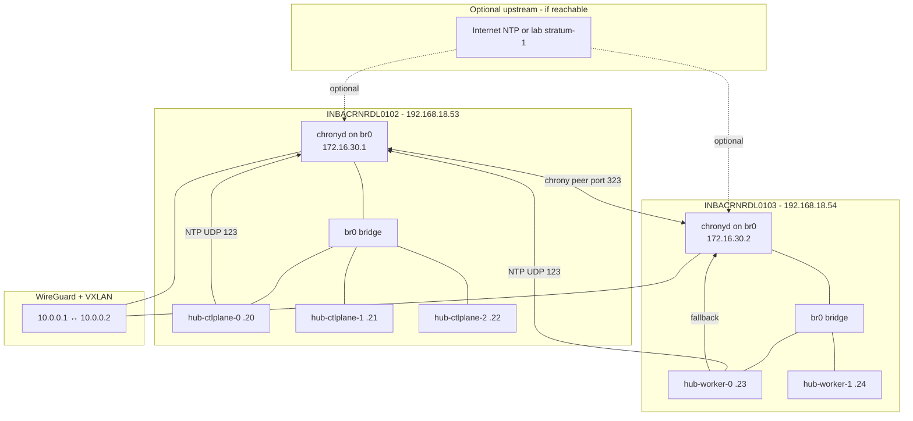

# Hub NTP — Network Identification and High-Availability Design

This document describes which kcli/libvirt network carries the hub VMs, how to deploy a
high-availability NTP service for the disconnected `172.16.30.0/24` machine network, and how
to reach the same time source from both **INBACRNRDL0102** and **INBACRNRDL0103** without
disrupting the existing **172.16.30.1** gateway.

## 1. Network identification

### 1.1 kcli network vs. actual L3 subnet

`kcli list network` on INBACRNRDL0102 shows several networks. The hub control-plane VMs are **not**
on `sriov-network` (`172.16.100.0/24`) or `default` (`192.168.122.0/24`).

| kcli network | Type | CIDR in kcli | Used by hub VMs? |
|--------------|------|--------------|------------------|
| **br0** | bridge | N/A (L2 bridge) | **Yes** |
| sriov-network | isolated | 172.16.100.0/24 | No |
| default | nat | 192.168.122.0/24 | No |
| extranetwork | nat | 192.168.222.0/24 | No |

Hub VMs are attached to **`br0`**:

```text
kcli create vm ... -P nets="[{'name': 'br0', 'mac': '$MAC'}]"
```

`br0` is a Linux bridge with no IP subnet in kcli itself. The **machine network** is configured
on the hypervisor bridge and in OpenShift install manifests:

| Item | Value |
|------|-------|
| Machine network CIDR | `172.16.30.0/24` |
| INBACRNRDL0102 `br0` IP | `172.16.30.1/24` (gateway, DNS, infra services) |
| INBACRNRDL0103 `br0` IP | `172.16.30.2/24` |
| Hub control-plane VMs (0102) | `.20`, `.21`, `.22` |
| Hub worker VMs (0103, planned) | `.23`, `.24` |
| OpenShift API VIP | `172.16.30.10` |
| OpenShift Ingress VIP | `172.16.30.11` |

Cross-hypervisor reachability for `172.16.30.0/24` is provided by **WireGuard + VXLAN** (see
[INBACRNRDL_Wireguard.md](./INBACRNRDL_Wireguard.md)). VMs on INBACRNRDL0103 reach
`172.16.30.1` via the VXLAN transit path; no extra routing is required for NTP once `chronyd`
listens on `br0`.

### 1.2 Why NTP failed on the hub cluster

OpenShift nodes were configured (via MCO/chrony) with upstream servers such as
`10.16.32.98` that are **not reachable** from the disconnected lab. Chrony reported
`System clock synchronized: no`, which caused Ceph `MON_CLOCK_SKEW` and blocked ODF /
ArgoCD.

The fix is to serve NTP from the **lab machine network** using addresses VMs already use as
gateway/DNS: **`172.16.30.1`** (primary) and **`172.16.30.2`** (secondary).

---

## 2. HA NTP design (non-disruptive)

### 2.1 Design goals

1. **Primary client target remains `172.16.30.1`** — same address VMs already use as default
   gateway and DNS (see `workingdir/agent-config.yaml`).
2. **No migration of the gateway IP** — `172.16.30.1` stays on INBACRNRDL0102 `br0`. Moving
   it with keepalived would risk DNS, Gitea, registry, and default-route disruption.
3. **Secondary NTP on `172.16.30.2`** — INBACRNRDL0103 serves time if the primary is down or
   unreachable over VXLAN.
4. **Hypervisor clock agreement** — both hosts peer with each other so the two NTP servers stay
   within Ceph's skew tolerance even without Internet NTP.
5. **Rolling, non-disruptive rollout** — configure chrony on hypervisors first, then update
   OpenShift nodes; no VM reboot required on hypervisors.

### 2.2 Architecture



### 2.3 Client configuration pattern

All OpenShift nodes (both hypervisors) should use:

```text
server 172.16.30.1 iburst prefer
server 172.16.30.2 iburst
```

- **Primary** time flows through the gateway (`172.16.30.1`).
- **Secondary** provides HA without changing the gateway role.
- Chrony fails over automatically; no keepalived VIP on `.1` is required.

### 2.4 Why not NTP broadcast?

NTP broadcast on `172.16.30.255` is possible but **not recommended** here:

- Broadcast is less precise than unicast for Ceph skew limits.
- VXLAN/proxy-ARP forwarding of broadcasts is less predictable than directed UDP to `.1`/`.2`.
- Unicast to the gateway IP matches existing DNS/default-route semantics.

---

## 3. Step-by-step configuration

### Step 0 — Prerequisites (both hypervisors)

```bash
sudo dnf install -y chrony
sudo systemctl enable --now chronyd
```

Allow NTP through the host firewall on `br0` (and VXLAN path if firewalld zone covers it):

```bash
sudo firewall-cmd --permanent --add-service=ntp
sudo firewall-cmd --reload
```

Verify `br0` addresses:

```bash
# INBACRNRDL0102
ip -4 addr show br0 | grep 172.16.30.1

# INBACRNRDL0103
ip -4 addr show br0 | grep 172.16.30.2
```

---

### Step 1 — Primary NTP on INBACRNRDL0102 (172.16.30.1)

Back up and replace `/etc/chrony.conf`:

```bash
sudo cp -a /etc/chrony.conf /etc/chrony.conf.bak.$(date +%F)
sudo tee /etc/chrony.conf >/dev/null <<'EOF'
# Hub lab primary NTP — INBACRNRDL0102 (gateway 172.16.30.1)
driftfile /var/lib/chrony/drift
makestep 1.0 3
rtcsync
logdir /var/log/chrony

# Serve the machine network
allow 172.16.30.0/24
allow 10.0.0.0/30
local stratum 8 orphan

# Peer with secondary hypervisor (HA, no gateway IP movement)
peer 172.16.30.2 iburst

# Optional: if Internet NTP is reachable from 0102, uncomment:
# server 0.fedora.pool.ntp.org iburst
# server 1.fedora.pool.ntp.org iburst

bindaddress 0.0.0.0
EOF

sudo systemctl restart chronyd
sudo chronyc tracking
sudo chronyc sources -v
```

Confirm chrony listens on UDP/123:

```bash
sudo ss -ulnp | grep 323
```

---

### Step 2 — Secondary NTP on INBACRNRDL0103 (172.16.30.2)

```bash
sudo cp -a /etc/chrony.conf /etc/chrony.conf.bak.$(date +%F)
sudo tee /etc/chrony.conf >/dev/null <<'EOF'
# Hub lab secondary NTP — INBACRNRDL0103 (172.16.30.2)
driftfile /var/lib/chrony/drift
makestep 1.0 3
rtcsync
logdir /var/log/chrony

allow 172.16.30.0/24
allow 10.0.0.0/30
local stratum 8 orphan

# Peer with primary gateway NTP
peer 172.16.30.1 iburst

bindaddress 0.0.0.0
EOF

sudo systemctl restart chronyd
sudo chronyc tracking
```

---

### Step 3 — Verify hypervisor HA and cross-host reachability

**On INBACRNRDL0102:**

```bash
chronyc sources -v
chronyc activity
ping -c 2 172.16.30.2
```

**On INBACRNRDL0103:**

```bash
chronyc sources -v
ping -c 2 172.16.30.1
```

**From a hub VM** (or debug pod on a node):

```bash
chronyc -h 172.16.30.1 tracking
chronyc -h 172.16.30.2 tracking
```

Expected: both hypervisors show each other as peers; offset stays below ~50 ms.

---

### Step 4 — Update OpenShift nodes (running cluster)

Apply a MachineConfig that points cluster chrony at the lab NTP servers. Example:

```yaml
apiVersion: machineconfiguration.openshift.io/v1
kind: MachineConfig
metadata:
  labels:
    machineconfiguration.openshift.io/role: master
  name: 99-master-chrony-lab-ntp
spec:
  config:
    ignition:
      version: 3.2.0
    storage:
      files:
      - contents:
          source: data:text/plain;charset=utf-8,%23%20Lab%20NTP%0Aserver%20172.16.30.1%20iburst%20prefer%0Aserver%20172.16.30.2%20iburst%0Amakestep%201.0%203%0Artcsync%0Adriftfile%20%2Fvar%2Flib%2Fchrony%2Fdrift%0Alogdir%20%2Fvar%2Flog%2Fchrony%0A
        mode: 420
        overwrite: true
        path: /etc/chrony.conf
```

```bash
export KUBECONFIG=./kubeconfig
oc apply -f 99-master-chrony-lab-ntp.yaml
# Duplicate with role: worker if workers exist
```

MCO rolls chrony **without node reboot** in most cases. Monitor:

```bash
oc get mcp
oc get nodes
```

Per-node check:

```bash
oc debug node/hub-ctlplane-0.hub.5g-deployment.lab -- \
  chroot /host bash -c 'chronyc tracking; timedatectl | grep synchronized'
```

---

### Step 5 — Update install manifests (new clusters)

Set `additionalNTPSources` in `workingdir/agent-config.yaml` to lab NTP (not public pools):

```yaml
additionalNTPSources:
  - 172.16.30.1
  - 172.16.30.2
```

Regenerate / redeploy agent ISO if rebuilding the hub from scratch.

---

### Step 6 — Validate ODF / ArgoCD recovery

After clocks synchronize:

```bash
export KUBECONFIG=./kubeconfig
oc get cephcluster -n openshift-storage -o jsonpath='{.items[0].status.ceph.health}{"\n"}'
oc get storagecluster -n openshift-storage -w
oc get apps -n openshift-gitops
```

Ceph `MON_CLOCK_SKEW` should clear; `StorageCluster` should reach `Ready`; ArgoCD
`rds-hub-operators-deployment` should complete sync.

---

## 4. HA behaviour and failure modes

| Scenario | Behaviour | User impact |
|----------|-----------|-------------|
| INBACRNRDL0102 chronyd running | VMs sync to `172.16.30.1` (gateway) | Normal |
| 0102 chronyd stopped, 0103 up | Clients fail over to `172.16.30.2` | Brief skew possible; no gateway change |
| VXLAN down between hosts | Local VMs use local hypervisor NTP | Each site keeps time; cross-site skew possible until link returns |
| Both hypervisors up | Peers keep offsets aligned | Best case for Ceph |

**Non-disruption guarantees:**

- Gateway IP `172.16.30.1` is **not** moved.
- DNS and default route on existing VMs are **unchanged**.
- chrony reload/restart on hypervisors does not restart VMs or `br0`.
- OpenShift MCO chrony update is a **rolling** node drain–free config push.

---

## 5. Optional hardening

### 5.1 Sync hypervisors from INBACRNRDL0102 host clock at boot

If no Internet NTP exists, sync hypervisor OS clock from hardware RTC before starting chrony:

```bash
sudo timedatectl set-ntp false
# optional: hwclock --hctosys
sudo systemctl restart chronyd
```

### 5.2 Monitor skew from the hub

```bash
# Cron on INBACRNRDL0102
chronyc tracking | mail -s "NTP tracking" admin@example.com
```

### 5.3 Restrict NTP to the machine network only

The `allow 172.16.30.0/24` directive prevents serving NTP to unrelated subnets.

---

## 6. Quick reference

| Role | Host | Service IP | chrony mode |
|------|------|------------|-------------|
| Primary NTP (gateway) | INBACRNRDL0102 | 172.16.30.1 | server + peer |
| Secondary NTP | INBACRNRDL0103 | 172.16.30.2 | server + peer |
| kcli VM network | both | br0 / 172.16.30.0/24 | clients |
| OpenShift nodes | cluster | chrony → .1, .2 | clients |

---

## 7. Related files

| File | Purpose |
|------|---------|
| [INBACRNRDL_Wireguard.md](./INBACRNRDL_Wireguard.md) | Cross-hypervisor L2/L3 for 172.16.30.0/24 |
| `workingdir/agent-config.yaml` | Per-host gateway `172.16.30.1`, NTP sources |
| `workingdir/install-config.yaml` | Machine network `172.16.30.0/24` |
| `doc/infra/chrony-0102.conf` | Copy-paste chrony config for primary |
| `doc/infra/chrony-0103.conf` | Copy-paste chrony config for secondary |
