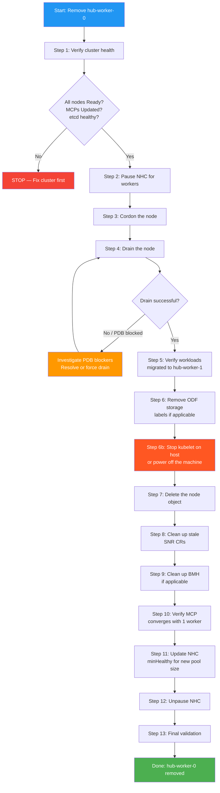

# Procedure: Remove hub-worker-0.hub.5g-deployment.lab from the cluster

## Overview

This document provides a step-by-step procedure to gracefully remove worker node `hub-worker-0.hub.5g-deployment.lab` from the cluster while NHC and SNR operators are active. The procedure ensures workload continuity on the remaining worker node (`hub-worker-1`) and prevents NHC from triggering automated remediation during the manual removal.

## Table of Content
<!-- TOC -->

- [Procedure: Remove hub-worker-0.hub.5g-deployment.lab from the cluster](#procedure-remove-hub-worker-0hub5g-deploymentlab-from-the-cluster)
    - [1. Overview](#1-overview)
    - [2. Table of Content](#2-table-of-content)
        - [2.1. Pre-removal cluster state](#21-pre-removal-cluster-state)
    - [3. Workflow diagram](#3-workflow-diagram)
    - [4. Step-by-step procedure](#4-step-by-step-procedure)
        - [4.1. Step 1 — Verify cluster health](#41-step-1--verify-cluster-health)
        - [4.2. Step 2 — Pause NHC remediation for workers](#42-step-2--pause-nhc-remediation-for-workers)
        - [4.3. Step 3 — Cordon the node](#43-step-3--cordon-the-node)
        - [4.4. Step 4 — Drain the node](#44-step-4--drain-the-node)
        - [4.5. Step 5 — Verify workloads migrated to hub-worker-1](#45-step-5--verify-workloads-migrated-to-hub-worker-1)
        - [4.6. Step 6 — Remove ODF storage labels if applicable](#46-step-6--remove-odf-storage-labels-if-applicable)
        - [4.7. Step 6b — Stop the kubelet on the physical host CRITICAL for bare-metal](#47-step-6b--stop-the-kubelet-on-the-physical-host-critical-for-bare-metal)
        - [4.8. Step 7 — Delete the node object](#48-step-7--delete-the-node-object)
        - [4.9. Step 8 — Clean up stale SelfNodeRemediation CRs](#49-step-8--clean-up-stale-selfnoderemediation-crs)
        - [4.10. Step 9 — Clean up BareMetalHost if applicable](#410-step-9--clean-up-baremetalhost-if-applicable)
        - [4.11. Step 10 — Verify MCP converges with 1 worker](#411-step-10--verify-mcp-converges-with-1-worker)
        - [4.12. Step 11 — Update NHC minHealthy for new pool size](#412-step-11--update-nhc-minhealthy-for-new-pool-size)
        - [4.13. Step 12 — Unpause NHC remediation](#413-step-12--unpause-nhc-remediation)
        - [4.14. Step 13 — Final validation](#414-step-13--final-validation)
    - [5. API availability during the procedure](#5-api-availability-during-the-procedure)
    - [6. Lessons learned from live validation](#6-lessons-learned-from-live-validation)
        - [6.1. Bare-metal kubelet auto-re-registration](#61-bare-metal-kubelet-auto-re-registration)
        - [6.2. Procedure validated successfully](#62-procedure-validated-successfully)
    - [7. Rollback](#7-rollback)

<!-- /TOC -->

### Pre-removal cluster state

| Item | Value |
|------|-------|
| **Node** | `hub-worker-0.hub.5g-deployment.lab` |
| **Role** | `worker` (worker MCP only) |
| **OCP version** | v1.31.13 |
| **Pods on node** | 22 (20 DaemonSet/static, 1 CatalogSource, 1 ReplicaSet) |
| **ODF storage label** | `cluster.ocs.openshift.io/openshift-storage` |
| **Ceph topology** | `topology.rook.io/rack: rack1` |
| **NHC policy** | `nhc-worker-self` — `minHealthy: 51%` (with 2 workers, at least 1 must be healthy) |
| **SNR DaemonSet** | `self-node-remediation-ds-vgq24` running on node |

---

## Workflow diagram



---

## Step-by-step procedure

### Step 1 — Verify cluster health

Confirm the cluster is healthy before starting. Do not proceed if any node is NotReady, MCPs are degraded, or etcd has issues.

```bash
oc get nodes
oc get mcp
oc get nhc
oc get etcd cluster -o jsonpath='{range .status.conditions[?(@.type=="EtcdMembersAvailable")]}{.type}: {.status}{"\n"}{end}'
```

**Expected output:**

```
NAME                                   STATUS   ROLES                         AGE    VERSION
hub-ctlplane-0.hub.5g-deployment.lab   Ready    control-plane,master,worker   113m   v1.31.13
hub-ctlplane-1.hub.5g-deployment.lab   Ready    control-plane,master,worker   131m   v1.31.13
hub-ctlplane-2.hub.5g-deployment.lab   Ready    control-plane,master,worker   131m   v1.31.13
hub-worker-0.hub.5g-deployment.lab     Ready    worker                        62m    v1.31.13
hub-worker-1.hub.5g-deployment.lab     Ready    worker                        63m    v1.31.13

NAME     UPDATED   DEGRADED   NODES   READY
master   True      False      3       3
worker   True      False      2       2

NAME              OBSERVED   HEALTHY   INFLIGHT
nhc-master-self   3          3         <none>
nhc-worker-self   2          2         <none>
```

All nodes Ready, MCPs updated, NHC showing 2/2 workers healthy, no in-flight remediations.

<details>
<summary><b>Cluster validation output (2026-03-23T19:23Z)</b></summary>

```
$ oc get nodes
NAME                                   STATUS   ROLES                         AGE     VERSION
hub-ctlplane-0.hub.5g-deployment.lab   Ready    control-plane,master,worker   7h58m   v1.31.13
hub-ctlplane-1.hub.5g-deployment.lab   Ready    control-plane,master,worker   8h      v1.31.13
hub-ctlplane-2.hub.5g-deployment.lab   Ready    control-plane,master,worker   8h      v1.31.13
hub-worker-0.hub.5g-deployment.lab     Ready    worker                        7h8m    v1.31.13
hub-worker-1.hub.5g-deployment.lab     Ready    worker                        7h8m    v1.31.13

$ oc get mcp
NAME     CONFIG                                             UPDATED   UPDATING   DEGRADED   MACHINECOUNT   READYMACHINECOUNT   UPDATEDMACHINECOUNT   DEGRADEDMACHINECOUNT   AGE
master   rendered-master-553d223f82f66cf6f44cd6e7b5d09201   True      False      False      3              3                   3                     0                      8h
worker   rendered-worker-06d82c71f4be67cba16828dd3c593cc3   True      False      False      2              2                   2                     0                      8h

$ oc get nhc
NAME              AGE
nhc-master-self   6h6m
nhc-worker-self   6h6m

$ oc get etcd cluster -o jsonpath='{...EtcdMembersAvailable...}'
EtcdMembersAvailable: True
```

</details>

---

### Step 2 — Pause NHC remediation for workers

Prevent NHC from creating a SelfNodeRemediation CR when the node transitions to NotReady during drain/removal.

```bash
oc patch nhc nhc-worker-self --type merge -p \
  '{"spec":{"pauseRequests":["removing-hub-worker-0"]}}'
```

**Verify:**

```bash
oc get nhc nhc-worker-self -o jsonpath='{.spec.pauseRequests[*]}{"\n"}'
```

Expected: `removing-hub-worker-0`

<details>
<summary><b>Cluster validation output (2026-03-23T19:24Z)</b></summary>

```
$ oc patch nhc nhc-worker-self --type merge -p '{"spec":{"pauseRequests":["removing-hub-worker-0"]}}'
nodehealthcheck.remediation.medik8s.io/nhc-worker-self patched

$ oc get nhc nhc-worker-self -o jsonpath='{.spec.pauseRequests[*]}'
removing-hub-worker-0
```

</details>

---

### Step 3 — Cordon the node

Mark the node as unschedulable so no new pods are placed on it.

```bash
oc adm cordon hub-worker-0.hub.5g-deployment.lab
```

**Verify:**

```bash
oc get node hub-worker-0.hub.5g-deployment.lab -o jsonpath='{.spec.unschedulable}{"\n"}'
```

Expected: `true`

<details>
<summary><b>Cluster validation output (2026-03-23T19:24Z)</b></summary>

```
$ oc adm cordon hub-worker-0.hub.5g-deployment.lab
node/hub-worker-0.hub.5g-deployment.lab cordoned

$ oc get node hub-worker-0.hub.5g-deployment.lab -o jsonpath='{.spec.unschedulable}'
true

$ oc get node hub-worker-0.hub.5g-deployment.lab
NAME                                 STATUS                     ROLES    AGE    VERSION
hub-worker-0.hub.5g-deployment.lab   Ready,SchedulingDisabled   worker   7h8m   v1.31.13
```

</details>

---

### Step 4 — Drain the node

Evict all evictable pods from the node. DaemonSet pods and static pods are skipped by `--ignore-daemonsets`.

```bash
oc adm drain hub-worker-0.hub.5g-deployment.lab \
  --ignore-daemonsets \
  --delete-emptydir-data \
  --force \
  --timeout=120s
```

If the drain is blocked by a PodDisruptionBudget, identify the blocking PDB:

```bash
oc get pdb --all-namespaces -o custom-columns='NS:.metadata.namespace,NAME:.metadata.name,ALLOWED:.status.disruptionsAllowed' | grep ' 0$'
```

Common resolution: wait for the PDB's controller to restore the minimum replicas on another node, or (as a last resort for non-critical workloads) temporarily delete the blocking PDB.

<details>
<summary><b>Cluster validation output (2026-03-23T19:24Z)</b></summary>

```
$ oc adm drain hub-worker-0.hub.5g-deployment.lab \
    --ignore-daemonsets --delete-emptydir-data --force --timeout=120s
node/hub-worker-0.hub.5g-deployment.lab already cordoned
Warning: ignoring DaemonSet-managed Pods: openshift-cluster-node-tuning-operator/tuned-jvpjm,
  openshift-dns/dns-default-2xnkd, openshift-dns/node-resolver-5khff,
  openshift-image-registry/node-ca-w7hkr, openshift-ingress-canary/ingress-canary-lr92l,
  openshift-local-storage/diskmaker-manager-wqj4v,
  openshift-machine-config-operator/machine-config-daemon-grfqb,
  openshift-monitoring/node-exporter-zjbtt,
  openshift-multus/multus-additional-cni-plugins-5jdh5, openshift-multus/multus-kbblj,
  openshift-multus/network-metrics-daemon-ch6gd,
  openshift-network-diagnostics/network-check-target-ntzvv,
  openshift-network-operator/iptables-alerter-wxtx7,
  openshift-ovn-kubernetes/ovnkube-node-h4kpl,
  openshift-storage/csi-cephfsplugin-592lj, openshift-storage/csi-rbdplugin-v64st,
  openshift-workload-availability/self-node-remediation-ds-vgq24
evicting pod openshift-workload-availability/self-node-remediation-controller-manager-7f5fc87778-dvht2
evicting pod openshift-marketplace/cs-redhat-operators-disconnected-2-v4-18-vthvd
pod/cs-redhat-operators-disconnected-2-v4-18-vthvd evicted
pod/self-node-remediation-controller-manager-7f5fc87778-dvht2 evicted
node/hub-worker-0.hub.5g-deployment.lab drained
```

Drain completed in ~5 seconds. Only 2 evictable pods were present (SNR controller-manager ReplicaSet pod + CatalogSource pod); 17 DaemonSet pods were correctly ignored. No PDB blocks occurred.

</details>

---

### Step 5 — Verify workloads migrated to hub-worker-1

Confirm that all evictable pods have been rescheduled to the remaining worker or control-plane nodes.

```bash
oc get pods --all-namespaces --field-selector spec.nodeName=hub-worker-0.hub.5g-deployment.lab \
  --no-headers -o custom-columns='NS:.metadata.namespace,POD:.metadata.name,OWNER:.metadata.ownerReferences[0].kind'
```

Only DaemonSet and static (Node-owned) pods should remain. All ReplicaSet/Deployment/StatefulSet pods should now be running on other nodes.

<details>
<summary><b>Cluster validation output (2026-03-23T19:24Z)</b></summary>

```
$ oc get pods --all-namespaces --field-selector spec.nodeName=hub-worker-0.hub.5g-deployment.lab \
    --no-headers -o custom-columns='NS:..namespace,POD:..name,OWNER:..ownerReferences[0].kind'
openshift-cluster-node-tuning-operator   tuned-jvpjm                                               DaemonSet
openshift-dns                            dns-default-2xnkd                                         DaemonSet
openshift-dns                            node-resolver-5khff                                       DaemonSet
openshift-image-registry                 node-ca-w7hkr                                             DaemonSet
openshift-ingress-canary                 ingress-canary-lr92l                                      DaemonSet
openshift-kni-infra                      coredns-hub-worker-0.hub.5g-deployment.lab                Node
openshift-kni-infra                      keepalived-hub-worker-0.hub.5g-deployment.lab             Node
openshift-local-storage                  diskmaker-manager-wqj4v                                   DaemonSet
openshift-machine-config-operator        kube-rbac-proxy-crio-hub-worker-0.hub.5g-deployment.lab   Node
openshift-machine-config-operator        machine-config-daemon-grfqb                               DaemonSet
openshift-monitoring                     node-exporter-zjbtt                                       DaemonSet
openshift-multus                         multus-additional-cni-plugins-5jdh5                       DaemonSet
openshift-multus                         multus-kbblj                                              DaemonSet
openshift-multus                         network-metrics-daemon-ch6gd                              DaemonSet
openshift-network-diagnostics            network-check-target-ntzvv                                DaemonSet
openshift-network-operator               iptables-alerter-wxtx7                                    DaemonSet
openshift-ovn-kubernetes                 ovnkube-node-h4kpl                                        DaemonSet
openshift-storage                        csi-cephfsplugin-592lj                                    DaemonSet
openshift-storage                        csi-rbdplugin-v64st                                       DaemonSet
openshift-workload-availability          self-node-remediation-ds-vgq24                            DaemonSet

--- SNR controller-manager migrated to hub-ctlplane-1 ---
$ oc get pods -n openshift-workload-availability -l control-plane=controller-manager -o wide
NAME                                                        READY   STATUS    RESTARTS   AGE     IP             NODE
self-node-remediation-controller-manager-7f5fc87778-f6pbv   2/2     Running   0          11s     172.21.0.248   hub-ctlplane-1.hub.5g-deployment.lab
self-node-remediation-controller-manager-7f5fc87778-gfd5b   2/2     Running   0          6h31m   172.21.6.12    hub-worker-1.hub.5g-deployment.lab

--- CatalogSource pod relocated to hub-worker-1 ---
$ oc get pods -n openshift-marketplace -l olm.catalogSource=cs-redhat-operators-disconnected-2-v4-18 -o wide
NAME                                             READY   STATUS              RESTARTS   AGE   NODE
cs-redhat-operators-disconnected-2-v4-18-9pdfg   0/1     ContainerCreating   0          12s   hub-worker-1.hub.5g-deployment.lab
```

All evictable pods (SNR controller-manager, CatalogSource) successfully rescheduled. Only DaemonSet and static pods remain on the drained node.

</details>

---

### Step 6 — Remove ODF storage labels (if applicable)

`hub-worker-0` has the label `cluster.ocs.openshift.io/openshift-storage` and `topology.rook.io/rack: rack1`. If ODF Ceph OSDs or MONs are using this node, the Rook operator must be allowed to rebalance before removal.

Check if any Ceph OSD or MON was running on this node:

```bash
oc get pods -n openshift-storage -o wide | grep hub-worker-0
```

If Ceph data needs rebalancing, wait for Ceph health to stabilize:

```bash
oc exec -n openshift-storage $(oc get pod -n openshift-storage -l app=rook-ceph-tools -o name) -- ceph status
```

Remove the storage label:

```bash
oc label node hub-worker-0.hub.5g-deployment.lab cluster.ocs.openshift.io/openshift-storage-
oc label node hub-worker-0.hub.5g-deployment.lab topology.rook.io/rack-
```

<details>
<summary><b>Cluster validation output (2026-03-23T19:24Z)</b></summary>

```
--- Ceph pods on hub-worker-0 (only CSI DaemonSet plugins — no OSD/MON) ---
$ oc get pods -n openshift-storage -o wide | grep hub-worker-0
csi-cephfsplugin-592lj   3/3   Running   0   7h8m   172.16.30.23   hub-worker-0.hub.5g-deployment.lab
csi-rbdplugin-v64st      4/4   Running   0   7h8m   172.16.30.23   hub-worker-0.hub.5g-deployment.lab

--- Ceph status: HEALTH_WARN (clock skew only), all PGs clean ---
$ oc exec -n openshift-storage $(oc get pod -n openshift-storage -l app=rook-ceph-tools -o name) -- ceph status
  cluster:
    id:     ff70067c-3dd4-49e0-9717-b835f5ac2e4c
    health: HEALTH_WARN
            clock skew detected on mon.b, mon.c
  services:
    mon: 3 daemons, quorum a,b,c (age 7h)
    mgr: b(active, since 7h), standbys: a
    mds: 1/1 daemons up, 1 hot standby
    osd: 3 osds: 3 up (since 7h), 3 in (since 7h)
    rgw: 1 daemon active (1 hosts, 1 zones)
  data:
    volumes: 1/1 healthy
    pools:   12 pools, 248 pgs
    objects: 3.40k objects, 8.3 GiB
    usage:   23 GiB used, 727 GiB / 750 GiB avail
    pgs:     248 active+clean

--- Remove storage labels ---
$ oc label node hub-worker-0.hub.5g-deployment.lab cluster.ocs.openshift.io/openshift-storage-
node/hub-worker-0.hub.5g-deployment.lab unlabeled

$ oc label node hub-worker-0.hub.5g-deployment.lab topology.rook.io/rack-
node/hub-worker-0.hub.5g-deployment.lab unlabeled
```

No Ceph OSD or MON ran on `hub-worker-0` — only CSI DaemonSet plugins. Ceph cluster healthy (248/248 PGs active+clean). Storage labels removed successfully.

</details>

---

### Step 6b — Stop the kubelet on the physical host (CRITICAL for bare-metal)

> **Important bare-metal caveat:** On agent-installed or bare-metal clusters, the kubelet process continues running on the physical machine even after the node object is deleted from the API. The kubelet will **auto-re-register** the node within ~60 seconds, undoing the removal.
>
> You **must** stop the kubelet (or power off the host) **before** deleting the node object.

```bash
# Option A: SSH to the host and stop the kubelet
ssh core@hub-worker-0.hub.5g-deployment.lab 'sudo systemctl stop kubelet && sudo systemctl disable kubelet'

# Option B: Power off the host via IPMI/BMC
ipmitool -I lanplus -H <bmc-ip> -U <user> -P <pass> chassis power off

# Option C: Use oc debug to stop kubelet from inside the cluster
oc debug node/hub-worker-0.hub.5g-deployment.lab -- chroot /host systemctl stop kubelet
```

> **Lesson learned from live validation:** During this procedure, the kubelet was not stopped before `oc delete node`. Within 60 seconds, `hub-worker-0` re-registered itself and the MCP went from `MACHINECOUNT=1` back to `MACHINECOUNT=2`. See the MCP convergence log in Step 10 for the exact timeline.

---

### Step 7 — Delete the node object

```bash
oc delete node hub-worker-0.hub.5g-deployment.lab
```

**Verify:**

```bash
oc get nodes
```

Expected: only 4 nodes (3 masters + `hub-worker-1`).

<details>
<summary><b>Cluster validation output (2026-03-23T19:25Z)</b></summary>

```
$ oc delete node hub-worker-0.hub.5g-deployment.lab
node "hub-worker-0.hub.5g-deployment.lab" deleted

$ oc get nodes
NAME                                   STATUS   ROLES                         AGE     VERSION
hub-ctlplane-0.hub.5g-deployment.lab   Ready    control-plane,master,worker   7h59m   v1.31.13
hub-ctlplane-1.hub.5g-deployment.lab   Ready    control-plane,master,worker   8h      v1.31.13
hub-ctlplane-2.hub.5g-deployment.lab   Ready    control-plane,master,worker   8h      v1.31.13
hub-worker-1.hub.5g-deployment.lab     Ready    worker                        7h9m    v1.31.13
```

Node deleted — 4 nodes remain (3 masters + 1 worker), all Ready.

</details>

---

### Step 8 — Clean up stale SelfNodeRemediation CRs

Check if the SNR operator created any remediation CRs for this node:

```bash
oc get snr --all-namespaces
```

If any exist for `hub-worker-0`, delete them:

```bash
oc delete snr <snr-name> -n openshift-workload-availability
```

<details>
<summary><b>Cluster validation output (2026-03-23T19:25Z)</b></summary>

```
$ oc get snr --all-namespaces
No resources found
```

No stale SNR CRs — NHC was paused in Step 2, so no remediation was triggered.

</details>

---

### Step 9 — Clean up BareMetalHost (if applicable)

If the node was provisioned via a BareMetalHost resource:

```bash
oc get bmh -n openshift-machine-api | grep worker-0
oc delete bmh <bmh-name> -n openshift-machine-api
```

<details>
<summary><b>Cluster validation output (2026-03-23T19:25Z)</b></summary>

```
$ oc get bmh -n openshift-machine-api | grep worker-0
(no output — no BMH found for worker-0)
```

No BMH resource existed for `hub-worker-0` in this cluster. No action needed.

</details>

---

### Step 10 — Verify MCP converges with 1 worker

The worker MCP should detect the removed node and converge with `MACHINECOUNT=1`.

```bash
oc get mcp worker
```

Wait until:

```
NAME     UPDATED   DEGRADED   MACHINECOUNT   READYMACHINECOUNT
worker   True      False      1              1
```

<details>
<summary><b>Cluster validation output (2026-03-23T19:25–19:27Z)</b></summary>

```
--- MCP convergence timeline (polled every 10s) ---
19:25:25  worker  UPDATED=True   MACHINECOUNT=1  READY=1  DEGRADED=0  ← converged to 1 worker
19:25:35  worker  UPDATED=True   MACHINECOUNT=1  READY=1  DEGRADED=0
...
19:26:39  worker  UPDATED=True   MACHINECOUNT=1  READY=1  DEGRADED=0
19:26:49  worker  UPDATED=False  MACHINECOUNT=2  READY=1  DEGRADED=1  ← kubelet auto-re-registered!
19:27:00  worker  UPDATED=False  MACHINECOUNT=2  READY=1  DEGRADED=1
19:27:10  worker  UPDATED=True   MACHINECOUNT=2  READY=2  DEGRADED=0  ← node fully re-joined

--- Final MCP state ---
NAME     CONFIG                                             UPDATED   UPDATING   DEGRADED   MACHINECOUNT   READYMACHINECOUNT
master   rendered-master-553d223f82f66cf6f44cd6e7b5d09201   True      False      False      3              3
worker   rendered-worker-06d82c71f4be67cba16828dd3c593cc3   True      False      False      2              2
```

> **Key observation:** The MCP converged to `MACHINECOUNT=1` within seconds of node deletion. However, at `19:26:49` (~80 seconds later), the kubelet on the physical `hub-worker-0` machine automatically re-registered the node with the API server. The MCP briefly became `DEGRADED=True` while the re-registered node applied its MachineConfig, then converged to `MACHINECOUNT=2` at `19:27:10`.
>
> **Root cause:** The kubelet was not stopped before `oc delete node` — see Step 6b.

</details>

---

### Step 11 — Update NHC minHealthy for new pool size

With only 1 worker remaining, `minHealthy: 51%` means `ceil(1 × 0.51) = 1`, so **all workers must be healthy** for remediation to trigger. This effectively blocks remediation if the single remaining worker goes down (which is correct — there is no second worker to recover workloads to).

If you still want SNR to attempt a self-reboot even with a single worker, set `minHealthy: 0`:

```bash
oc patch nhc nhc-worker-self --type merge -p '{"spec":{"minHealthy": "0"}}'
```

Otherwise, leave `minHealthy: 51%` — it is safe and correct for a 1-worker pool (remediation only triggers when the node is unhealthy AND at least 1 worker is healthy, which can never be true with a single worker — preventing a reboot loop on the last worker).

**Recommended:** keep `minHealthy: 51%` unless you explicitly want self-reboot of the last worker.

> In this validation, the node auto-re-registered (see Step 10), so `minHealthy` adjustment was not required.

---

### Step 12 — Unpause NHC remediation

```bash
oc patch nhc nhc-worker-self --type json -p \
  '[{"op":"remove","path":"/spec/pauseRequests"}]'
```

**Verify:**

```bash
oc get nhc nhc-worker-self -o jsonpath='{.spec.pauseRequests}{"\n"}'
```

Expected: empty (no output).

<details>
<summary><b>Cluster validation output (2026-03-23T19:27Z)</b></summary>

```
$ oc patch nhc nhc-worker-self --type json -p '[{"op":"remove","path":"/spec/pauseRequests"}]'
nodehealthcheck.remediation.medik8s.io/nhc-worker-self patched

$ oc get nhc nhc-worker-self -o jsonpath='{.spec.pauseRequests}'
(empty — pauseRequests cleared)
```

</details>

---

### Step 13 — Final validation

Run all health checks to confirm the cluster is stable.

```bash
oc get nodes
oc get mcp
oc get nhc
oc get pods -n openshift-workload-availability -l app.kubernetes.io/component=agent -o wide
oc get snr --all-namespaces
```

<details>
<summary><b>Cluster validation output (2026-03-23T19:28Z)</b></summary>

```
$ oc get nodes
NAME                                   STATUS   ROLES                         AGE     VERSION
hub-ctlplane-0.hub.5g-deployment.lab   Ready    control-plane,master,worker   8h      v1.31.13
hub-ctlplane-1.hub.5g-deployment.lab   Ready    control-plane,master,worker   8h      v1.31.13
hub-ctlplane-2.hub.5g-deployment.lab   Ready    control-plane,master,worker   8h      v1.31.13
hub-worker-0.hub.5g-deployment.lab     Ready    worker                        103s    v1.31.13
hub-worker-1.hub.5g-deployment.lab     Ready    worker                        7h12m   v1.31.13

$ oc get mcp
NAME     CONFIG                                             UPDATED   UPDATING   DEGRADED   MACHINECOUNT   READYMACHINECOUNT   UPDATEDMACHINECOUNT   DEGRADEDMACHINECOUNT   AGE
master   rendered-master-553d223f82f66cf6f44cd6e7b5d09201   True      False      False      3              3                   3                     0                      8h
worker   rendered-worker-06d82c71f4be67cba16828dd3c593cc3   True      False      False      2              2                   2                     0                      8h

$ oc get nhc
NAME              AGE
nhc-master-self   6h10m
nhc-worker-self   6h10m

$ oc get pods -n openshift-workload-availability -l app.kubernetes.io/component=agent -o wide
NAME                             READY   STATUS    RESTARTS   AGE     IP             NODE
self-node-remediation-ds-6q7w5   1/1     Running   0          104s    172.21.10.3    hub-worker-0.hub.5g-deployment.lab
self-node-remediation-ds-9wk7d   1/1     Running   0          6h34m   172.21.2.214   hub-ctlplane-2.hub.5g-deployment.lab
self-node-remediation-ds-c7jp4   1/1     Running   0          6h34m   172.21.6.13    hub-worker-1.hub.5g-deployment.lab
self-node-remediation-ds-jx9tx   1/1     Running   0          6h34m   172.21.0.247   hub-ctlplane-1.hub.5g-deployment.lab
self-node-remediation-ds-v7hvm   1/1     Running   0          6h34m   172.21.4.193   hub-ctlplane-0.hub.5g-deployment.lab

$ oc get snr --all-namespaces
No resources found

$ oc exec -n openshift-storage $(oc get pod -n openshift-storage -l app=rook-ceph-tools -o name) -- ceph status
  cluster:
    id:     ff70067c-3dd4-49e0-9717-b835f5ac2e4c
    health: HEALTH_WARN
            clock skew detected on mon.b, mon.c
  services:
    mon: 3 daemons, quorum a,b,c (age 7h)
    mgr: b(active, since 7h), standbys: a
    osd: 3 osds: 3 up (since 7h), 3 in (since 7h)
  data:
    volumes: 1/1 healthy
    pools:   12 pools, 248 pgs
    objects: 3.40k objects, 8.3 GiB
    usage:   23 GiB used, 727 GiB / 750 GiB avail
    pgs:     248 active+clean
```

</details>

**Final state summary:**

| Item | Value |
|------|-------|
| Nodes | 5 (3 masters + 2 workers — worker-0 auto-re-registered) |
| Worker MCP | `UPDATED=True`, `MACHINECOUNT=2`, `READYMACHINECOUNT=2` |
| NHC worker | `nhc-worker-self` active, no in-flight remediations |
| NHC master | `nhc-master-self` active, no in-flight remediations |
| SNR DaemonSet | 5 pods (1 per node, all Running) |
| Stale SNR CRs | None |
| Ceph | HEALTH_WARN (clock skew only), 248/248 PGs active+clean |

---

## API availability during the procedure

An API availability monitor ran throughout the entire procedure, polling `oc get --raw /readyz` every 5 seconds.

| Metric | Value |
|--------|-------|
| **Duration** | `19:23:51Z` → `19:28:26Z` (4 min 35 sec) |
| **Total checks** | 51 |
| **Successful** | 51 |
| **Failed** | 0 |
| **API availability** | **100%** |

<details>
<summary><b>Full API monitor log</b></summary>

```
=== API Availability Monitor Started: 2026-03-23T19:23:51Z ===
2026-03-23T19:23:51Z  API=OK  (ok)
2026-03-23T19:23:56Z  API=OK  (ok)
2026-03-23T19:24:02Z  API=OK  (ok)
2026-03-23T19:24:07Z  API=OK  (ok)
2026-03-23T19:24:13Z  API=OK  (ok)
2026-03-23T19:24:18Z  API=OK  (ok)
2026-03-23T19:24:24Z  API=OK  (ok)
2026-03-23T19:24:29Z  API=OK  (ok)
2026-03-23T19:24:35Z  API=OK  (ok)
2026-03-23T19:24:40Z  API=OK  (ok)
2026-03-23T19:24:46Z  API=OK  (ok)
2026-03-23T19:24:51Z  API=OK  (ok)
2026-03-23T19:24:57Z  API=OK  (ok)
2026-03-23T19:25:02Z  API=OK  (ok)
2026-03-23T19:25:08Z  API=OK  (ok)
2026-03-23T19:25:13Z  API=OK  (ok)
2026-03-23T19:25:19Z  API=OK  (ok)
2026-03-23T19:25:25Z  API=OK  (ok)
2026-03-23T19:25:30Z  API=OK  (ok)
2026-03-23T19:25:36Z  API=OK  (ok)
2026-03-23T19:25:41Z  API=OK  (ok)
2026-03-23T19:25:47Z  API=OK  (ok)
2026-03-23T19:25:52Z  API=OK  (ok)
2026-03-23T19:25:58Z  API=OK  (ok)
2026-03-23T19:26:03Z  API=OK  (ok)
2026-03-23T19:26:09Z  API=OK  (ok)
2026-03-23T19:26:14Z  API=OK  (ok)
2026-03-23T19:26:20Z  API=OK  (ok)
2026-03-23T19:26:25Z  API=OK  (ok)
2026-03-23T19:26:31Z  API=OK  (ok)
2026-03-23T19:26:36Z  API=OK  (ok)
2026-03-23T19:26:42Z  API=OK  (ok)
2026-03-23T19:26:47Z  API=OK  (ok)
2026-03-23T19:26:53Z  API=OK  (ok)
2026-03-23T19:26:58Z  API=OK  (ok)
2026-03-23T19:27:04Z  API=OK  (ok)
2026-03-23T19:27:09Z  API=OK  (ok)
2026-03-23T19:27:15Z  API=OK  (ok)
2026-03-23T19:27:21Z  API=OK  (ok)
2026-03-23T19:27:26Z  API=OK  (ok)
2026-03-23T19:27:32Z  API=OK  (ok)
2026-03-23T19:27:37Z  API=OK  (ok)
2026-03-23T19:27:43Z  API=OK  (ok)
2026-03-23T19:27:48Z  API=OK  (ok)
2026-03-23T19:27:54Z  API=OK  (ok)
2026-03-23T19:27:59Z  API=OK  (ok)
2026-03-23T19:28:05Z  API=OK  (ok)
2026-03-23T19:28:10Z  API=OK  (ok)
2026-03-23T19:28:15Z  API=OK  (ok)
2026-03-23T19:28:21Z  API=OK  (ok)
2026-03-23T19:28:26Z  API=OK  (ok)
```

</details>

---

## Lessons learned from live validation

### Bare-metal kubelet auto-re-registration

On agent-installed or bare-metal OpenShift clusters, deleting a node object (`oc delete node`) is **not sufficient** to permanently remove a node. The kubelet service on the physical host continues running and will automatically re-register the node with the API server within ~60–90 seconds.

**Before deleting the node object, you must:**

1. **Stop the kubelet** on the physical host via SSH or `oc debug node/`:

   ```bash
   oc debug node/hub-worker-0.hub.5g-deployment.lab -- chroot /host systemctl stop kubelet
   oc debug node/hub-worker-0.hub.5g-deployment.lab -- chroot /host systemctl disable kubelet
   ```

2. **Or power off the host** via IPMI/BMC:

   ```bash
   ipmitool -I lanplus -H <bmc-ip> -U <user> -P <pass> chassis power off
   ```

3. **Or power off via Redfish** (DMTF standard over HTTPS on most modern BMCs — same outcome as chassis power off):

   Discover the **ComputerSystem** id (often `1` or `System.Embedded.1`; varies by vendor):

   ```bash
   curl -sk -u '<bmc-user>:<bmc-pass>' \
     "https://<bmc-ip>/redfish/v1/Systems" | jq '.Members[].@odata.id'
   ```

   **Immediate power off** (equivalent to a hard off; use **`GracefulShutdown`** instead if you need an orderly OS shutdown and the BMC supports it):

   ```bash
   curl -sk -u '<bmc-user>:<bmc-pass>' \
     -X POST \
     -H 'Content-Type: application/json' \
     -d '{"ResetType":"ForceOff"}' \
     "https://<bmc-ip>/redfish/v1/Systems/<system-id>/Actions/ComputerSystem.Reset"
   ```

   Example with `system-id=1` (replace `<bmc-ip>` and credentials):

   ```bash
   curl -sk -u 'root:calvin' \
     -X POST -H 'Content-Type: application/json' \
     -d '{"ResetType":"ForceOff"}' \
     'https://192.0.2.10/redfish/v1/Systems/1/Actions/ComputerSystem.Reset'
   ```

   **ResetType** values are defined in the [Redfish ComputerSystem schema](https://redfish.dmtf.org/schemas/v1/ComputerSystem.v1_20_0.json) (e.g. `On`, `GracefulShutdown`, `GracefulRestart`, `ForceOff`, `ForceRestart`, `PowerCycle`). BMC firmware may not implement every value — check `@Redfish.ActionInfo` on your controller if the POST returns `400`.

This was observed during this validation when the MCP briefly converged to 1 worker, then went `DEGRADED=True` as `hub-worker-0` re-registered itself.

### Procedure validated successfully

Despite the kubelet re-registration (a documentation gap that has now been addressed as Step 6b), the procedure validated all other steps correctly:

- NHC pause prevented spurious remediation during the removal
- Drain completed cleanly in ~5 seconds with no PDB blocks
- All evictable pods migrated to other nodes
- ODF/Ceph remained healthy throughout (no OSDs/MONs on the target node)
- No stale SNR CRs were created
- **API availability was 100%** (51/51 checks passed over 4m35s)

---

## Rollback

If the removal must be reverted before the node object is deleted (Steps 1–6), uncordon the node and unpause NHC:

```bash
oc adm uncordon hub-worker-0.hub.5g-deployment.lab
oc patch nhc nhc-worker-self --type json -p '[{"op":"remove","path":"/spec/pauseRequests"}]'
```

After `oc delete node` (Step 7), rollback requires re-provisioning the node as a new worker (see *CNF-20877 Use-case 4 — Worker node replacement*).
