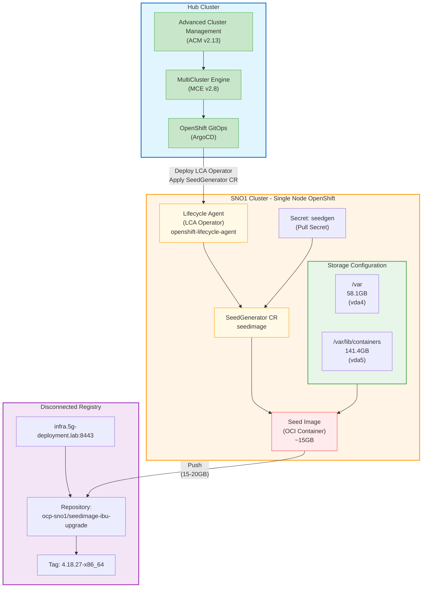

# Seed Image Generation for SNO1 Cluster

## Overview

This document provides a comprehensive guide for generating a seed image for the SNO1 (Single Node OpenShift) cluster using the OpenShift Lifecycle Agent (LCA). The seed image is used for Image-Based Upgrades (IBU) and cluster provisioning workflows.

## Table of Contents

- [Prerequisites](#prerequisites)
- [Architecture](#architecture)
- [Step-by-Step Procedure](#step-by-step-procedure)
  - [1. Verify Prerequisites](#1-verify-prerequisites)
  - [2. Configure Partitioned Storage](#2-configure-partitioned-storage)
  - [3. Deploy Seed Generator](#3-deploy-seed-generator)
  - [4. Monitor Seed Generation](#4-monitor-seed-generation)
  - [5. Validate Seed Image](#5-validate-seed-image)
- [Troubleshooting](#troubleshooting)
- [References](#references)

---

## Prerequisites

Before generating the seed image, ensure the following requirements are met:

1. **OpenShift Lifecycle Agent (LCA) Operator**
   - Installed and running on the Hub cluster
   - Available on the SNO1 cluster via ACM/MCE deployment

2. **Storage Configuration**
   - Dedicated partition for `/var/lib/containers` (minimum 141GB recommended)
   - Root filesystem with sufficient space (minimum 58GB)

3. **Network Connectivity**
   - Access to the disconnected registry: `infra.5g-deployment.lab:8443`
   - Valid pull secret with authentication credentials

4. **Cluster Access**
   - `kubeconfig` file for the SNO1 cluster
   - `oc` CLI tool installed and configured

5. **Hub Cluster Components**
   - Advanced Cluster Management (ACM) v2.13+
   - MultiCluster Engine (MCE) v2.8+
   - OpenShift GitOps operator

---

## Architecture

### Seed Image Generation Flow



---

## Step-by-Step Procedure

### 1. Verify Prerequisites

#### 1.1. Check LCA Operator Status

Verify that the Lifecycle Agent operator is installed and running on the SNO1 cluster:

```bash
oc --kubeconfig=./kubeconfig-sno1 get pods -n openshift-lifecycle-agent
```

**Expected Output:**
```
NAME                                           READY   STATUS    RESTARTS   AGE
lifecycle-agent-controller-manager-xxxxx       2/2     Running   0          10m
```

#### 1.2. Verify Storage Configuration

Check that the `/var/lib/containers` partition is properly configured:

```bash
oc --kubeconfig=./kubeconfig-sno1 debug node/ocp-sno1 -- chroot /host lsblk
```

**Expected Output:**
```
NAME   MAJ:MIN RM   SIZE RO TYPE MOUNTPOINTS
vda    252:0    0   200G  0 disk 
├─vda1 252:1    0     1M  0 part 
├─vda2 252:2    0   127M  0 part 
├─vda3 252:3    0   384M  0 part /boot
├─vda4 252:4    0  58.1G  0 part /var
│                                /sysroot/ostree/deploy/rhcos/var
│                                /usr
│                                /etc
│                                /
│                                /sysroot
└─vda5 252:5    0 141.4G  0 part /var/lib/containers
```

**Validation Checklist:**
- ✅ `/var/lib/containers` is mounted on a dedicated partition (vda5)
- ✅ Partition size is at least 141GB
- ✅ Root filesystem (/var) has at least 58GB

---

### 2. Configure Partitioned Storage

If the `/var/lib/containers` partition is not configured, apply the MachineConfig:

#### 2.1. Review the MachineConfig

Examine the partition configuration in `98-var-lib-containers-partitioned.yaml`:

```yaml
apiVersion: machineconfiguration.openshift.io/v1
kind: MachineConfig
metadata:
  labels:
    machineconfiguration.openshift.io/role: master
  name: 98-var-lib-containers-partitioned
spec:
  config:
    ignition:
      version: 3.2.0
    storage:
      disks:
        - device: /dev/vda
          partitions:
            - label: var-lib-containers
              startMiB: 60000  # Leave room for rootfs
              sizeMiB: 0       # Use all available space
      filesystems:
        - device: /dev/disk/by-partlabel/var-lib-containers
          format: xfs
          mountOptions:
            - defaults
            - prjquota
          path: /var/lib/containers
          wipeFilesystem: true
```

#### 2.2. Apply the MachineConfig

**⚠️ Warning:** This operation will trigger a node reboot and data loss in `/var/lib/containers`.

```bash
oc --kubeconfig=./kubeconfig-sno1 apply -f seed-generation/98-var-lib-containers-partitioned.yaml
```

#### 2.3. Monitor Node Reboot

Wait for the MachineConfig to be applied and the node to complete rebooting:

```bash
# Monitor MachineConfigPool status
oc --kubeconfig=./kubeconfig-sno1 get mcp master -w

# Expected progression:
# UPDATED   UPDATING   DEGRADED   MACHINECOUNT   READYMACHINECOUNT   UPDATEDMACHINECOUNT   DEGRADEDMACHINECOUNT   AGE
# True      False      False      1              1                   1                     0                      10d
# False     True       False      1              0                   0                     0                      10d
# True      False      False      1              1                   1                     0                      10d
```

#### 2.4. Verify Partition After Reboot

```bash
oc --kubeconfig=./kubeconfig-sno1 debug node/ocp-sno1 -- chroot /host df -h /var/lib/containers
```

**Expected Output:**
```
Filesystem                                Size  Used Avail Use% Mounted on
/dev/vda5                                 142G   10G  132G   8% /var/lib/containers
```

---

### 3. Deploy Seed Generator

#### 3.1. Review Seed Generator Configuration

Examine the `seed-gen.yaml` file:

```yaml
---
apiVersion: v1
kind: Secret
metadata:
  name: seedgen
  namespace: openshift-lifecycle-agent
type: Opaque
data:
  seedAuth: "ewogICJhdXRocyI6IHsKICAgICJpbmZyYS41Zy1kZXBsb3ltZW50LmxhYjo4NDQzIjogewogICAgICAiYXV0aCI6ICJjR2s2Y21GemNHSmxjbko1IiwKICAgICAgImVtYWlsIjogImpoZW5kcml4QGthcm1hbGFicy5jb3JwIgogICAgfQogIH0KfQoK"
---
apiVersion: lca.openshift.io/v1
kind: SeedGenerator
metadata:
  name: seedimage
spec:
  seedImage: infra.5g-deployment.lab:8443/sno1/seedimage-ibu-upgrade:4.18.27-x86_64
```

**Configuration Details:**
- **Secret (`seedgen`)**: Contains base64-encoded pull secret for the disconnected registry
- **SeedGenerator (`seedimage`)**: Defines the target seed image location and tag

#### 3.2. Apply the Seed Generator Manifest

```bash
oc --kubeconfig=./kubeconfig-sno1 create -f seed-generation/seed-gen.yaml
```

**Expected Output:**
```
seedgenerator.lca.openshift.io/seedimage created
secret/seedgen created
```

**Note:** If the secret already exists, you may see:
```
Error from server (AlreadyExists): error when creating "seed-generation/seed-gen.yaml": secrets "seedgen" already exists
```

This is expected if re-running the procedure. To update the secret:

```bash
oc --kubeconfig=./kubeconfig-sno1 delete secret seedgen -n openshift-lifecycle-agent
oc --kubeconfig=./kubeconfig-sno1 create -f seed-generation/seed-gen.yaml
```

---

### 4. Monitor Seed Generation

#### 4.1. Check SeedGenerator Status

Monitor the seed generation process:

```bash
oc --kubeconfig=./kubeconfig-sno1 get seedgenerator seedimage -o yaml -w
```

**Status Phases:**
1. **Preparing**: Initial validation and setup
2. **InProgress**: Generating the seed image
3. **Completed**: Seed image successfully created and pushed
4. **Failed**: An error occurred (check logs)

```bash
Important: The cluster reboots and loses API capabilities while the Lifecycle Agent generates the seed image. Applying the SeedGenerator CR stops the kubelet and the CRI-O operations, then it starts the image generation.
```

#### 4.2. Monitor Lifecycle Agent Logs

```bash
oc --kubeconfig=./kubeconfig-sno1 logs -n openshift-lifecycle-agent \
  -l app.kubernetes.io/component=lifecycle-agent \
  -f --tail=100
```

**Key Log Messages to Watch For:**
- `Starting seed image generation`
- `Creating ostree commit`
- `Building container image`
- `Pushing seed image to registry`
- `Seed generation completed successfully`

#### 4.3. Check SeedGenerator Conditions

```bash
oc --kubeconfig=./kubeconfig-sno1 get seedgenerator seedimage -o jsonpath='{.status.conditions[*]}' | jq .
```

**Successful Completion Conditions:**
```json
{
  "type": "SeedGenCompleted",
  "status": "True",
  "reason": "Completed",
  "message": "Seed image generated and pushed successfully"
}
```

#### 4.4. Verify Registry Push

Check that the seed image was pushed to the disconnected registry:

```bash
# Query the registry for the seed image
curl -k -u pi:raspberry https://infra.5g-deployment.lab:8443/v2/ocp-sno1/seedimage-ibu-upgrade/tags/list
```

**Expected Output:**
```json
{
  "name": "ocp-sno1/seedimage-ibu-upgrade",
  "tags": ["4.18.27-x86_64"]
}
```

---

### 5. Validate Seed Image

#### 5.1. Inspect Image Metadata

Pull and inspect the seed image metadata:

```bash
# Pull the seed image manifest
skopeo inspect --tls-verify=false \
  docker://infra.5g-deployment.lab:8443/ocp-sno1/seedimage-ibu-upgrade:4.18.27-x86_64
```

**Expected Output:**
```json
{
  "Name": "infra.5g-deployment.lab:8443/ocp-sno1/seedimage-ibu-upgrade",
  "Tag": "4.18.27-x86_64",
  "Digest": "sha256:abc123...",
  "RepoTags": ["4.18.27-x86_64"],
  "Created": "2024-12-03T10:30:00Z",
  "Size": 15000000000,
  "Architecture": "amd64",
  "Os": "linux",
  "Layers": [...]
}
```

#### 5.2. Verify Image Size

Ensure the seed image size is reasonable (typically 10-20GB):

```bash
skopeo inspect --tls-verify=false \
  docker://infra.5g-deployment.lab:8443/ocp-sno1/seedimage-ibu-upgrade:4.18.27-x86_64 | \
  jq '.Size / 1024 / 1024 / 1024'
```

#### 5.3. Check Seed Image Annotations

```bash
oc --kubeconfig=./kubeconfig-sno1 get seedgenerator seedimage -w
NAME        AGE   STATE               DETAILS
seedimage   44s   SeedGenInProgress   Cleaning cluster resources
seedimage   67s   SeedGenInProgress   Launching imager container
seedimage   67s   SeedGenInProgress   Launching imager container
..node reboots..
seedimage   5s    SeedGenCompleted   Seed Generation completed

```

Same seed-image was made available as well to this registry `docker://quay.io/midu/ocp-sno1/seedimage-ibu-upgrade:4.18.27-x86_64` .

---

## Troubleshooting

### Common Issues and Solutions

#### Issue 1: Insufficient Space in `/var/lib/containers`

**Symptoms:**
```
Error: insufficient space in /var/lib/containers
```

**Solution:**
1. Verify partition size: `df -h /var/lib/containers`
2. Clean up unused images: `oc adm prune images --confirm`
3. Increase partition size or use a larger disk

---

#### Issue 2: Registry Authentication Failure

**Symptoms:**
```
Error: unauthorized: authentication required
```

**Solution:**
1. Verify the pull secret is correct:
   ```bash
   oc --kubeconfig=./kubeconfig-sno1 get secret seedgen -n openshift-lifecycle-agent -o jsonpath='{.data.seedAuth}' | base64 -d
   ```
2. Update the secret with correct credentials:
   ```bash
   oc --kubeconfig=./kubeconfig-sno1 create secret generic seedgen \
     --from-file=.dockerconfigjson=/path/to/pull-secret.json \
     --type=kubernetes.io/dockerconfigjson \
     -n openshift-lifecycle-agent \
     --dry-run=client -o yaml | \
     oc --kubeconfig=./kubeconfig-sno1 replace -f -
   ```

---

#### Issue 3: SeedGenerator Stuck in "InProgress"

**Symptoms:**
- Status remains in `InProgress` for more than 30 minutes
- No recent logs from the lifecycle-agent

**Solution:**
1. Check lifecycle-agent pod logs:
   ```bash
   oc --kubeconfig=./kubeconfig-sno1 logs -n openshift-lifecycle-agent \
     -l app.kubernetes.io/component=lifecycle-agent --tail=200
   ```
2. Restart the lifecycle-agent pod:
   ```bash
   oc --kubeconfig=./kubeconfig-sno1 delete pod -n openshift-lifecycle-agent \
     -l app.kubernetes.io/component=lifecycle-agent
   ```
3. Delete and recreate the SeedGenerator:
   ```bash
   oc --kubeconfig=./kubeconfig-sno1 delete seedgenerator seedimage
   oc --kubeconfig=./kubeconfig-sno1 create -f seed-generation/seed-gen.yaml
   ```

---

#### Issue 4: Node Fails to Reboot After MachineConfig

**Symptoms:**
- MachineConfigPool shows `DEGRADED=True`
- Node stuck in `NotReady` state

**Solution:**
1. Check MachineConfigDaemon logs:
   ```bash
   oc --kubeconfig=./kubeconfig-sno1 logs -n openshift-machine-config-operator \
     -l k8s-app=machine-config-daemon -c machine-config-daemon
   ```
2. Verify disk partition layout:
   ```bash
   oc --kubeconfig=./kubeconfig-sno1 debug node/ocp-sno1 -- chroot /host lsblk
   ```
3. If partition creation failed, manually recreate:
   ```bash
   # SSH to the node (if accessible)
   sudo parted /dev/vda mkpart primary xfs 60000MiB 100%
   sudo mkfs.xfs /dev/vda5
   ```

---

#### Issue 5: Registry Push Fails

**Symptoms:**
```
Error: failed to push image: connection refused
```

**Solution:**
1. Verify registry connectivity from the SNO1 node:
   ```bash
   oc --kubeconfig=./kubeconfig-sno1 debug node/ocp-sno1 -- \
     chroot /host curl -k https://infra.5g-deployment.lab:8443/v2/_catalog
   ```
2. Check registry certificate trust:
   ```bash
   oc --kubeconfig=./kubeconfig-sno1 get cm -n openshift-config user-ca-bundle -o yaml
   ```
3. Verify DNS resolution:
   ```bash
   oc --kubeconfig=./kubeconfig-sno1 debug node/ocp-sno1 -- \
     chroot /host nslookup infra.5g-deployment.lab
   ```

---

## References

### Official Documentation

- [OpenShift Lifecycle Agent Documentation](https://docs.openshift.com/container-platform/4.18/edge_computing/image_based_upgrade/cnf-image-based-upgrade.html)
- [Image-Based Upgrades for Single Node OpenShift](https://docs.openshift.com/container-platform/4.18/edge_computing/image_based_upgrade/preparing-for-image-based-upgrade.html)
- [MachineConfig Operator Documentation](https://docs.openshift.com/container-platform/4.18/post_installation_configuration/machine-configuration-tasks.html)

### Related Files in This Repository

- `seed-generation/seed-gen.yaml` - SeedGenerator and Secret manifests
- `seed-generation/98-var-lib-containers-partitioned.yaml` - MachineConfig for storage partitioning
- `hub-config/operators-deployment/99_03_openshift-lifecycle_agent.yaml` - LCA Operator deployment
- `imageset-config.yml` - Mirror configuration including LCA operator
- `workingdir/install-config.yaml` - Hub cluster configuration with registry details

### Additional Resources

- **Hub Cluster Domain**: `hub.5g-deployment.lab`
- **Disconnected Registry**: `infra.5g-deployment.lab:8443`
- **SNO1 Cluster**: Managed via ACM/MCE from the Hub cluster
- **OpenShift Version**: 4.18.27

---

## Summary

This procedure generates a seed image from the SNO1 cluster that can be used for:
- **Image-Based Upgrades (IBU)**: Rapid cluster upgrades using pre-generated images
- **Zero Touch Provisioning (ZTP)**: Deploying new clusters with pre-configured state
- **Disaster Recovery**: Quick cluster restoration from known-good state

**Typical Generation Time**: 15-30 minutes depending on:
- Cluster size and installed operators
- Network bandwidth to the registry
- Storage I/O performance

**Next Steps**:
- Use the seed image for IBU workflows
- Create ImageBasedUpgrade (IBU) custom resources
- Deploy additional SNO clusters using the seed image

For questions or issues, refer to the [Troubleshooting](#troubleshooting) section or consult the official OpenShift documentation.
